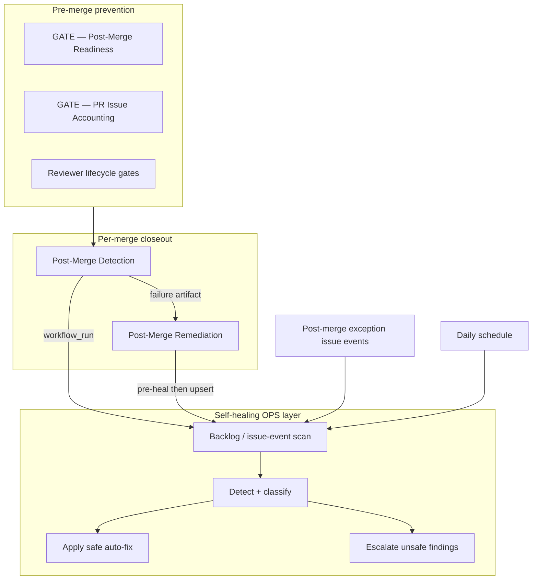
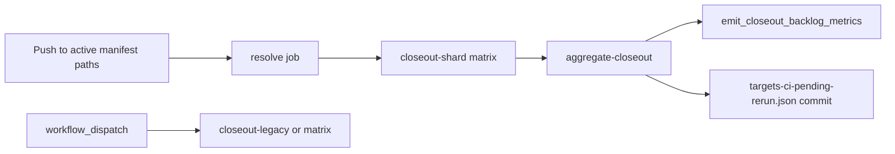

# Post-Merge Self-Healing Architecture

## Purpose

This document explains the production design for LGFC post-merge self-healing CI.
It describes how Programs **#1847** (framework) and **#1914** (operational activation)
fit together with upstream pre-merge gates and downstream remediation surfaces.

The design goal is to stop the unhealthy loop where merged PRs repeatedly create
post-merge closeout exception issues that require manual or Cursor cleanup.

## Problem the architecture solves

Recent CI redesign work made post-merge closeout strict. That correctness exposed
an upstream defect: many PRs passed pre-merge gates while carrying evidence that
post-merge closeout later rejected. The repository accumulated a large backlog of
open exception issues tracking incorrect issue status, labels, manifests, and
reviewer disposition gaps.

Self-healing is the **downstream hygiene and escalation layer**. It does not
replace PR governance, reviewer-response accounting, source-issue accounting, or
Bill/Atlas merge authorization.

## Design principles

1. **Prevent before merge when possible** — pre-merge gates (`GATE — Post-Merge Readiness`, PR issue accounting, reviewer lifecycle gates) should block deterministic defects before landings on `main`.
2. **Repair deterministically after merge when safe** — bounded repo and issue hygiene may be repaired automatically when repository evidence is complete and unambiguous.
3. **Escalate only unsafe findings** — ambiguous reviewer intent, allowlist conflicts, secrets/config failures, runtime app-code defects, and operator-authority decisions become scoped remediation issues instead of silent mutation.
4. **Avoid issue noise** — do not open child escalation issues when self-healing can prove a safe resolution; add a disposition comment on the **same** issue and apply the `ops-pr-escalation` label instead.

## Architectural layers

| Layer | Primary owner | Responsibility |
|---|---|---|
| Pre-merge prevention | `gate-post-merge-readiness.yml`, `ops-pr-issue-accounting.yml` | Block merges that would fail deterministic closeout |
| Per-merge closeout | `post-merge-closeout.yml` | Validate merged PR evidence and close source issues when safe |
| Remediation handoff | `post-merge-remediation.yml` | Open or update exception issues only when blocking failures remain after self-healing |
| Self-healing OPS | `ops-post-merge-self-healing.yml` | Scan, classify, repair, and escalate post-merge hygiene drift |

## Trigger model

`OPS — Post-Merge Self-Healing` runs on five trigger classes:

| Trigger | Default mode | Behavior |
|---|---|---|
| `workflow_dispatch` | dry-run unless operator disables it | Inspection, authorized apply, optional escalation issue creation |
| `workflow_run` after closeout/remediation/readiness | apply safe fixes | Ingest closeout artifacts when available; burn down backlog; apply deterministic repairs |
| `issues` on post-merge exception signatures | apply safe fixes for matching issue only | Classify and disposition a single newly opened/edited/labeled exception issue immediately |
| `schedule` (daily) | apply safe fixes | Repository-wide backlog scan and ongoing hygiene burn-down |
| `push` to self-healing scripts on `main` | dry-run | Regression signal only |

Matching issue events are limited to titles, bodies, or labels that identify
post-merge closeout exceptions. Any issues already labeled `ops-pr-escalation` are
excluded from repeat scans. Applying the `ops-pr-escalation` label does not
re-trigger the workflow.

## Processing pipeline

Every authorized run executes the same ordered pipeline:

1. **Backlog / issue-event scan** — `post_merge_self_heal_backlog.mjs`
2. **Detect** — `post_merge_self_heal_detect.mjs`
3. **Apply** — `post_merge_self_heal_apply.mjs`
4. **Escalate** — `post_merge_self_heal_escalate.mjs` (manual dispatch only by default)

The backlog scanner classifies each open exception issue into one disposition:

- safe to close
- safe manifest/metadata repair
- duplicate of canonical remediation
- preserve because source issue remains active
- preserve because evidence is ambiguous
- unsafe / operator review required

When CI cannot auto-close, it comments once on the **same** exception issue and
applies the `ops-pr-escalation` label. That label is the Operations handoff
signal and prevents daily re-scan churn.

## Ops PR escalation label (`ops-pr-escalation`)

| Outcome | Issue action |
|---|---|
| `safe_to_close` | Close exception issue with disposition comment |
| Not safe to auto-close | Disposition comment + add `ops-pr-escalation` |
| Already has `ops-pr-escalation` | Skip scan (no new comment, no workflow re-entry) |

Ops queue search:

`is:issue is:open label:post-merge-failure label:ops-pr-escalation`

Remove `ops-pr-escalation` only when an operator intentionally wants CI to
re-triage an issue after new evidence lands.

The classifier contract in
`docs/reference/ci/post-merge-self-healing-classification-contract.md`
defines the deterministic outcome precedence used by detect/apply/escalate.

## Prevention of unnecessary remediation issues

Remediation issue creation is suppressed when:

- the closeout result records `self_healing_safe=true` for deterministic terminal-label repair;
- the closeout `self_healing` block classifies the residue as `safe_auto_fix` without ambiguity;
- `Post-Merge Remediation` completes a pre-heal pass (backlog scan + detect + apply) before upsert; and
- an open canonical remediation issue already exists for the same PR/source/failure group.

When suppression applies, CI records a skip reason such as `self-healing-safe-resolution`
instead of opening duplicate noise.

## Safe auto-fix boundary

Safe auto-fix is limited to deterministic repository hygiene:

- stale closeout manifest rows after proven pass;
- duplicate exception/remediation issues superseded by canonical evidence;
- stale exception issues where PR/source/closeout evidence proves no remaining action;
- terminal source-issue label reconciliation when integrity checks identify a bounded repair plan;
- merge-SHA integrity repairs when closeout evidence is provably stale.

Safe auto-fix never edits runtime application code, fabricates reviewer dispositions,
merges PRs, or advances program queues without explicit authority.

## Escalation boundary

CI routes non-auto-fixable post-merge exceptions to Operations on the **original
exception issue** using `ops-pr-escalation`. It does not open child escalation
issues during normal schedule, workflow_run, or issue-event paths.

Manual dispatch may still enable separate escalation issue creation when an
operator explicitly sets `open_escalation_issues=true`.

CI preserves issues for operator review when evidence is ambiguous or protected:

- missing or undispositioned reviewer comments;
- source issue or allowlist ambiguity;
- auth/secrets/config failures;
- required workflow failures without a deterministic hygiene repair;
- active alternate program-lane or queue decisions.

Optional manual escalation issues use deduplication keys
`(PR, source issue, failure class)` and update an existing open issue when the
key matches.

## Relationship to Program #1906

Program **#1906** owns upstream CI parity: mapping post-merge exception classes to
pre-merge blockers and closing the gap where merges pass pre-gates but fail closeout.

Programs **#1847** and **#1914** own downstream cleanup and ongoing hygiene.
Program **#1963** hardened the batch closeout replay path (path-scoped push replay,
active manifest registry, rate-limit rerun queue, matrix sharding, resumable
`partial_failure`, and authoritative backlog metrics) documented in
`docs/how-to/ci/post-merge-self-healing-runbook.md` and
`docs/reference/ci/post-merge-validation-surface.md`.

All three layers are required:

- **#1906** reduces new exception creation at the source.
- **#1847** provides the classifier, detector, apply, and escalation framework.
- **#1914** activates backlog burn-down, issue-event interception, and scheduled hygiene.
- **#1963** reduces closeout replay churn, rate-limit tail failures, generator/replay
  gaps, and ops backlog metric confusion on the batch closeout workflow.

## Batch closeout automation (Program #1963)

| Component | Role |
|---|---|
| `targets-active.json` | Authoritative automatic replay manifest registry |
| `resolve_closeout_manifests_from_push.mjs` | Path-scoped replay on push |
| Matrix shards | Isolate manifest failures; `fail-fast: false` |
| Aggregate job | Merge reports, `summary.by_code`, persist rerun queue |
| `emit_closeout_backlog_metrics.mjs` | GraphQL `ops-pr-escalation` counts + step summary |
| Resumable `partial_failure` | Rate-limit-only tails exit success when rerun persisted |

## Operational artifacts

Each self-healing run uploads:

| Artifact | Meaning |
|---|---|
| `post-merge-self-heal-backlog.json` | Backlog classifications and issue disposition results |
| `post-merge-self-heal-detection.json` | Classified findings and summary counts |
| `post-merge-self-heal-apply.json` | Planned or applied safe auto-fix actions |
| `post-merge-self-heal-escalation.json` | Planned or executed escalation actions |

Operators should inspect artifacts before enabling live escalation issue creation.

## Governance invariants

Self-healing cannot:

- approve, merge, or mark a PR ready for merge;
- satisfy reviewer-response accounting by guessing reviewer intent;
- broaden a PR file-touch allowlist;
- modify secrets or production configuration;
- close, reopen, relabel, or advance issues outside deterministic safe-close rules and the `ops-pr-escalation` handoff label;
- override Bill/Atlas gate, queue, launch, or merge decisions.

## Related references

- Classifier contract: `docs/reference/ci/post-merge-self-healing-classification-contract.md`
- Operator runbook: `docs/how-to/ci/post-merge-self-healing-runbook.md`
- Post-merge validation surface: `docs/reference/ci/post-merge-validation-surface.md`
- OPS runtime philosophy: `docs/explanation/ci/lgfc-ops-runtime-philosophy.md`
