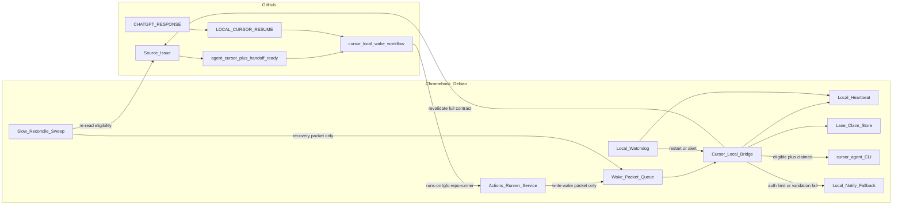

# Cursor Local Auto-Start Architecture

## Purpose

Explain why LGFC uses an event-driven **GitHub Actions wake delivery → Chromebook runner → Cursor Local Bridge → local `cursor agent`** path, and why the Actions runner alone is not a Cursor notifier.

This document is the **as-built** design authority derived from the design recorded on Issue #2667 / PR #2669, extended by Operations Issue #2694 for local heartbeat, watchdog recovery, and bounded missed-handoff reconciliation. Operational install steps live in the how-to; normative gates live in the bridge contract.

## Problem

GitHub Issues are the source of work. Cursor Local is the implementation agent. The legacy poll-wake loop:

- depends on an open Cursor agent chat;
- only prints a stdout sentinel;
- polls on a multi-minute interval;
- never starts work without a human or open session initiating the agent.

Bill’s requirement for Mode B: when assignment becomes valid, the Chromebook must receive the event and Cursor must begin work **without** Bill manually opening or prompting an agent.

After Mode B shipped, two reliability gaps remained:

1. a hung Bridge process could stay “active” without proving useful health;
2. a fully eligible handoff could remain unclaimed if the wake event or host packet was missed.

## Decision

**Mode B — Auto-start local CLI agent**, with local health and recovery.

| Decision | Choice |
| --- | --- |
| Delivery | GitHub Actions job on `lgfc-repo-runner` writes a host wake packet |
| Execution owner | Cursor Local Bridge (host systemd service) |
| Agent runtime | Authenticated local `cursor agent` / `agent -p` |
| Safety gate | Full eligibility contract (not a single label) |
| Failure mode | Local notify + Issue left **unclaimed** |
| Health | Local heartbeat + systemd timer watchdog (quiet when healthy) |
| Missed-handoff recovery | Bounded local reconciliation every `reconcileIntervalSeconds` (default 900s) into the normal packet path |
| Prohibited | Background Agents, Cloud Agents REST, SDK cloud, paid relays, GitHub keepalive spam |

## Cost model

| Path | Cursor subscription impact |
| --- | --- |
| Idle runner + idle Bridge | None |
| Wake delivery job (self-hosted) | None |
| Local heartbeat / watchdog | None (local only) |
| Reconciliation sweep (GitHub read API) | None for Cursor; uses `gh` read path only until a recovered packet launches |
| Local `cursor agent` run | Uses existing account model/agent allowance (same class as IDE agent use) |
| Background Agents / cloud agent APIs | Out of scope / prohibited |

Auto-start can increase spent allowance versus manual starts because eligible work launches without Bill choosing to open a chat. Mitigations: full eligibility gate, single-lane claim, dedupe by resume comment id, fallback without claim on auth/limit/validation failure, fail-closed reconciliation.

## Architecture

Critical boundary: the runner **delivers**; the Bridge **decides and launches**. Health and missed-handoff recovery are **Bridge-local**. They must not move Cursor credentials or launch authority onto the runner.

## Component inventory

Every component must have purpose, inputs, outputs, and dependencies. No infrastructure may be introduced without that documentation.

| Component | Purpose | Must not |
| --- | --- | --- |
| Source Issue | Task authority and eligibility surface | Be treated as proof of pickup |
| Wake workflow | Near-real-time delivery of a host packet | Launch Cursor, hold API keys, claim the lane |
| Actions runner service | Host job receiver for gated workflows | Own Cursor auth, health, or agent lifetime |
| Wake packet queue | Decouple job lifetime from agent lifetime | Be treated as authority (Bridge revalidates live Issue state) |
| Cursor Local Bridge | Sole Cursor launcher: validate, dedupe, claim, launch, supervise | Start on labels alone or while unauthenticated |
| Local heartbeat | Prove the watch loop is alive | Publish routine traffic to GitHub |
| Local watchdog | Restart stale/hung Bridge; alert on persistent failure | Clear claims outside TTL contract; spam GitHub |
| Slow reconciliation | Reconstruct missed eligible packets into the queue | Launch Cursor directly or weaken eligibility |
| Eligibility validator | Fail-closed full contract checks | Accept multi-action resumes |
| Serial claim store | One Implementation stream at a time | Allow concurrent conflicting claims |
| Local Cursor CLI | Execute exactly one bounded resume action | Use cloud handoff / Background Agents |
| Notify fallback | Operator-visible failure without silent drop | Claim the lane on failure |
| Poll-wake loop | Legacy backup detector only | Remain the primary auto-start path |

Normative eligibility checklist and fallback taxonomy: `docs/reference/ci/cursor-local-bridge-contract.md`.

## Event flow

1. ChatGPT posts `CHATGPT RESPONSE` and a separate `LOCAL CURSOR RESUME` with exactly one bounded action; labels include `agent:cursor` and `handoff:ready`.
2. Wake workflow runs on the Chromebook runner and writes a wake packet.
3. Bridge dequeues the packet and re-fetches live Issue state.
4. If eligibility or CLI auth fails → notify + `CURSOR BRIDGE FALLBACK: unclaimed` and stop.
5. If eligible → acquire serial claim, mark resume comment id consumed, launch `cursor agent`.
6. On completion or failure → post evidence comments, release claim.
7. Independently, the Bridge refreshes a local heartbeat each watch cycle.
8. On the reconcile cadence, the Bridge lists recent open Issues with the required labels, re-applies full eligibility, and queues a recovery packet only when an eligible resume lacks a pending or consumed packet.

## Why this beats poll-wake

1. GitHub pushes work to the host when Issue state changes instead of multi-minute polling.
2. Bridge does not require an open IDE agent chat or stdout sentinel monitoring.
3. Full eligibility is revalidated before any Cursor usage is spent.
4. Failures are explicit and leave the Issue unclaimed for safe manual pickup.
5. Local heartbeat/watchdog recovers hung Bridge processes without GitHub keepalive noise.
6. Bounded reconciliation recovers missed packets without converting the Bridge into a polling-first architecture.

## Rejected alternatives

| Option | Verdict |
| --- | --- |
| Poll-wake only | Requires open session; prints a line; not auto-start |
| Notify-only bridge | Bill still initiates work |
| Runner invokes Cursor inside the Actions step | Conflates transport with execution; job timeout kills agent; secrets surface risk |
| Webhook + public tunnel | Extra moving parts; possible paid relay |
| Background Agents / SDK cloud | Cost and prohibited path |
| Persistent dispatcher without runner | Still needs poll or webhook; runner is better ingress |
| Scheduled GitHub Actions keepalive / synthetic comments | Forbidden noise; does not prove Bridge health |
| Reconciliation that launches Cursor directly | Bypasses packet path and weakens the sole-launcher boundary |

## As-built verification

| Evidence | Result |
| --- | --- |
| PR #2669 merged to `main` | Wake workflow, contracts, Bridge scripts on `main` |
| Host Bridge service | `lgfc-cursor-bridge.service` installed and running |
| Validation fallback soak | Unclaimed fallback on incomplete eligibility |
| Auth fallback soak | Unclaimed fallback while CLI logged out |
| Duplicate suppression | Second delivery for same resume comment id skipped |
| Authenticated launch soak (#2670) | `CURSOR BRIDGE STARTED` → `COMPLETED` exit 0; claim released |
| #2694 heartbeat / watchdog / reconcile | Local heartbeat, systemd watchdog timer, bounded reconciliation into normal packet path |

## Related documents

- Contract: `docs/reference/ci/cursor-local-bridge-contract.md`
- Install how-to: `docs/how-to/cursor/configure-cursor-local-bridge.md`
- Runner contract: `docs/reference/ci/repository-runner-contract.md`
- Runtime routing: `docs/governance/standards/CURSOR-RUNTIME-ROUTING.md`
- Legacy backup: `docs/how-to/cursor/github-poll-wake-loop.md`
