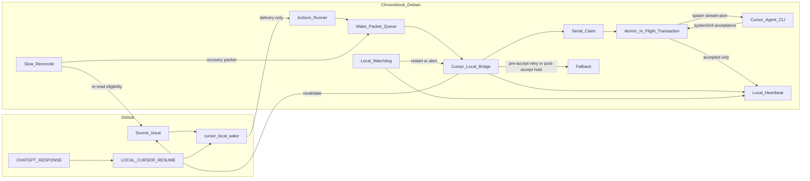

# Cursor Local Auto-Start Architecture

## Purpose

Explain why LGFC uses an event-driven **GitHub Actions wake delivery → Chromebook runner → Cursor Local Bridge → local `cursor agent`** path, why the Actions runner alone is not a Cursor notifier, and why a spawned CLI process is not proof that the agent accepted work.

This document is the as-built design authority derived from Issue #2667 / PR #2669, extended by #2694 for heartbeat, watchdog recovery, and missed-handoff reconciliation, and corrected by #2739 for transactional launch acceptance.

## Problem

GitHub Issues are the source of work. Cursor Local is the implementation agent. The legacy poll-wake loop depended on an open Cursor session, only printed a sentinel, and never started work without human initiation.

Mode B therefore added event delivery and a persistent local Bridge. Subsequent live operation exposed three distinct reliability boundaries:

1. a hung Bridge process could stay “active” without proving useful health;
2. a fully eligible handoff could remain unclaimed if the wake event or host packet was missed;
3. the CLI could spawn and open a connection without the Cursor agent accepting the task, while the Bridge prematurely marked the handoff consumed and reported `STARTED`.

The third boundary is critical. Transport success, process creation, connection establishment, agent acceptance, and completed work are different states and must not be collapsed.

## Decision

**Auto-start local CLI agent with transactional acceptance, local health, and recovery.**

| Decision | Choice |
| --- | --- |
| Delivery | GitHub Actions job on `lgfc-repo-runner` writes a host wake packet |
| Execution owner | Cursor Local Bridge systemd service |
| Agent runtime | Authenticated local `cursor agent` / `agent -p --output-format stream-json` |
| Safety gate | Full Issue eligibility contract plus one serial claim |
| Acceptance signal | First valid Cursor NDJSON `system/init` event |
| Pre-accept failure | Release claim, leave resume unconsumed, retain one packet with bounded backoff |
| Post-accept failure | Keep consumed marker, suppress automatic retry, require manual verification |
| Health | Local heartbeat + systemd timer watchdog, including active-launch pulses |
| Missed-handoff recovery | Bounded local reconciliation into the normal packet path |
| Prohibited | Background Agents, cloud APIs, paid relays, GitHub keepalive spam, `--force`, automatic merge or Production authority |

## Cost model

| Path | Cursor subscription impact |
| --- | --- |
| Idle runner + idle Bridge | None |
| Wake delivery job | None |
| Local heartbeat / watchdog | None; local only |
| Reconciliation sweep | None for Cursor until an eligible packet launches |
| Local Cursor Agent run | Existing account model/agent allowance |
| Background Agents / cloud agent APIs | Prohibited |

Auto-start can consume allowance without Bill opening a chat. The controls are full eligibility, one serial claim, transaction state, positive acceptance, deduplication by resume id, bounded pre-accept retry, and no automatic retry after possible mutation.

## Architecture



Critical boundaries:

- The runner **delivers**; it never launches Cursor.
- The Bridge **validates, claims, launches, and supervises**.
- `spawn()` means only `CLI_SPAWNED`.
- Cursor `system/init` means `AGENT_ACCEPTED`.
- Only acceptance permits the consumed marker and `CURSOR BRIDGE STARTED` evidence.

## Launch state machine

```text
DELIVERED
  -> ELIGIBLE
  -> CLAIMED
  -> CLI_SPAWNED
  -> AGENT_ACCEPTED
  -> RUNNING
  -> COMPLETED
```

### Before acceptance

`in-flight.json` records the packet, claim identity, process id, and `cli_spawned` state. The resume remains unconsumed. A startup timeout, connection failure, auth transition, process error, or exit before `system/init` kills the child, releases the claim, restores the same packet with bounded exponential backoff, and emits one deduplicated fallback.

If the Bridge restarts in this state, the processing packet returns to the retry path. No duplicate work is possible because no agent acceptance occurred.

### At acceptance

The Bridge parses newline-delimited JSON from stdout. A valid event must contain:

```json
{"type":"system","subtype":"init","session_id":"..."}
```

The Bridge then, in order:

1. writes the consumed-resume marker;
2. updates `in-flight.json` to `running` with `acceptedAt` and `sessionId`;
3. posts `CURSOR BRIDGE STARTED`;
4. continues heartbeat updates while the child executes.

### After acceptance

A zero exit posts `COMPLETED`, releases the claim, clears transaction state, and archives the packet. A nonzero exit, execution timeout, Bridge restart, or supervision error preserves the consumed marker and suppresses auto-retry because repository mutation may already have occurred.

## Component responsibilities

| Component | Purpose | Must not |
| --- | --- | --- |
| Source Issue | Task authority and eligibility | Be treated as pickup evidence |
| Wake workflow | Deliver a packet | Launch Cursor, hold keys, or claim the lane |
| Actions runner | Receive gated delivery jobs | Own Cursor auth or lifetime |
| Packet queue | Decouple delivery and execution | Become authority |
| Bridge | Validate, claim, launch, supervise, recover | Report started on spawn alone |
| In-flight transaction | Preserve launch state across supervision/restart | Contain prompts, secrets, or private output |
| Cursor CLI | Execute one bounded action and emit lifecycle NDJSON | Use cloud handoff or `--force` |
| Heartbeat | Prove useful health during idle and execution | Stop refreshing while awaiting child exit |
| Watchdog | Recover stale Bridge process | Clear valid claims arbitrarily |
| Reconciliation | Reconstruct missed eligible packets | Bypass the queue or launch directly |
| Fallback | Make failures visible | Trigger duplicate execution |

## Event flow

1. ChatGPT posts authority and a separate one-action resume; required labels are present.
2. The wake workflow writes a packet and may post `ACK: delivered`.
3. The Bridge dequeues the packet, re-fetches Issue state, and validates eligibility/auth.
4. The Bridge acquires the serial claim and writes `cli_spawned` transaction state.
5. The CLI starts in `stream-json` mode.
6. If no `system/init` arrives before timeout, the child is terminated and the packet is retryable; no `STARTED` or consumed marker exists.
7. On `system/init`, the Bridge marks consumed, records the session, and posts `STARTED`.
8. Heartbeats continue while the agent runs.
9. Completion or post-accept failure releases the claim and records the correct duplicate-safety disposition.
10. Reconciliation remains an independent recovery path for eligible work lacking pending or consumed evidence.

## Why this design is required

1. GitHub delivery no longer depends on an open chat.
2. A connection window is not mistaken for agent execution.
3. Pre-accept faults recover automatically without losing the handoff.
4. Post-accept faults fail safe against duplicate repository mutation.
5. The watchdog sees a fresh heartbeat during long-running work.
6. Operators can distinguish queue, claim, spawned, accepted, running, and completed state.

## Rejected alternatives

| Option | Verdict |
| --- | --- |
| Treat successful `spawn()` as started | False-positive pickup; caused #2739 |
| Mark consumed before acceptance | Can permanently suppress retry |
| Retry automatically after acceptance | Duplicate mutation risk |
| Runner invokes Cursor inside Actions | Conflates transport and execution; timeout/credential risk |
| Poll-wake only | Requires open session; not auto-start |
| Public webhook/tunnel | Unnecessary exposure and moving parts |
| Background Agents / cloud runtime | Prohibited cost/runtime path |
| Synthetic keepalive comments | Noise; not health evidence |
| Reconciliation launches directly | Bypasses the normal safety path |

## Verification obligations

Repository tests must prove spawn-without-acceptance timeout, pre-accept retryability, single acceptance, heartbeat continuity, secret-safe diagnostics, and restart classification. Chromebook verification must additionally prove reset/reconnect success, an intentional stalled connection, claim release, retryability, and no duplicate launch after service restart.

#2694 and #2638 cannot receive terminal closeout from repository-only tests; the direct-host acceptance evidence remains mandatory.

## Related documents

- Contract: `docs/reference/ci/cursor-local-bridge-contract.md`
- Install how-to: `docs/how-to/cursor/configure-cursor-local-bridge.md`
- Runner contract: `docs/reference/ci/repository-runner-contract.md`
- Runtime routing: `docs/governance/standards/CURSOR-RUNTIME-ROUTING.md`
- Legacy backup: `docs/how-to/cursor/github-poll-wake-loop.md`
