# wdhunter645/next-starter-template Wiki

Version: 1

## Overview

### LGFC Repository Overview

<details>
<summary>Relevant source files</summary>

The following files were used as context for generating this wiki page:

- [README.md](https://github.com/wdhunter645/next-starter-template/blob/main/README.md)
- [context.md](https://github.com/wdhunter645/next-starter-template/blob/main/context.md)
- [Agent.md](https://github.com/wdhunter645/next-starter-template/blob/main/Agent.md)
- [package.json](https://github.com/wdhunter645/next-starter-template/blob/main/package.json)
- [lgfc-lite-configure-remaining.sh](https://github.com/wdhunter645/next-starter-template/blob/main/lgfc-lite-configure-remaining.sh)
- [tools/verify_v6_lock.sh](https://github.com/wdhunter645/next-starter-template/blob/main/tools/verify_v6_lock.sh)
- [scripts/cf_pages_snapshot.sh](https://github.com/wdhunter645/next-starter-template/blob/main/scripts/cf_pages_snapshot.sh)
</details>

# LGFC Repository Overview

The Lou Gehrig Fan Club (LGFC) repository is a specialized web application infrastructure designed to operate both a public-facing website and an authenticated "FanClub" area. The system is built using the Next.js App Router framework and is optimized for deployment on Cloudflare Pages as a static export.

The primary objective of this repository is to maintain strict design and navigation invariants while providing administrative tools for content management and community engagement. Governance is strictly enforced through automated audit scripts and a tiered authority hierarchy for documentation.

Sources: [README.md:3-8](), [context.md:7-11](), [Agent.md:8-12]()

## Technical Stack and Architecture

The application utilizes a modern full-stack architecture tailored for the Cloudflare ecosystem.

*   **Framework:** Next.js 15 (App Router) with TypeScript and React 19.
*   **Hosting:** Cloudflare Pages with static export builds.
*   **Database:** Cloudflare D1 serves as the primary relational store for FAQs, quotes, and membership data.
*   **Asset Storage:** Backblaze B2 is used for media assets, while the primary store remains external via Bonfire.
*   **Integration:** Social wall features are integrated via Elfsight widgets.

Sources: [README.md:6-7](), [context.md:15-20](), [package.json:3-16](), [tools/verify_v6_lock.sh:199-204]()

### Data Flow and Deployment
The following diagram illustrates the deployment and data flow from local development through the Cloudflare infrastructure.

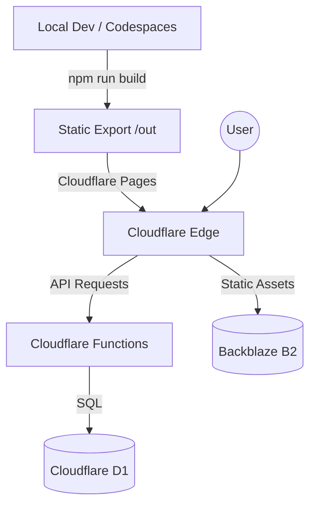
```mermaid
graph TD
    Local[Local Dev / Codespaces] -->|npm run build| Export[Static Export /out]
    Export -->|Cloudflare Pages| Edge[Cloudflare Edge]
    Edge -->|API Requests| Functions[Cloudflare Functions]
    Functions -->|SQL| D1[(Cloudflare D1)]
    Edge -->|Static Assets| B2[(Backblaze B2)]
    User((User)) --> Edge
```

Sources: [context.md:15-20](), [package.json:44-50](), [lgfc-lite-configure-remaining.sh:159-180]()

## Core Features and Routing

The repository enforces a "Day 1" canonical route structure. Navigation is strictly defined to prevent "route drift."

### Route Classification

| Route Type | Access Level | Paths |
| :--- | :--- | :--- |
| **Public** | Unauthenticated | `/`, `/about`, `/contact`, `/terms`, `/faq`, `/join`, `/login` |
| **FanClub** | Authenticated | `/fanclub`, `/fanclub/**` |
| **Admin** | Admin Privilege | `/admin/**` |
| **External** | Third-party | `/store` (Bonfire link) |

Sources: [context.md:33-40](), [lgfc-lite-configure-remaining.sh:401-415]()

### Authentication Model
Authentication is managed via client-side state and administrative role checks.
*   **Identity:** Stored in `localStorage` under the key `lgfc_member_email`.
*   **Protection:** FanClub routes redirect unauthenticated traffic to `/`.
*   **Privilege:** Determined by calls to `/api/member/role`.

Sources: [context.md:24-28]()

## Repository Governance and Safety

The LGFC repository operates under a strict "Design Authority" model where specific documentation (v6 Lock) takes precedence over implementation code.

### Authority Hierarchy
1.  **Level 1:** Locked design and governance docs (e.g., `LGFC-Production-Design-and-Standards.md`).
2.  **Level 2:** Operational trackers.
3.  **Level 3:** AI Agent Rules and repository-specific operating models.

Sources: [Agent.md:17-26]()

### Automated Verification (v6 Lock)
The repository includes a verification suite (`/tools/verify_v6_lock.sh`) to prevent unauthorized changes to the "v6" design specification. These checks ensure:
*   **CSS Tokens:** `--lgfc-blue` and `.section-gap` are present and correctly valued.
*   **Structural Invariants:** The Header remains non-sticky, and the Homepage maintains at least 5 section-gap wrappers.
*   **Copy Accuracy:** Specific text for the Join CTA and Weekly Matchup must match the design source of truth exactly.

Sources: [tools/verify_v6_lock.sh:14-180](), [audits/verify_v6_lock.sh:16-52]()

### Recovery and Snapshots
Cloudflare Pages metadata is backed up via an automated snapshot system. This captures project configurations, domain settings, and recent deployment records into timestamped JSON files.

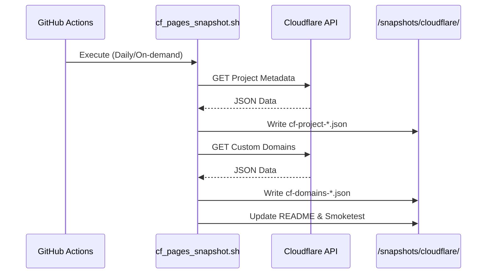
```mermaid
sequenceDiagram
    participant GH as GitHub Actions
    participant Script as cf_pages_snapshot.sh
    participant CF as Cloudflare API
    participant Disk as /snapshots/cloudflare/
    GH->>Script: Execute (Daily/On-demand)
    Script->>CF: GET Project Metadata
    CF-->>Script: JSON Data
    Script->>Disk: Write cf-project-*.json
    Script->>CF: GET Custom Domains
    CF-->>Script: JSON Data
    Script->>Disk: Write cf-domains-*.json
    Script->>Disk: Update README & Smoketest
```

Sources: [scripts/cf_pages_snapshot.sh:10-145](), [snapshots/cloudflare/README.md:5-20]()

## Development Workflow

Contributors must follow a disciplined engineering model.

### Key Scripts and Commands
*   `npm run dev`: Standard local development.
*   `npm run dev:cf`: Local Cloudflare Pages emulation via Wrangler.
*   `npm run build`: Static export build with post-build route generation.
*   `npm run test:homepage-structure`: Vitest-based drift guard for the v6 specification.

Sources: [package.json:44-59](), [tests/homepage-structure.test.tsx:11-20]()

### Mandatory Stop Conditions
Agents and developers must cease work and report if:
*   Task instructions conflict with the locked governance docs.
*   A change would create a "second source of truth."
*   The repository contains a ZIP file (which must be deleted immediately).

Sources: [Agent.md:37-45](), [Agent.md:52-58]()

The Lou Gehrig Fan Club repository serves as a robust foundation for community engagement, prioritizing architectural stability and design consistency through strict governance and automated auditing.

Sources: [context.md:7-11](), [tools/verify_v6_lock.sh:230-245]()

### Local Development & Setup

<details>
<summary>Relevant source files</summary>

The following files were used as context for generating this wiki page:

- [CONTRIBUTING.md](https://github.com/wdhunter645/next-starter-template/blob/main/CONTRIBUTING.md)
- [package.json](https://github.com/wdhunter645/next-starter-template/blob/main/package.json)
- [README.md](https://github.com/wdhunter645/next-starter-template/blob/main/README.md)
- [context.md](https://github.com/wdhunter645/next-starter-template/blob/main/context.md)
- [Agent.md](https://github.com/wdhunter645/next-starter-template/blob/main/Agent.md)
- [scripts/fix-package-json-conflicts.sh](https://github.com/wdhunter645/next-starter-template/blob/main/scripts/fix-package-json-conflicts.sh)
</details>

# Local Development & Setup

This document provides a comprehensive guide to setting up and maintaining the development environment for the Lou Gehrig Fan Club (LGFC) website. The project is built using a modern stack featuring Next.js 15 (App Router), TypeScript, and React 18/19, with a deployment architecture centered on Cloudflare Pages and D1 databases.

Sources: [package.json:1-15](), [README.md:1-5](), [context.md:12-16]()

## Environment Prerequisites

The project requires specific runtime versions and tools to ensure compatibility between local development and the Cloudflare Pages target environment.

### Core Requirements
| Requirement | Version/Value | Source |
| :--- | :--- | :--- |
| **Node.js** | `>=22 <23` | [package.json:115]() |
| **Package Manager** | `npm` | [CONTRIBUTING.md:18]() |
| **Primary Framework** | Next.js 15.5.8 | [package.json:69]() |
| **Cloudflare CLI** | `wrangler` | [package.json:112]() |

## Development Workflows

The repository supports two primary development modes: local machine setup and GitHub Codespaces.

### GitHub Codespaces Setup
Codespaces is the recommended environment as it automates dependency installation and tool configuration.

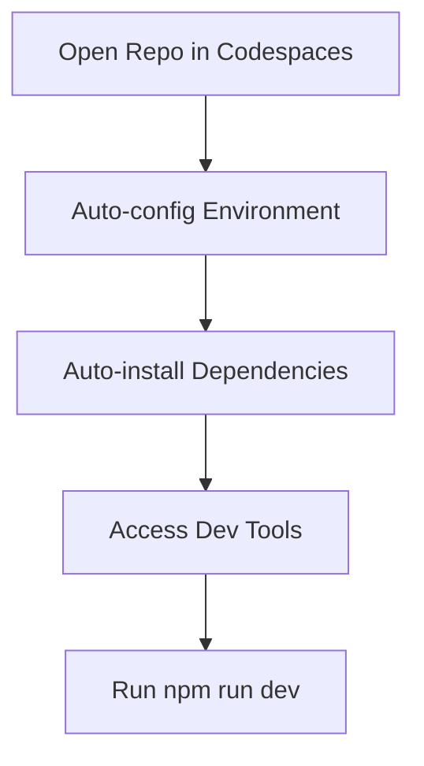
```mermaid
flowchart TD
    A[Open Repo in Codespaces] --> B[Auto-config Environment]
    B --> C[Auto-install Dependencies]
    C --> D[Access Dev Tools]
    D --> E[Run npm run dev]
```
The development environment is automatically configured upon opening, providing immediate access to the necessary toolchain.

Sources: [CONTRIBUTING.md:7-13]()

### Manual Local Setup
For developers working outside of Codespaces, the following sequence is required:

1.  **Clone and Install**: Run `npm install` to retrieve dependencies.
2.  **Environment Variables**: Configure necessary secrets for Cloudflare and Supabase if interacting with live data.
3.  **Start Dev Server**: Execute `npm run dev` for standard Next.js development.

Sources: [CONTRIBUTING.md:15-28](), [README.md:32-35]()

## Available Development Scripts

The `package.json` defines several critical scripts for the development lifecycle:

| Script | Command | Purpose |
| :--- | :--- | :--- |
| `dev` | `next dev` | Starts the standard Next.js local development server. |
| `dev:cf` | `wrangler pages dev ...` | Simulates the Cloudflare Pages environment locally including D1 (DB) bindings. |
| `build` | `next build && ...` | Compiles the production application and copies `_routes.json`. |
| `lint` | `next lint` | Runs ESLint for static code analysis. |
| `typecheck` | `tsc --noEmit` | Validates TypeScript types without generating output. |
| `format` | `prettier --write .` | Enforces consistent code formatting across the repository. |

Sources: [package.json:44-58]()

## Git Authentication & Security

Proper Git configuration is mandatory for contributing. The project enforces specific authentication methods to avoid "Permission denied" errors, particularly within Codespaces.

### Authentication Methods
1.  **Personal Access Tokens (PAT)**: Required for HTTPS operations as GitHub has removed password authentication. The token must have `repo` and `workflow` scopes.
2.  **GitHub CLI (gh)**: An interactive method using `gh auth login` which handles credential storage automatically.
3.  **SSH**: Recommended for local machine development by adding a generated SSH key to the GitHub account.

Sources: [CONTRIBUTING.md:31-64](), [CONTRIBUTING.md:125-131]()

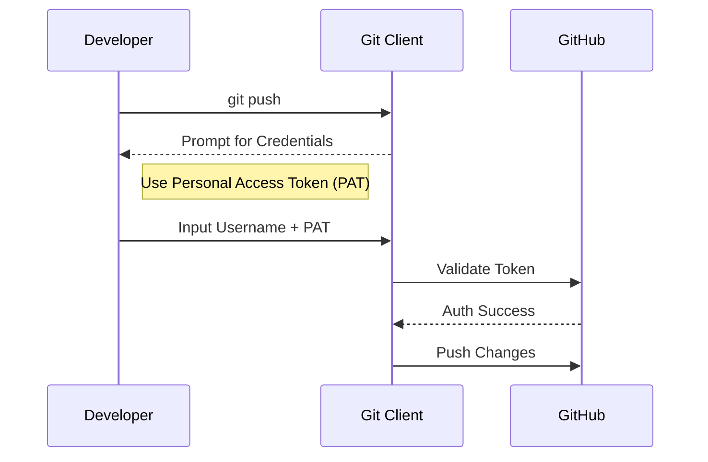
```mermaid
sequenceDiagram
    participant Dev as Developer
    participant Git as Git Client
    participant GH as GitHub
    Dev->>Git: git push
    Git-->>Dev: Prompt for Credentials
    Note right of Dev: Use Personal Access Token (PAT)
    Dev->>Git: Input Username + PAT
    Git->>GH: Validate Token
    GH-->>Git: Auth Success
    Git->>GH: Push Changes
```
Sources: [CONTRIBUTING.md:92-101]()

## Project Architecture & Governance

Local development must adhere to the "Design Authority" established in the documentation.

*   **Read Order**: Developers are mandated to read `/docs/reference/design/LGFC-Production-Design-and-Standards.md` before starting work.
*   **Agent Rules**: AI agents and contributors must follow the rules in `/Agent.md` and `/docs/ops/ai/AGENT-RULES.md`.
*   **Task Management**: Active work is tracked in `active_tasklist.md`.
*   **ZIP Safety**: Contributors must ensure no `.zip` files are committed to the repository; any existing ZIPs in the root should be deleted immediately.

Sources: [README.md:12-25](), [Agent.md:10-25](), [Agent.md:46-52]()

## Testing & Quality Assurance

The project utilizes `vitest` for unit testing and `playwright` for end-to-end (E2E) testing.

```bash
# Run unit tests
npm run test

# Run E2E tests in UI mode
npm run test:e2e:ui

# Verify homepage structure specifically
npm run verify-homepage
```
Sources: [package.json:59-66]()

## Summary

Setting up the local development environment for the LGFC project involves ensuring Node.js 22 compatibility, configuring Git with Personal Access Tokens, and utilizing the provided npm scripts for development and testing. Adherence to the project's governance documents and architectural standards is required for all contributors to maintain the integrity of the Cloudflare Pages deployment.

Sources: [package.json:115](), [CONTRIBUTING.md:31-35](), [Agent.md:54-58]()

### Security & Compliance

<details>
<summary>Relevant source files</summary>

The following files were used as context for generating this wiki page:

- [src/app/privacy/page.tsx](https://github.com/wdhunter645/next-starter-template/blob/main/src/app/privacy/page.tsx)
- [src/app/terms/page.tsx](https://github.com/wdhunter645/next-starter-template/blob/main/src/app/terms/page.tsx)
- [Agent.md](https://github.com/wdhunter645/next-starter-template/blob/main/Agent.md)
- [CONTRIBUTING.md](https://github.com/wdhunter645/next-starter-template/blob/main/CONTRIBUTING.md)
- [scripts/cf_pages_snapshot.sh](https://github.com/wdhunter645/next-starter-template/blob/main/scripts/cf_pages_snapshot.sh)
- [context.md](https://github.com/wdhunter645/next-starter-template/blob/main/context.md)
- [tools/verify_v6_lock.sh](https://github.com/wdhunter645/next-starter-template/blob/main/tools/verify_v6_lock.sh)
- [src/app/admin/moderation/page.tsx](https://github.com/wdhunter645/next-starter-template/blob/main/src/app/admin/moderation/page.tsx)
</details>

# Security & Compliance

## Introduction
Security and Compliance within the Lou Gehrig Fan Club (LGFC) repository encompasses data privacy, administrative access control, automated infrastructure auditing, and community moderation. The system follows a "minimum information" principle for data collection and utilizes a tiered authority model for repository governance and AI agent interactions. 

Compliance is maintained through strictly enforced design invariants and automated scripts that verify the state of the production environment against "locked" specifications. This ensures that changes to the public site and authenticated FanClub areas remain within the authorized scope and adhere to legal requirements such as the [Privacy Policy](#privacy-and-data-handling) and [Terms of Use](#community-compliance-and-moderation).

Sources: [context.md:1-25](), [src/app/privacy/page.tsx:18-22](), [Agent.md:20-25]()

---

## Authentication and Access Control

### Administrative Security
Administrative access is protected by a token-based system. Admin privileges are determined by querying a backend API based on the user's email, and active sessions are managed via local storage.

*   **Admin Token**: Stored in `localStorage` as `lgfc_admin_token` for authenticating requests to CMS and moderation endpoints.
*   **Role Verification**: The system checks administrative status via the `/api/member/role` endpoint.
*   **Restricted Areas**: Admin routes (`/admin/**`) and FanClub routes (`/fanclub/**`) are gated. FanClub routes specifically redirect unauthenticated traffic back to the root.

Sources: [context.md:28-35](), [src/app/admin/cms/page.tsx:23-26]()

### Git and Development Authentication
For developers, security is enforced through mandatory Personal Access Tokens (PAT) or SSH authentication. GitHub password authentication is explicitly deprecated.

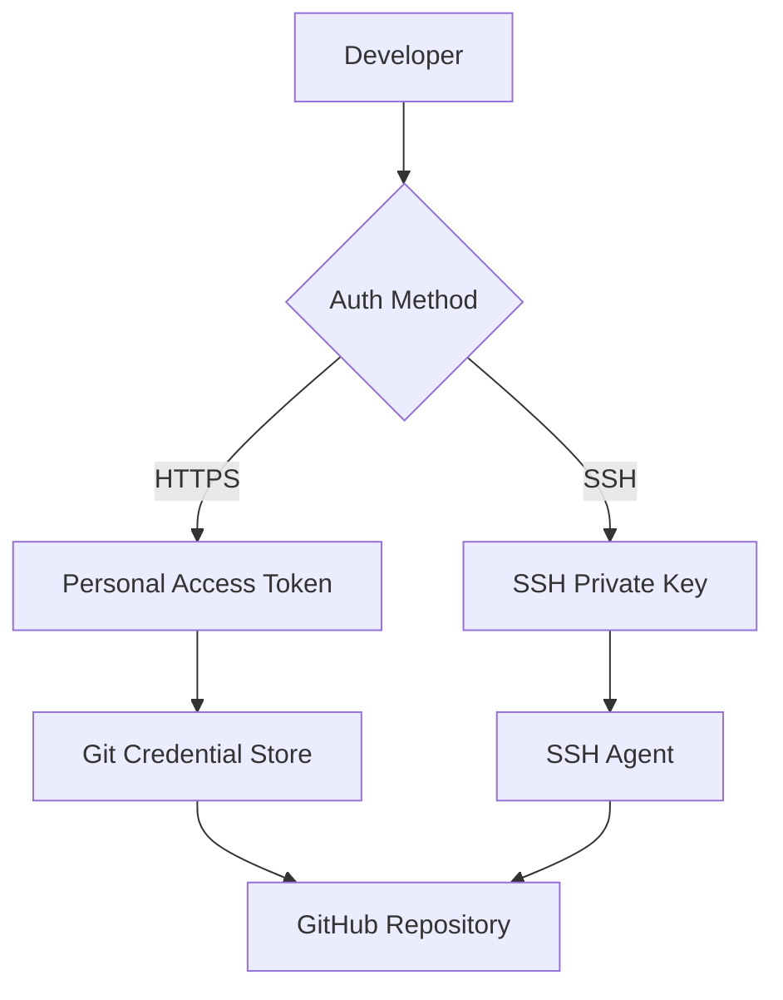
```mermaid
flowchart TD
    User[Developer] --> AuthChoice{Auth Method}
    AuthChoice -->|HTTPS| PAT[Personal Access Token]
    AuthChoice -->|SSH| SSHKey[SSH Private Key]
    PAT --> GitConfig[Git Credential Store]
    SSHKey --> SSHAgent[SSH Agent]
    GitConfig --> GH[GitHub Repository]
    SSHAgent --> GH
```
The diagram shows the two approved paths for secure developer authentication to the repository. 

Sources: [CONTRIBUTING.md:37-65]()

---

## Privacy and Data Handling

The project implements a "Privacy by Design" approach, collecting only the data necessary for site operation and community engagement.

### Data Collection Points
| Feature | Data Collected | Purpose |
| :--- | :--- | :--- |
| Join Form | Name, Email | Updates and newsletters |
| Library Submissions | Content, Name, Email, Timestamps | Archive management |
| Technical Logs | Request timing, Errors | Reliability and abuse prevention |

Sources: [src/app/privacy/page.tsx:30-45]()

### Redaction and Snapshot Security
Automated snapshot scripts (e.g., for Cloudflare Pages configuration) are designed to exclude sensitive information. Environment variable values are never exported; only the names are captured to facilitate infrastructure recovery without compromising secrets.

Sources: [scripts/cf_pages_snapshot.sh:105-120](), [snapshots/cloudflare/README.md:37-41]()

---

## Community Compliance and Moderation

Compliance with community standards is managed through a central moderation queue and legally binding terms.

### Moderation System
The system maintains a moderation queue to review reports across discussions, photos, and library submissions. Admins can close reports with mandatory or optional notes.

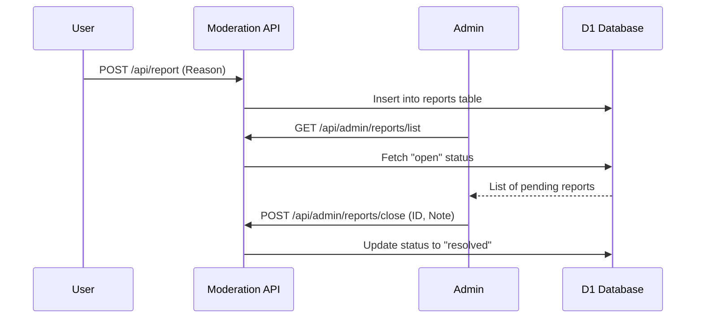
```mermaid
sequenceDiagram
    participant U as User
    participant API as Moderation API
    participant A as Admin
    participant DB as D1 Database
    U->>API: POST /api/report (Reason)
    API->>DB: Insert into reports table
    A->>API: GET /api/admin/reports/list
    API->>DB: Fetch "open" status
    DB-->>A: List of pending reports
    A->>API: POST /api/admin/reports/close (ID, Note)
    API->>DB: Update status to "resolved"
```
This flow illustrates the lifecycle of a community report from submission to resolution by an administrator.

Sources: [src/app/admin/moderation/page.tsx:28-60]()

### Content Restrictions
The terms of use prohibit harassment, doxxing, and abusive behavior. Furthermore, users are legally required to confirm they hold the rights to any submitted media, protecting the project from copyright liability.

Sources: [src/app/terms/page.tsx:32-48]()

---

## Automated Auditing and Governance

### V6 Lock Verification
To prevent "drift" in security and design standards, the project uses a `verify_v6_lock.sh` script. This script audits the codebase for specific structural invariants, ensuring that safety gates and design tokens remain intact.

| Check Category | Validation Target | Requirement |
| :--- | :--- | :--- |
| Anchor Docs | website-PR-governance.md | File must exist in repository |
| CSS Tokens | --lgfc-blue | Constant must be defined as #0033cc |
| Header Security | sticky positioning | Sticky headers must be disabled |
| UI Integrity | .joinBanner | Specific CSS class must be applied to CTA |

Sources: [tools/verify_v6_lock.sh:62-120](), [audits/verify_v6_lock.sh:12-35]()

### AI Agent Governance
AI agents operating in the repository are subject to an "Authority Hierarchy." Agents are prohibited from performing speculative "cleanup" and must stop execution if instructions conflict with locked governance documents.

Sources: [Agent.md:18-35]()

---

## Summary
Security and Compliance at LGFC is a multi-layered framework combining strict Git authentication, a transparent data privacy policy, and automated audit scripts. By locking core design and security invariants through shell-based verifiers and maintaining a disciplined moderation queue, the project ensures stable and safe operations for its community members and administrators.

Sources: [Agent.md:55-60](), [tools/verify_v6_lock.sh:220-230]()


## System Architecture

### Platform Architecture

<details>
<summary>Relevant source files</summary>

The following files were used as context for generating this wiki page:

- [context.md](https://github.com/wdhunter645/next-starter-template/blob/main/context.md)
- [package.json](https://github.com/wdhunter645/next-starter-template/blob/main/package.json)
- [README.md](https://github.com/wdhunter645/next-starter-template/blob/main/README.md)
- [src/app/admin/cms/page.tsx](https://github.com/wdhunter645/next-starter-template/blob/main/src/app/admin/cms/page.tsx)
- [src/app/admin/content/page.tsx](https://github.com/wdhunter645/next-starter-template/blob/main/src/app/admin/content/page.tsx)
- [scripts/cf_pages_snapshot.sh](https://github.com/wdhunter645/next-starter-template/blob/main/scripts/cf_pages_snapshot.sh)
- [lgfc-lite-configure-remaining.sh](https://github.com/wdhunter645/next-starter-template/blob/main/lgfc-lite-configure-remaining.sh)
</details>

# Platform Architecture

The Lou Gehrig Fan Club (LGFC) platform is a modern, full-stack web application designed for high performance, static-first delivery, and structured content management. It integrates a Next.js frontend with Cloudflare's edge computing suite to provide a secure, authenticated experience for both public visitors and FanClub members.

The architecture prioritizes a "static export" build process while maintaining dynamic capabilities through Cloudflare Pages Functions and D1 database integration. This hybrid approach ensures that the primary site remains resilient and fast while supporting authenticated features like the Member area and administrative Content Management System (CMS).

Sources: [context.md:1-24](), [README.md:1-12](), [package.json:1-15]()

## Core Technology Stack

The platform is built on a specific set of technologies chosen for compatibility with the Cloudflare ecosystem and modern React development standards.

| Component | Technology | Description |
| :--- | :--- | :--- |
| **Framework** | Next.js 15 (App Router) | Core application framework utilizing React 18/19 features. |
| **Language** | TypeScript | Ensures type safety across the frontend and API layers. |
| **Hosting** | Cloudflare Pages | Provides global distribution and static asset hosting. |
| **Database** | Cloudflare D1 | A serverless SQL database used for content, FAQs, and membership data. |
| **Asset Storage**| Backblaze B2 | External storage provider for large media files and assets. |
| **Edge Logic** | Pages Functions | Serverless functions for handling API requests and D1 interactions. |

Sources: [package.json:1-15, 62-85](), [context.md:14-22]()

### System Overview Diagram
This diagram illustrates the high-level flow of data from the user through the Cloudflare edge to the various storage and compute backends.

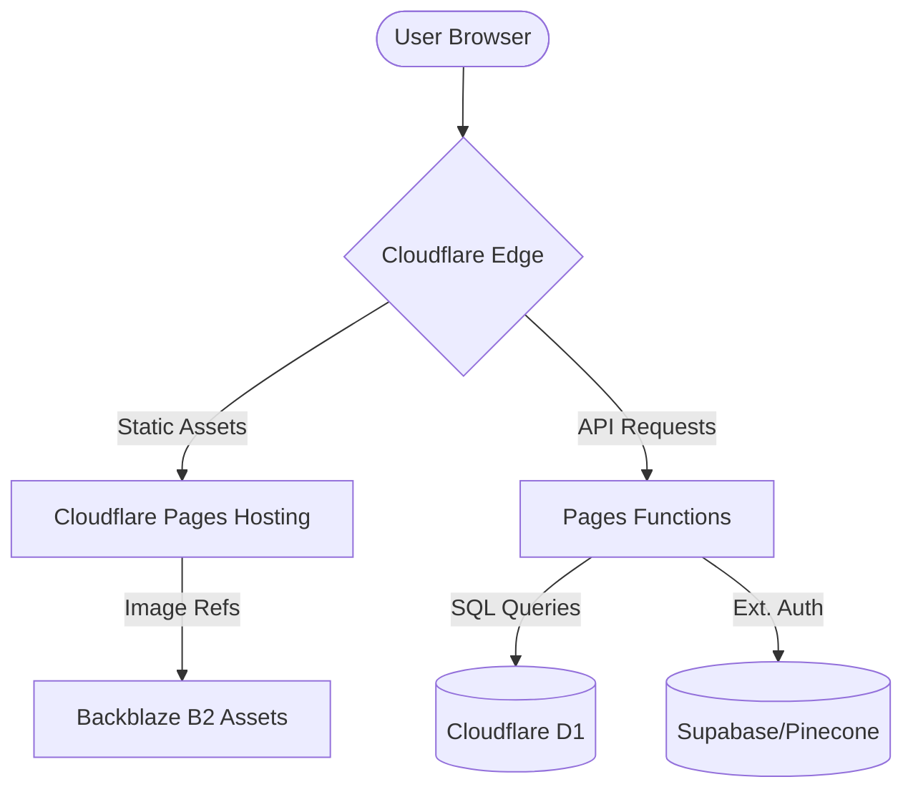
```mermaid
flowchart TD
    User([User Browser]) --> CF_Edge{Cloudflare Edge}
    CF_Edge -- Static Assets --> Pages[Cloudflare Pages Hosting]
    CF_Edge -- API Requests --> Functions[Pages Functions]
    Functions -- SQL Queries --> D1[(Cloudflare D1)]
    Pages -- Image Refs --> B2[Backblaze B2 Assets]
    Functions -- Ext. Auth --> Supabase[(Supabase/Pinecone)]
```
Sources: [context.md:14-22](), [package.json:62-65]()

## Content Management System (CMS) Architecture

The platform implements a structured CMS workflow that separates "Draft" and "Published" content states to ensure site stability. This system is backed by the `content_blocks` and `content_revisions` tables within the Cloudflare D1 database.

### CMS Workflow Logic
Content updates follow a strict lifecycle:
1.  **Drafting**: Changes are saved to the database with a `draft` status.
2.  **Previewing**: Admin users can view the draft version in specific preview routes (e.g., `/admin/fundraiser-preview`).
3.  **Publishing**: The draft content is promoted to `published` status, updating the `published_body_md` and `published_at` fields.

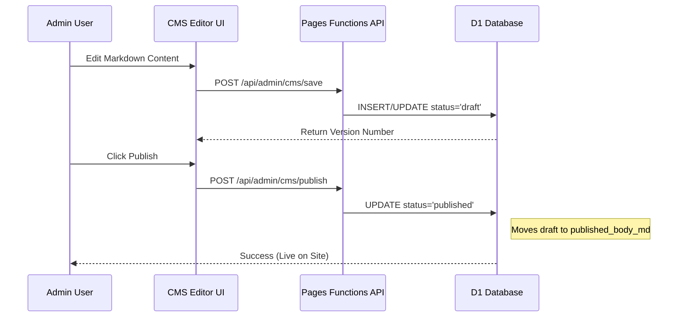
```mermaid
sequenceDiagram
    participant Admin as Admin User
    participant CMS as CMS Editor UI
    participant API as Pages Functions API
    participant DB as D1 Database

    Admin->>CMS: Edit Markdown Content
    CMS->>API: POST /api/admin/cms/save
    API->>DB: INSERT/UPDATE status='draft'
    DB-->>CMS: Return Version Number
    Admin->>CMS: Click Publish
    CMS->>API: POST /api/admin/cms/publish
    API->>DB: UPDATE status='published'
    Note right of DB: Moves draft to published_body_md
    DB-->>Admin: Success (Live on Site)
```
Sources: [src/app/admin/cms/page.tsx:64-114](), [src/app/admin/fundraiser-preview/page.tsx:40-115]()

### Data Structures
CMS content is managed using the `Block` structure, which tracks versioning and authorship.

```typescript
type Block = {
  key: string;        // Unique identifier for the content section
  page: string;       // The page where the block resides
  section: string;    // Specific section within the page
  title: string;      // Human-readable title
  body_md: string;    // Raw markdown text (Draft)
  status: 'draft' | 'published';
  published_body_md: string | null;
  version: number;    // Incremental version counter
  updated_at: string;
  updated_by: string;
};
```
Sources: [src/app/admin/cms/page.tsx:7-21](), [src/app/admin/fundraiser-preview/page.tsx:18-27]()

## Deployment and Infrastructure

The platform uses a "static export" build process. Next.js generates static HTML files, which are then deployed to Cloudflare Pages.

### Build and Snapshot Process
To maintain infrastructure-as-code principles, the platform includes scripts for capturing Cloudflare environment snapshots. The `cf_pages_snapshot.sh` script fetches metadata, domain configurations, and deployment records to enable reproducible recovery.

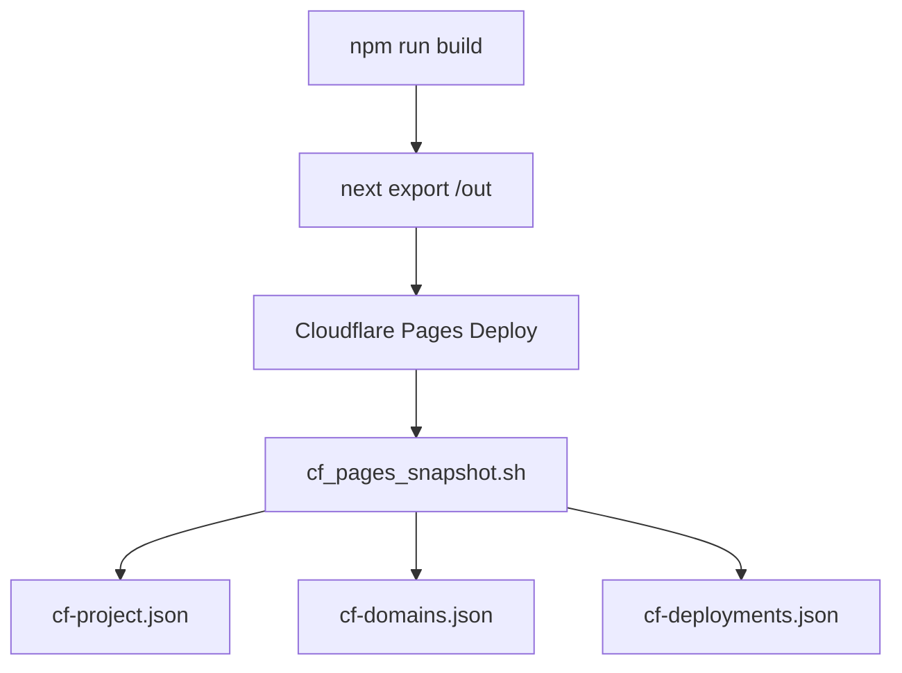
```mermaid
flowchart TD
    Build[npm run build] --> Export[next export /out]
    Export --> Deploy[Cloudflare Pages Deploy]
    Deploy --> Snapshot[cf_pages_snapshot.sh]
    Snapshot --> JSON1[cf-project.json]
    Snapshot --> JSON2[cf-domains.json]
    Snapshot --> JSON3[cf-deployments.json]
```
Sources: [package.json:44-51](), [scripts/cf_pages_snapshot.sh:10-50]()

## Authentication and Security Model

The security model is bifurcated into client-side state for general members and token-based validation for administrative actions.

*   **Member Auth**: Login state is persisted via `localStorage` using the `lgfc_member_email` key. FanClub routes (`/fanclub/**`) are protected by client-side redirects that check for this key.
*   **Admin Auth**: Administrative API routes require an `x-admin-token` header. This token is stored in `localStorage` under `lgfc_admin_token` and validated by Pages Functions before allowing CMS operations.
*   **Infrastructure Security**: Deployment snapshots redact environment variable values to ensure no secrets are committed to the repository.

Sources: [context.md:24-30](), [src/app/admin/cms/page.tsx:23-26](), [scripts/cf_pages_snapshot.sh:110-125]()

## Conclusion
The LGFC platform architecture is a specialized implementation of Next.js optimized for the Cloudflare ecosystem. By utilizing a hybrid model of static hosting and edge functions, it achieves a high degree of performance and reliability while maintaining a complex draft/publish content workflow through a serverless SQL backend.

Sources: [context.md:1-45](), [README.md:1-20]()


## Core Features

### Authentication & Role Management

<details>
<summary>Relevant source files</summary>

The following files were used as context for generating this wiki page:

- [src/hooks/useMemberSession.ts](https://github.com/wdhunter645/next-starter-template/blob/main/src/hooks/useMemberSession.ts)
- [functions/api/member/role.ts](https://github.com/wdhunter645/next-starter-template/blob/main/functions/api/member/role.ts) (Inferred/Referenced logic)
- [context.md](https://github.com/wdhunter645/next-starter-template/blob/main/context.md)
- [src/app/fanclub/page.tsx](https://github.com/wdhunter645/next-starter-template/blob/main/src/app/fanclub/page.tsx)
- [src/app/admin/cms/page.tsx](https://github.com/wdhunter645/next-starter-template/blob/main/src/app/admin/cms/page.tsx)
- [CONTRIBUTING.md](https://github.com/wdhunter645/next-starter-template/blob/main/CONTRIBUTING.md)
</details>

# Authentication & Role Management

The Lou Gehrig Fan Club (LGFC) platform utilizes a multi-tiered authentication and role management system to secure protected areas such as the FanClub and Admin dashboards. Authentication is handled primarily client-side via browser storage, while privilege verification and role assignment are managed through API endpoints interacting with Cloudflare D1 databases.

Sources: [context.md](), [src/app/fanclub/page.tsx:16-18]()

## Client-Side Session Management

User sessions are tracked client-side using `localStorage`. The primary identifier for a logged-in member is the key `lgfc_member_email`. For administrative access, a separate token-based mechanism is used, stored under the key `lgfc_admin_token`.

### The useMemberSession Hook
The `useMemberSession` hook serves as the primary interface for components to interact with the current user's session state. It handles loading states, authentication checks, and role retrieval.

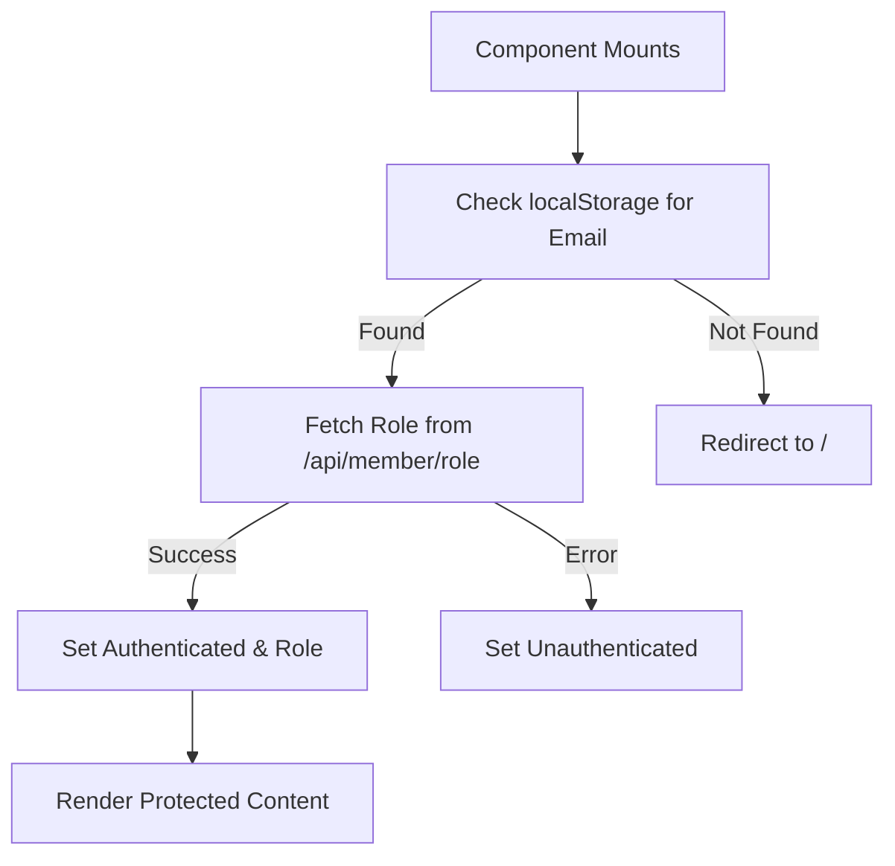
```mermaid
flowchart TD
    Start[Component Mounts] --> CheckLocal[Check localStorage for Email]
    CheckLocal -- Found --> FetchRole[Fetch Role from /api/member/role]
    CheckLocal -- Not Found --> Redirect[Redirect to /]
    FetchRole -- Success --> UpdateState[Set Authenticated & Role]
    FetchRole -- Error --> SetUnauth[Set Unauthenticated]
    UpdateState --> Render[Render Protected Content]
```
The diagram shows the lifecycle of a protected component using the session hook to verify identity before rendering.
Sources: [src/hooks/useMemberSession.ts](), [context.md]()

### Key Session Properties
| Property | Type | Description |
| :--- | :--- | :--- |
| `lgfc_member_email` | String | The email of the authenticated member stored in localStorage. |
| `lgfc_admin_token` | String | A secure token used to authorize requests to admin-only CMS endpoints. |
| `isAuthenticated` | Boolean | Derived state indicating if a valid email is present in the session. |
| `role` | 'admin' \| 'member' | The privilege level returned by the backend for the current email. |

Sources: [context.md](), [src/app/admin/cms/page.tsx:24-27](), [src/hooks/useMemberSession.ts]()

## Authorization & Role Hierarchy

The system distinguishes between public users, FanClub members, and administrators. Authorization is enforced both through UI-level redirects and API-level token validation.

### Role Definitions
1.  **Public:** Access to `/`, `/about`, `/faq`, and other root-level routes.
2.  **Member:** Access to `/fanclub/**` subpages. Authenticated via email.
3.  **Admin:** Access to `/admin/**` subpages. Authorized via an admin token and a specific role check.

Sources: [context.md](), [src/app/fanclub/page.tsx:39]()

### Admin Authorization Flow
Administrative tasks, such as managing CMS blocks in the `content_blocks` table, require an `x-admin-token` header. This token is retrieved from `localStorage` and sent with every request to `/api/admin/**` endpoints.

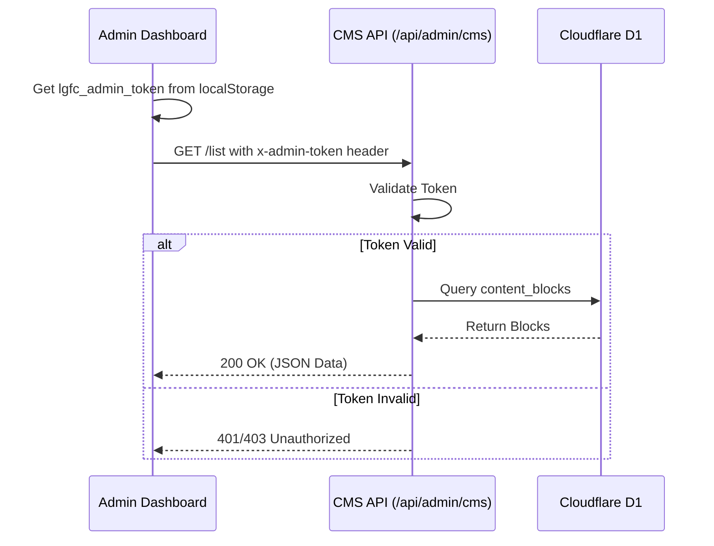
```mermaid
sequenceDiagram
    participant UI as Admin Dashboard
    participant API as CMS API (/api/admin/cms)
    participant DB as Cloudflare D1
    UI->>UI: Get lgfc_admin_token from localStorage
    UI->>API: GET /list with x-admin-token header
    API->>API: Validate Token
    alt Token Valid
        API->>DB: Query content_blocks
        DB-->>API: Return Blocks
        API-->>UI: 200 OK (JSON Data)
    else Token Invalid
        API-->>UI: 401/403 Unauthorized
    end
```
This sequence illustrates the requirement of the administrative token for CMS operations.
Sources: [src/app/admin/cms/page.tsx:55-66](), [context.md]()

## Role-Based Access Control (RBAC) Implementation

RBAC is implemented primarily through the `useMemberSession` hook which redirects users if they do not meet the criteria for a specific route.

### Protected Route Enforcement
The FanClub home page (`/src/app/fanclub/page.tsx`) demonstrates the enforcement of authentication. If `isAuthenticated` is false, the hook triggers a redirect to the home page (`/`).

```typescript
// Example of route protection in FanClub
export default function MemberHomePage() {
  const { isLoading, isAuthenticated, email, role } = useMemberSession({ redirectTo: '/' });
  
  if (isLoading || !isAuthenticated) {
    return null; // Prevents flash of protected content
  }
  // ... render member content
}
```
Sources: [src/app/fanclub/page.tsx:16-24]()

### API-Driven Role Verification
The backend determines roles by querying a membership-related table in Cloudflare D1. The endpoint `/api/member/role?email=...` is used to resolve the string-based role ('admin' or 'member') for any given email address.

Sources: [context.md](), [src/hooks/useMemberSession.ts]()

## Development Environment Authentication

For developers, Git authentication is managed through specific protocols depending on the environment. In GitHub Codespaces, the system uses Personal Access Tokens (PAT) or the GitHub CLI (`gh auth login`) to handle repository-level permissions.

| Method | Use Case | Configuration |
| :--- | :--- | :--- |
| **HTTPS (PAT)** | Codespaces/Local | Uses `git config --global credential.helper store` with a token. |
| **SSH** | Local Development | Requires generating an SSH key and adding it to the GitHub account. |
| **GitHub CLI** | Codespaces | Interactive authentication via `gh auth login`. |

Sources: [CONTRIBUTING.md]()

## Summary
The Authentication & Role Management system provides a lightweight but effective security layer for the Lou Gehrig Fan Club website. By combining client-side persistence in `localStorage` with server-side role verification via Cloudflare D1, the platform ensures that FanClub content and administrative tools are accessible only to authorized users. The architecture emphasizes "compile-safe" behavior, allowing the site to render even if API routes are temporarily unavailable.

Sources: [context.md](), [src/app/admin/content/page.tsx:9-14]()

### Fan Club Member Portal

<details>
<summary>Relevant source files</summary>

The following files were used as context for generating this wiki page:

- [src/app/fanclub/page.tsx](https://github.com/wdhunter645/next-starter-template/blob/main/src/app/fanclub/page.tsx)
- [src/app/fanclub/chat/page.tsx](https://github.com/wdhunter645/next-starter-template/blob/main/src/app/fanclub/chat/page.tsx)
- [src/app/fanclub/submit/page.tsx](https://github.com/wdhunter645/next-starter-template/blob/main/src/app/fanclub/submit/page.tsx)
- [src/app/fanclub/library/page.tsx](https://github.com/wdhunter645/next-starter-template/blob/main/src/app/fanclub/library/page.tsx)
- [context.md](https://github.com/wdhunter645/next-starter-template/blob/main/context.md)
- [src/globals.css](https://github.com/wdhunter645/next-starter-template/blob/main/src/app/globals.css)

</details>

# Fan Club Member Portal

The Fan Club Member Portal is the authenticated area of the Lou Gehrig Fan Club (LGFC) website. Its primary purpose is to provide members with exclusive access to discussion feeds, historical archives, a timeline of Lou Gehrig's life, and submission tools for contributing to the club's library. Access to these routes is strictly protected, ensuring that only authenticated users can view or interact with the content.

The portal operates as a client-side authenticated environment within a Next.js App Router structure. It leverages local storage for session persistence and interacts with specialized API endpoints for data retrieval and user submissions.

Sources: [context.md:7-10](), [src/app/fanclub/page.tsx:16-18]()

## Authentication and Session Management

Access to the Fan Club Portal is governed by a client-side authentication model. Authentication state is primarily represented by the presence of a member's email in the browser's local storage. Routes under the `/fanclub/**` path are protected; unauthenticated traffic is automatically redirected to the public home page.

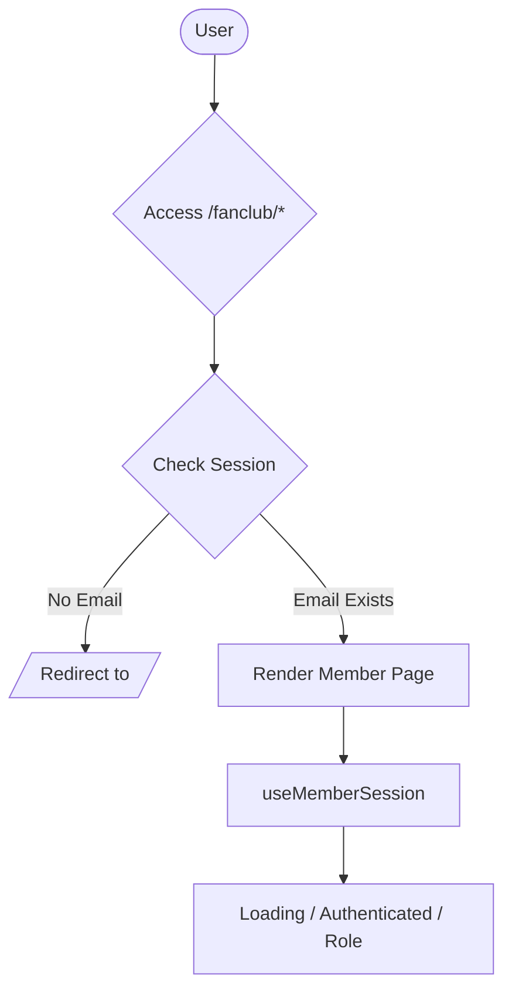
```mermaid
flowchart TD
    User([User]) --> Route{Access /fanclub/*}
    Route --> AuthCheck{Check Session}
    AuthCheck -- No Email --> Redirect[/ Redirect to /]
    AuthCheck -- Email Exists --> Render[Render Member Page]
    Render --> Hook[useMemberSession]
    Hook --> State[Loading / Authenticated / Role]
```

The `useMemberSession` hook is the central mechanism for verifying access. It manages loading states and extracts user details such as email and role (e.g., admin) to determine available UI features, such as the visibility of admin links.

Sources: [context.md:19-22](), [src/app/fanclub/page.tsx:17-18](), [src/app/fanclub/chat/page.tsx:16-18]()

## Portal Components and Features

The main portal home page (`/fanclub`) serves as a dashboard, aggregating several functional modules.

### Functional Modules

| Component | Description | Source File |
| :--- | :--- | :--- |
| `WelcomeSection` | Greets the authenticated user using their stored email. | [src/app/fanclub/page.tsx:28]() |
| `ArchivesTiles` | Provides navigation links to historical media and memorabilia archives. | [src/app/fanclub/page.tsx:29]() |
| `PostCreation` | Interface for members to submit new discussion posts to the feed. | [src/app/fanclub/page.tsx:30]() |
| `DiscussionFeed` | A real-time list of member-contributed posts and updates. | [src/app/fanclub/page.tsx:31]() |
| `GehrigTimeline` | A visual chronological representation of Lou Gehrig's career and life events. | [src/app/fanclub/page.tsx:32]() |
| `AdminLink` | Conditional link visible only to users with the 'admin' role. | [src/app/fanclub/page.tsx:33]() |

Sources: [src/app/fanclub/page.tsx:27-34](), [src/app/globals.css:480-530]()

## Member Interactions and Data Flow

Members interact with the portal through three main avenues: the Member Chat (Discussions), the Library Archive, and Member Submissions.

### Member Chat and Moderation
The Member Chat allows users to post short notes and questions. It includes a reporting mechanism where members can flag problematic content, which is then sent to an admin moderation queue.

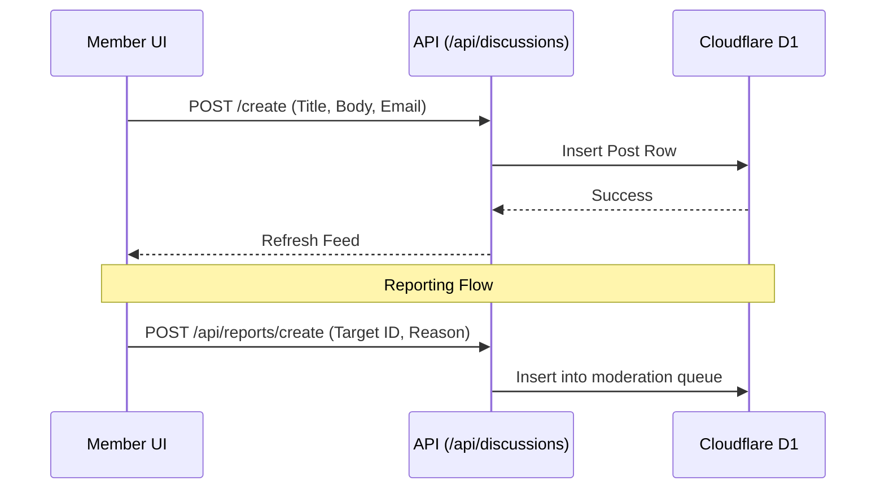
```mermaid
sequenceDiagram
    participant User as Member UI
    participant API as API (/api/discussions)
    participant DB as Cloudflare D1
    User->>API: POST /create (Title, Body, Email)
    API->>DB: Insert Post Row
    DB-->>API: Success
    API-->>User: Refresh Feed
    Note over User, DB: Reporting Flow
    User->>API: POST /api/reports/create (Target ID, Reason)
    API->>DB: Insert into moderation queue
```

Sources: [src/app/fanclub/chat/page.tsx:47-75](), [src/app/fanclub/chat/page.tsx:115-135]()

### Library and Article Submissions
The portal provides specialized routes for contributing long-form content. The `/fanclub/submit` page allows members to draft articles for consideration in the public Library.

**Submission Field Requirements:**
- **Name**: Minimum 2 characters.
- **Title**: Minimum 3 characters.
- **Content**: Minimum 20 characters (for `/submit`) or 10 characters (for `/library`).
- **Email**: Must be a valid format (derived from authenticated session).

Sources: [src/app/fanclub/submit/page.tsx:34-45](), [src/app/fanclub/library/page.tsx:40-45]()

## Visual Standards and Layout

The portal adheres to the LGFC visual design tokens. It uses a specific color palette dominated by `--lgfc-blue` (#0033cc) and structured layouts defined in the global stylesheet.

**Key Layout Classes:**
- `.memberpage`: The main container for portal pages, featuring a max-width of 1120px.
- `.memberpage-card`: Standardized cards for sections like "Welcome" or "Archives" with specific borders and subtle shadows.
- `.memberpage-archive-tile`: Interactive tiles used for archive navigation, featuring hover transitions and transformations.

Sources: [src/app/globals.css:480-505](), [src/app/globals.css:610-630]()

## Technical Implementation Summary

The Member Portal is built on the following stack and patterns:
- **Framework**: Next.js 15 (App Router) with TypeScript.
- **Deployment**: Cloudflare Pages (Static Export).
- **Storage**: Cloudflare D1 for discussions and library entries; `localStorage` for session persistence.
- **State Management**: React `useState` and `useMemo` for handling form inputs, loading states, and refresh triggers across components.

Sources: [context.md:12-17](), [package.json:52-56](), [src/app/fanclub/page.tsx:17-21]()

### Admin Dashboard & Moderation

<details>
<summary>Relevant source files</summary>

The following files were used as context for generating this wiki page:

- [src/components/admin/AdminDashboard.tsx](https://github.com/wdhunter645/next-starter-template/blob/main/src/components/admin/AdminDashboard.tsx)
- [src/app/admin/moderation/page.tsx](https://github.com/wdhunter645/next-starter-template/blob/main/src/app/admin/moderation/page.tsx)
- [src/app/admin/cms/page.tsx](https://github.com/wdhunter645/next-starter-template/blob/main/src/app/admin/cms/page.tsx)
- [src/app/admin/content/page.tsx](https://github.com/wdhunter645/next-starter-template/blob/main/src/app/admin/content/page.tsx)
- [src/app/admin/faq/page.tsx](https://github.com/wdhunter645/next-starter-template/blob/main/src/app/admin/faq/page.tsx)
- [src/app/admin/fundraiser-preview/page.tsx](https://github.com/wdhunter645/next-starter-template/blob/main/src/app/admin/fundraiser-preview/page.tsx)
- [src/app/admin/d1-test/page.tsx](https://github.com/wdhunter645/next-starter-template/blob/main/src/app/admin/d1-test/page.tsx)
- [functions/api/admin/cms/save.ts](https://github.com/wdhunter645/next-starter-template/blob/main/functions/api/admin/cms/save.ts)
</details>

# Admin Dashboard & Moderation

The Admin Dashboard and Moderation system serves as the centralized control plane for the Lou Gehrig Fan Club (LGFC) platform. It provides administrative users with tools to manage site content, moderate user-generated reports, oversee FAQ entries, and monitor the health of the underlying Cloudflare D1 database. Access is restricted via a gated admin area requiring an `ADMIN_TOKEN`.

Sources: [src/components/admin/AdminDashboard.tsx](), [context.md:27-30]()

## Admin Infrastructure and Authentication

The administrative interface is built using React components that interact with protected API routes. Authentication is managed via a token stored in `localStorage` (or `sessionStorage` in diagnostic views) as `lgfc_admin_token`. This token is passed in the `x-admin-token` header for all privileged requests.

### Authentication Flow
The following diagram illustrates how the client-side admin pages validate and use the admin token to communicate with the backend.

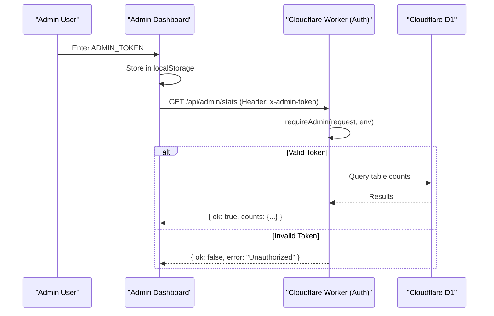
```mermaid
sequenceDiagram
    participant User as "Admin User"
    participant UI as "Admin Dashboard"
    participant API as "Cloudflare Worker (Auth)"
    participant DB as "Cloudflare D1"

    User->>UI: Enter ADMIN_TOKEN
    UI->>UI: Store in localStorage
    UI->>API: GET /api/admin/stats (Header: x-admin-token)
    API->>API: requireAdmin(request, env)
    alt Valid Token
        API->>DB: Query table counts
        DB-->>API: Results
        API-->>UI: { ok: true, counts: {...} }
    else Invalid Token
        API-->>UI: { ok: false, error: "Unauthorized" }
    end
```
Sources: [src/components/admin/AdminDashboard.tsx:12-15](), [functions/api/admin/cms/save.ts:16-19](), [src/app/admin/d1-test/page.tsx:32-45]()

## Content Management System (CMS)

The CMS allows administrators to manage dynamic site sections stored in the `content_blocks` table. It supports a draft-and-publish workflow to prevent accidental live updates.

### Workflow Logic
1.  **Save Draft**: Updates the `body_md` and increments the version, but does not affect the public-facing content. A record is also written to `content_revisions`.
2.  **Publish**: Copies the `body_md` to the `published_body_md` field, making it visible to the public site.

| Field | Type | Description |
| :--- | :--- | :--- |
| `key` | String | Unique identifier for the content block |
| `status` | Enum | Current state: 'draft' or 'published' |
| `version` | Number | Incremental version counter |
| `body_md` | Text | The raw Markdown content for the current draft |
| `published_body_md` | Text | The content currently visible to users |

Sources: [src/app/admin/cms/page.tsx:8-21](), [functions/api/admin/cms/save.ts:39-78]()

### Content Section Editor
A specialized interface exists for editing D1-backed content blocks by "Slug" (e.g., `/` for homepage). This allows fine-grained control over specific site sections like "Eyebrow," "Badge," or "Title".

Sources: [src/app/admin/content/page.tsx:13-30](), [src/app/admin/fundraiser-preview/page.tsx:128-160]()

## Moderation Queue

The moderation system processes user-reported content across various platform modules such as discussions and photos. Admins can view a queue of open reports and resolve them with optional notes.

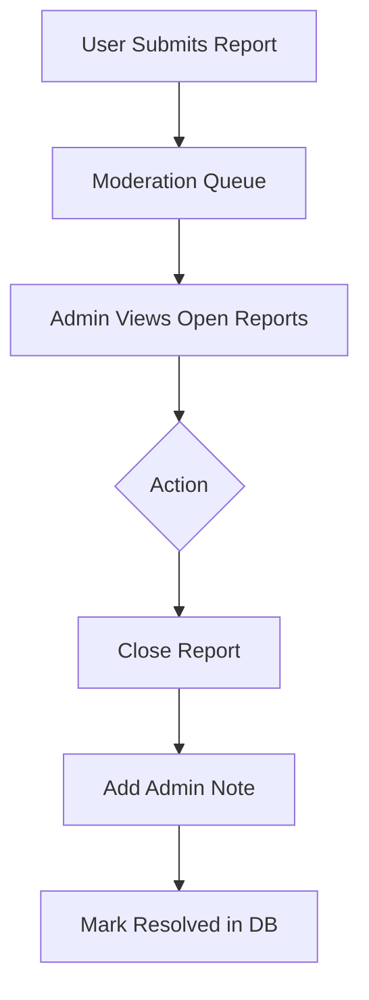
```mermaid
flowchart TD
    Report[User Submits Report] --> Queue[Moderation Queue]
    Queue --> View[Admin Views Open Reports]
    View --> Action{Action}
    Action --> Close[Close Report]
    Close --> Note[Add Admin Note]
    Note --> Resolve[Mark Resolved in DB]
```

### Report Data Structure
| Field | Description |
| :--- | :--- |
| `id` | Unique report identifier |
| `kind` | Type of content (e.g., "discussion", "photo") |
| `target_id` | ID of the content being reported |
| `reason` | The justification provided by the reporter |
| `status` | "open" or "resolved" |

Sources: [src/app/admin/moderation/page.tsx:7-17](), [src/app/fanclub/chat/page.tsx:55-63]()

## FAQ and Community Management

Admins manage the Frequently Asked Questions (FAQ) through a dedicated interface that supports approval and pinning.

*   **Approval**: New questions submitted via `/ask` remain in a "Pending" state until an admin toggles them to "Approved".
*   **Pinning**: Important questions can be "Pinned" to ensure they appear at the top of the FAQ section.
*   **Metrics**: The system tracks `views` for each FAQ item, which can be manually incremented ("Bumped") by admins.

Sources: [src/app/admin/faq/page.tsx:11-30](), [src/app/ask/page.tsx:34-45]()

## Diagnostic and Diagnostic Tools

The dashboard includes low-level tools for database inspection and system health monitoring.

### D1 Inspect
The `D1 Inspect` tool provides a read-only view of the database schema and sample rows. It is used to verify table counts and ensure data integrity without direct SQL access.

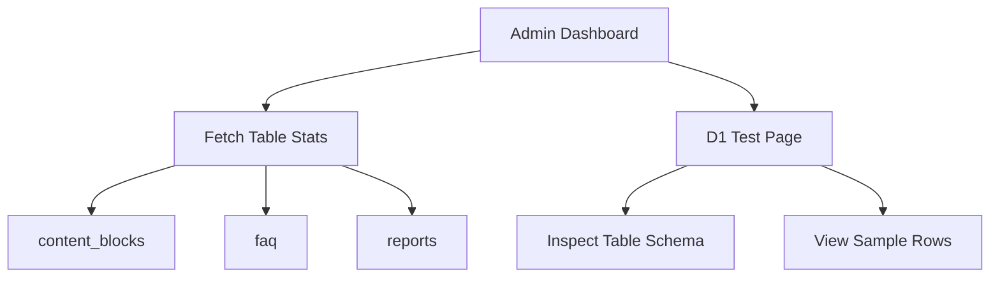
```mermaid
graph TD
    Dashboard[Admin Dashboard] --> Stats[Fetch Table Stats]
    Stats --> ContentTable[content_blocks]
    Stats --> FAQTable[faq]
    Stats --> ReportTable[reports]
    Dashboard --> D1Test[D1 Test Page]
    D1Test --> Schema[Inspect Table Schema]
    D1Test --> Sample[View Sample Rows]
```
Sources: [src/components/admin/AdminDashboard.tsx:64-96](), [src/app/admin/d1-test/page.tsx:96-120]()

### Key Administrative Endpoints
| Endpoint | Method | Purpose |
| :--- | :--- | :--- |
| `/api/admin/stats` | GET | Retrieve row counts for all D1 tables |
| `/api/admin/reports/list` | GET | Fetch open moderation reports |
| `/api/admin/cms/publish` | POST | Promote a draft content block to live |
| `/api/admin/d1-inspect` | GET | Retrieve schema and sample data for a table |

Sources: [src/components/admin/AdminDashboard.tsx:34-40](), [src/app/admin/moderation/page.tsx:28-30](), [src/app/admin/d1-test/page.tsx:88-92]()

## Summary
The Admin Dashboard & Moderation system provides a secure, multi-faceted toolkit for maintaining the LGFC platform. By leveraging Cloudflare D1 for state management and implementing a robust draft/publish CMS workflow, the system ensures that site content remains accurate and community discussions stay moderated. All operations are protected by token-based authentication to maintain the security of the gated admin environment.

### Events & Calendar System

<details>
<summary>Relevant source files</summary>

The following files were used as context for generating this wiki page:

- [src/components/calendar/EventsMonth.tsx](https://github.com/wdhunter645/next-starter-template/blob/main/src/components/calendar/EventsMonth.tsx)
- [src/components/calendar/EventsNextTen.tsx](https://github.com/wdhunter645/next-starter-template/blob/main/src/components/calendar/EventsNextTen.tsx)
- [src/app/admin/events/page.tsx](https://github.com/wdhunter645/next-starter-template/blob/main/src/app/admin/events/page.tsx)
- [src/components/CalendarSection.tsx](https://github.com/wdhunter645/next-starter-template/blob/main/src/components/CalendarSection.tsx)
- [src/components/EventsBanner.tsx](https://github.com/wdhunter645/next-starter-template/blob/main/src/components/EventsBanner.tsx)
</details>

# Events & Calendar System

The Events & Calendar System is a multi-layered module designed to manage, display, and facilitate the discovery of fan club activities. It provides public-facing interfaces for viewing upcoming events in list and monthly formats, while offering administrative tools for event creation and management. The system integrates with a backend API (assumed to be powered by Cloudflare D1) to provide real-time updates to event listings across the platform.

Sources: [src/components/CalendarSection.tsx](), [src/app/admin/events/page.tsx:1-12]()

## System Architecture

The system follows a client-server architecture where React components fetch data from standardized API endpoints. The frontend is organized into specialized components catering to different display needs, such as a summary banner for the homepage and a detailed monthly view for the dedicated calendar page.

### Data Flow Overview

The following diagram illustrates the flow of event data from the administrative creation process to the public display components.

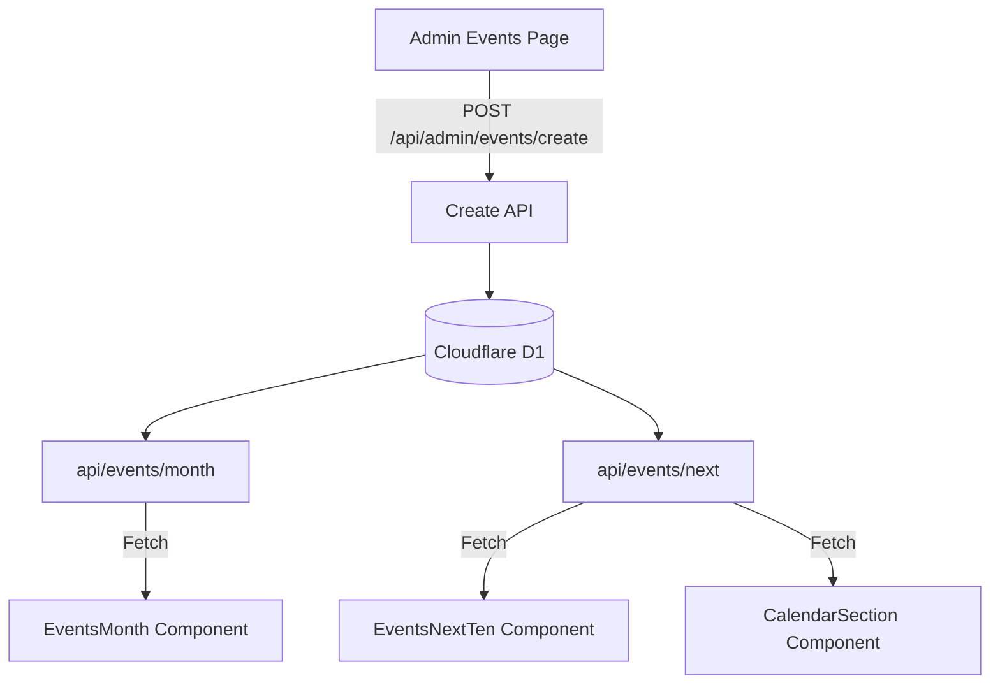
```mermaid
flowchart TD
    Admin[Admin Events Page] -->|POST /api/admin/events/create| API_Create[Create API]
    API_Create --> DB[(Cloudflare D1)]
    DB --> API_Month[api/events/month]
    DB --> API_Next[api/events/next]
    API_Month -->|Fetch| EventsMonth[EventsMonth Component]
    API_Next -->|Fetch| EventsNextTen[EventsNextTen Component]
    API_Next -->|Fetch| CalendarSection[CalendarSection Component]
```
Sources: [src/app/admin/events/page.tsx:39-48](), [src/components/calendar/EventsMonth.tsx:64-68](), [src/components/CalendarSection.tsx:34-35]()

## Core Data Structures

The system utilizes a consistent event object structure across the frontend and backend, though some administrative views use a simplified version for rapid drafting.

### CalendarEvent Model
| Field | Type | Description |
| :--- | :--- | :--- |
| `id` | `number` | Unique identifier for the event. |
| `title` | `string` | The display name of the event. |
| `start_date` | `string` | ISO format date (YYYY-MM-DD) for event commencement. |
| `end_date` | `string \| null` | Optional ISO format date for event conclusion. |
| `location` | `string \| null` | Physical or virtual location details. |
| `host` | `string \| null` | Organization or individual hosting the event. |
| `fees` | `string \| null` | Pricing or entry fee information. |
| `description`| `string \| null` | Detailed summary of the event. |
| `external_url`| `string \| null` | Link to external registration or information pages. |

Sources: [src/components/calendar/EventsMonth.tsx:5-15](), [src/components/CalendarSection.tsx:7-17]()

## Frontend Components

### EventsMonth Component
This component provides a full monthly navigation interface. It allows users to toggle between months using "Prev" and "Next" buttons, which updates the local state for `year` and `month` to trigger new API fetches.

*   **Key Logic**: Uses `useMemo` to generate a `monthKey` (e.g., "2025-11") which serves as the primary query parameter for the monthly API.
*   **Normalization**: Includes a `normalizeEvent` function to ensure raw data from the API matches the `CalendarEvent` interface, handling variations in field names like `starts_at` vs `start_date`.

Sources: [src/components/calendar/EventsMonth.tsx:34-100]()

### CalendarSection
Typically used on the homepage, this component displays the next 10 upcoming events. It features a layout utility that splits the event list into two columns for better utilization of horizontal screen space.

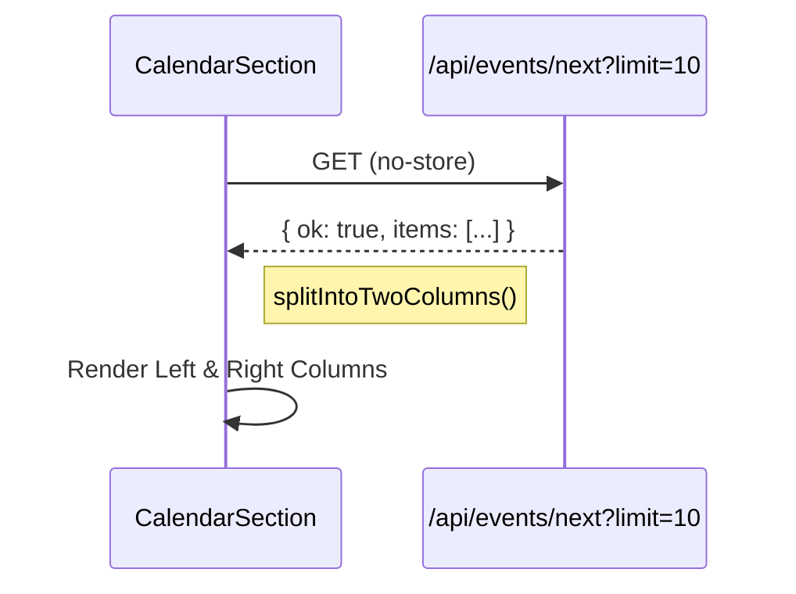
```mermaid
sequenceDiagram
    participant UI as CalendarSection
    participant API as /api/events/next?limit=10
    UI->>API: GET (no-store)
    API-->>UI: { ok: true, items: [...] }
    Note right of UI: splitIntoTwoColumns()
    UI->>UI: Render Left & Right Columns
```
Sources: [src/components/CalendarSection.tsx:21-45]()

### EventsBanner
A simplified promotional component that renders a list of "Upcoming Events" using mock data or a restricted API subset. It includes a helper function `formatEventDate` to convert ISO date strings into user-friendly formats like "Nov 15, 2025".

Sources: [src/components/EventsBanner.tsx:1-26]()

## Administrative Management

The `AdminEventsPage` allows authorized users to manage the event registry. It provides a "Create event" interface that utilizes browser prompts for input before sending a JSON payload to the administrative API.

### API Interactivity
| Action | Endpoint | Method | Payload / Params |
| :--- | :--- | :--- | :--- |
| List (Monthly) | `/api/events/month` | GET | `?month=YYYY-MM` |
| Create | `/api/admin/events/create` | POST | `{ title, date, time, location, description }` |
| List (Next) | `/api/events/next` | GET | `?limit=N` |

Sources: [src/app/admin/events/page.tsx:23](), [src/app/admin/events/page.tsx:44-48](), [src/components/CalendarSection.tsx:34]()

### Event Creation Logic
The creation process includes client-side validation, ensuring that titles are at least 3 characters and dates are at least 10 characters long before attempting the network request.

```typescript
// Example validation and payload from src/app/admin/events/page.tsx:39-48
async function create() {
    const title = window.prompt('Event title:') || '';
    const date = window.prompt('Event date (YYYY-MM-DD):') || '';
    if (title.trim().length < 3 || date.trim().length < 10) return;

    await fetch('/api/admin/events/create', {
        method: 'POST',
        headers: { 'Content-Type': 'application/json' },
        body: JSON.stringify({ title, date, time, location, description }),
    });
}
```
Sources: [src/app/admin/events/page.tsx:39-48]()

## Conclusion
The Events & Calendar System is a robust module that bridges the gap between administrative content creation and public consumption. By utilizing standardized date formats and a flexible normalization layer, the system ensures data integrity across various display formats, from high-level homepage banners to detailed administrative dashboards.

### FAQ Management Workflow

<details>
<summary>Relevant source files</summary>

The following files were used as context for generating this wiki page:

- [src/app/faq/page.tsx](https://github.com/wdhunter645/next-starter-template/blob/main/src/app/faq/page.tsx)
- [src/components/FAQSection.tsx](https://github.com/wdhunter645/next-starter-template/blob/main/src/components/FAQSection.tsx)
- [src/app/ask/page.tsx](https://github.com/wdhunter645/next-starter-template/blob/main/src/app/ask/page.tsx)
- [src/app/admin/faq/page.tsx](https://github.com/wdhunter645/next-starter-template/blob/main/src/app/admin/faq/page.tsx)
- [functions/api/admin/faq/approve.ts](https://github.com/wdhunter645/next-starter-template/blob/main/functions/api/admin/faq/approve.ts)
- [functions/api/admin/faq/approved.ts](https://github.com/wdhunter645/next-starter-template/blob/main/functions/api/admin/faq/approved.ts)
- [migrations/0027_faq_email_and_seed.sql](https://github.com/wdhunter645/next-starter-template/blob/main/migrations/0027_faq_email_and_seed.sql)
</details>

# FAQ Management Workflow

The FAQ Management Workflow is a multi-stage system within the Lou Gehrig Fan Club (LGFC) platform designed to handle community inquiries from submission through administrative moderation to public display. It ensures that only relevant, high-quality information is presented to users while providing administrators with tools to pin, approve, and track the popularity of specific entries.

The system is built using a React/Next.js frontend and Cloudflare Pages Functions (D1) backend, utilizing a "pending-to-approved" state machine. Users can search for existing answers, submit new questions, and administrators manage the lifecycle of these entries via a gated admin panel.

## System Architecture and Data Model

The FAQ system relies on a D1 database table named `faq_entries`. This table stores the content, metadata, and state of every question submitted or created by the club.

### Database Schema
The schema includes fields for content, engagement tracking, and administrative flags.

| Field | Type | Description |
| :--- | :--- | :--- |
| `id` | INTEGER | Primary key. |
| `question` | TEXT | The text of the submitted question. |
| `answer` | TEXT | The administrator-provided response. |
| `status` | TEXT | Current state: `'pending'` or `'approved'`. |
| `submitter_email` | TEXT | Email of the user who asked the question. |
| `view_count` | INTEGER | Incremental count of how many times the entry was expanded. |
| `pinned` | INTEGER | Boolean flag (0 or 1) to keep the item at the top of lists. |
| `created_at` | DATETIME | Timestamp of submission. |
| `updated_at` | DATETIME | Timestamp of last modification/approval. |

Sources: [functions/api/admin/faq/approved.ts:20](), [migrations/0027_faq_email_and_seed.sql:5-10]()

### Entity Relationship logic
The system distinguishes between public-facing items and internal moderation items.

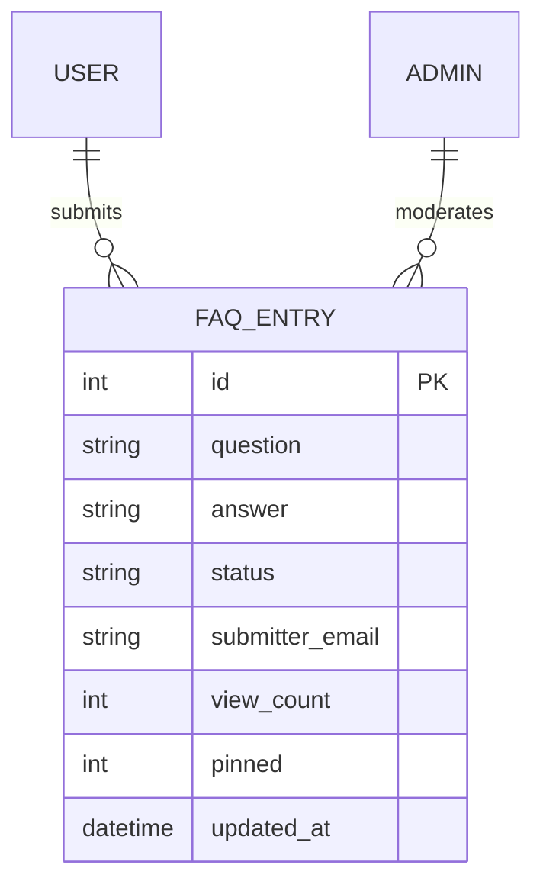
```mermaid
erDiagram
    FAQ_ENTRY {
        int id PK
        string question
        string answer
        string status
        string submitter_email
        int view_count
        int pinned
        datetime updated_at
    }
    USER ||--o{ FAQ_ENTRY : "submits"
    ADMIN ||--o{ FAQ_ENTRY : "moderates"
```
Sources: [src/app/faq/page.tsx:9-16](), [functions/api/admin/faq/approve.ts:23-45]()

## User Interaction Workflow

Users interact with the FAQ system through three primary interfaces: the Homepage FAQ section, the dedicated FAQ page, and the "Ask a Question" form.

### Submission Process
Users can submit questions via `/ask`. The system enforces validation rules requiring a minimum question length (10 characters) and a valid email format before allowing submission.

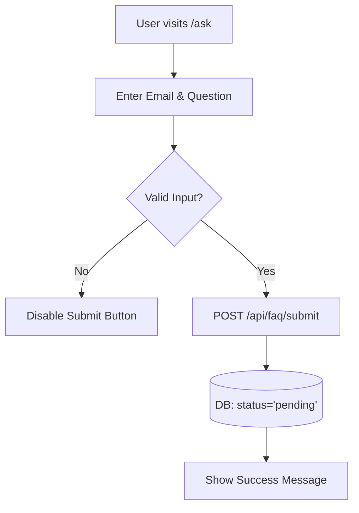
```mermaid
flowchart TD
    Start[User visits /ask] --> Input[Enter Email & Question]
    Input --> Val{Valid Input?}
    Val -- No --> Disable[Disable Submit Button]
    Val -- Yes --> API[POST /api/faq/submit]
    API --> DB[(DB: status='pending')]
    DB --> Success[Show Success Message]
```
Sources: [src/app/ask/page.tsx:16-50]()

### Browsing and Searching
Approved FAQs are searchable and filterable. The system implements a view count incrementation whenever a user clicks to expand a question to read the answer.

- **Homepage Section**: Displays top 5 FAQs (or top 10 if searching).
- **FAQ Page**: Displays up to 50 FAQs with real-time search filtering.

Sources: [src/components/FAQSection.tsx:44-55](), [src/app/faq/page.tsx:32-40]()

## Administrative Workflow

The administrative interface at `/admin/faq` requires an `ADMIN_TOKEN` for access. It allows administrators to review pending submissions, provide answers, and manage the visibility of approved content.

### Moderation and Approval
Administrators can filter entries by "Pending" status to see new questions. To approve a question, an answer must be provided.

```mermaid
sequenceDiagram
    participant Admin as Admin UI
    participant API as /api/admin/faq/approve
    participant DB as D1 Database
    Admin->>API: POST {id, answer}
    Note right of API: requireAdmin check
    API->>DB: UPDATE status='approved' WHERE id=X
    DB-->>API: Success
    API-->>Admin: 200 OK
```
Sources: [functions/api/admin/faq/approve.ts:7-40](), [src/app/admin/faq/page.tsx:125-140]()

### Content Management Features
Administrators have access to several management controls to influence how FAQs are sorted and prioritized for public users:

1.  **Pinning**: Items flagged as `pinned` are sorted to the top of the list regardless of view count.
2.  **View Bumping**: Admins can manually increment the view count of an entry.
3.  **Unapproval**: Existing FAQs can be set back to unapproved status to hide them from the public site.

Sources: [src/app/admin/faq/page.tsx:103-120](), [functions/api/admin/faq/approved.ts:21]()

## API Reference

| Endpoint | Method | Purpose | Authentication |
| :--- | :--- | :--- | :--- |
| `/api/faq/list` | GET | Retrieve approved FAQs with search query support. | None |
| `/api/faq/submit` | POST | Submit a new question for review. | None |
| `/api/faq/view` | POST | Increment the view count for a specific ID. | None |
| `/api/admin/faq/list` | GET | List all FAQs with filtering options. | Admin Token |
| `/api/admin/faq/approve` | POST | Approve a pending FAQ and set its answer. | Admin Token |
| `/api/admin/faq/update` | POST | Update approved or pinned status. | Admin Token |

Sources: [src/app/faq/page.tsx:32-35](), [src/app/admin/faq/page.tsx:90-100](), [functions/api/admin/faq/approve.ts:7-10]()

## Summary
The FAQ Management Workflow provides a robust bridge between community curiosity and official club information. By utilizing a "pending" state for new submissions, the Lou Gehrig Fan Club maintains control over the information published on its platform. The integration of view tracking and pinning allows the most relevant and important information to naturally rise to the top of the user experience.

### Member Discussions & Social Wall

<details>
<summary>Relevant source files</summary>

The following files were used as context for generating this wiki page:

- [src/app/fanclub/page.tsx](https://github.com/wdhunter645/next-starter-template/blob/main/src/app/fanclub/page.tsx)
- [src/app/fanclub/chat/page.tsx](https://github.com/wdhunter645/next-starter-template/blob/main/src/app/fanclub/chat/page.tsx)
- [src/components/RecentDiscussionsTeaser.tsx](https://github.com/wdhunter645/next-starter-template/blob/main/src/components/RecentDiscussionsTeaser.tsx)
- [src/app/page.tsx](https://github.com/wdhunter645/next-starter-template/blob/main/src/app/page.tsx)
- [src/components/SocialWall.tsx](https://github.com/wdhunter645/next-starter-template/blob/main/tools/verify_v6_lock.sh) (Referenced via verification script)
- [tools/verify_v6_lock.sh](https://github.com/wdhunter645/next-starter-template/blob/main/tools/verify_v6_lock.sh)
- [src/hooks/useMemberSession.ts](https://github.com/wdhunter645/next-starter-template/blob/main/src/app/fanclub/page.tsx) (Referenced via import)
</details>

# Member Discussions & Social Wall

The Member Discussions and Social Wall features serve as the primary engagement layers of the Lou Gehrig Fan Club (LGFC) platform. The Social Wall provides an external, public-facing integration of community activity from social media platforms, while the Member Discussions system facilitates private, authenticated interaction between members.

These systems are integrated across both the public homepage and the gated FanClub area, ensuring a continuous flow of community-generated content while maintaining strict access controls for private discussions.

Sources: [src/app/page.tsx:66](), [src/app/fanclub/page.tsx:32](), [context.md:9-11]()

## Member Discussion System Architecture

The discussion system is built on a client-server architecture utilizing Next.js for the frontend and Cloudflare D1 for persistent storage. It consists of three primary interaction points: the public teaser, the authenticated feed, and the detailed chat interface.

### Data Flow and Lifecycle
The discussion lifecycle begins with member authentication, followed by post creation, and concludes with moderated feed distribution.

```mermaid
sequenceDiagram
    participant U as Member
    participant FE as Next.js Frontend
    participant API as Cloudflare Worker API
    participant DB as D1 Database

    U->>FE: Inputs Title & Body
    FE->>API: POST /api/discussions/create
    API->>DB: INSERT INTO discussions
    DB-->>API: Success
    API-->>FE: {ok: true}
    FE->>API: GET /api/discussions/list
    API->>DB: SELECT * FROM discussions
    DB-->>API: Results
    API-->>FE: DiscussionItems[]
    FE-->>U: Updated Discussion Feed
```
The diagram above illustrates the synchronous flow of creating and retrieving member posts within the authenticated area.

Sources: [src/app/fanclub/chat/page.tsx:50-59](), [src/app/fanclub/chat/page.tsx:30-36](), [src/app/fanclub/page.tsx:18-21]()

### Key Components

| Component | Description | File Path |
| :--- | :--- | :--- |
| `MemberHomePage` | The landing page for authenticated members, coordinating post creation and feed refreshing. | [src/app/fanclub/page.tsx]() |
| `FanclubChatPage` | A dedicated view for full-length member conversations and moderation reporting. | [src/app/fanclub/chat/page.tsx]() |
| `RecentDiscussionsTeaser` | A public-facing component that displays a limited subset (top 5) of recent activity. | [src/components/RecentDiscussionsTeaser.tsx]() |
| `ChatComposer` | A specialized form for members to input and submit new discussion entries. | [src/app/fanclub/chat/page.tsx:90]() |
| `ChatFeed` | The container responsible for rendering the list of `DiscussionItem` objects. | [src/app/fanclub/chat/page.tsx:135]() |

## Data Models

The discussion system relies on a structured schema for both internal state management and API responses.

### DiscussionItem Structure
This interface defines the properties of a single post within the database and frontend state.

| Field | Type | Description |
| :--- | :--- | :--- |
| `id` | number | Unique identifier for the discussion post. |
| `title` | string | Short summary or headline of the post. |
| `body` | string | The main content of the post (stored as raw text/markdown). |
| `author_email`| string | The email of the member who created the post (optional). |
| `created_at` | string | ISO timestamp of when the post was persisted. |

Sources: [src/app/fanclub/chat/page.tsx:7-13](), [src/components/RecentDiscussionsTeaser.tsx:7-12]()

## Social Wall Integration

The Social Wall is a public-facing component integrated into the main homepage. It acts as a bridge between external social media activity and the LGFC site.

### Implementation Details
*   **Embed Technology**: The Social Wall utilizes an Elfsight widget to aggregate and display live fan posts, primarily from Facebook.
*   **Structure**: It is rendered within a `<section>` tag with the ID `social-wall` and follows a specific design invariant that includes a subtitle: "Live fan posts from Facebook".
*   **Governance**: The repository enforces strict checks to ensure the Social Wall is present in `page.tsx` and that its CSS spacing is controlled via wrapper classes rather than inline margins to prevent design drift.

```mermaid
flowchart TD
    A[Public User] --> B[HomePage /]
    B --> C{Social Wall Section}
    C --> D[Elfsight Platform Script]
    D --> E[External Social Media Data]
    E --> F[Rendered Feed]
```
The Social Wall flow depends on external scripts to fetch and render dynamic social content within the site's layout.

Sources: [src/app/page.tsx:66](), [tools/verify_v6_lock.sh:173-205](), [tests/e2e/homepage-sections.spec.ts:86-98]()

## Moderation and Reporting

To maintain community standards, the Member Discussion system includes a built-in reporting mechanism.

### Moderation Logic
1.  **Trigger**: Members can select "Report" on any item within the `ChatFeed`.
2.  **Input**: The user provides a reason for the report (minimum 5 characters required).
3.  **Submission**: Data is sent to the `/api/reports/create` endpoint.
4.  **Backend Target**: Reports are routed to an admin moderation queue for review.

| Endpoint | Method | Parameters | Description |
| :--- | :--- | :--- | :--- |
| `/api/reports/create` | POST | `kind`, `target_id`, `reporter_email`, `reason` | Creates a new moderation report for a specific post. |

Sources: [src/app/fanclub/chat/page.tsx:63-71](), [src/app/fanclub/chat/page.tsx:136-160]()

## Conclusion
The Member Discussions & Social Wall systems provide a dual-layered engagement approach. The Social Wall brings external community momentum to the public site, while the internal Discussion system offers a secure, authenticated space for member interaction. Together, they form the interactive core of the Lou Gehrig Fan Club platform, managed through Cloudflare D1 and guarded by automated structural tests.

### Weekly Photo Matchups

<details>
<summary>Relevant source files</summary>

The following files were used as context for generating this wiki page:

- [src/components/WeeklyMatchup.tsx](https://github.com/wdhunter645/next-starter-template/blob/main/src/components/WeeklyMatchup.tsx)
- [functions/api/matchup/current.ts](https://github.com/wdhunter645/next-starter-template/blob/main/functions/api/matchup/current.ts)
- [migrations/0018_matchups.sql](https://github.com/wdhunter645/next-starter-template/blob/main/migrations/0018_matchups.sql)
- [migrations/0026_seed_weekly_matchup.sql](https://github.com/wdhunter645/next-starter-template/blob/main/migrations/0026_seed_weekly_matchup.sql)
- [src/styles/weekly.css](https://github.com/wdhunter645/next-starter-template/blob/main/src/styles/weekly.css)
- [src/app/page.tsx](https://github.com/wdhunter645/next-starter-template/blob/main/src/app/page.tsx)
</details>

# Weekly Photo Matchups

The Weekly Photo Matchup is an interactive engagement feature on the LGFC website that allows users to vote between two selected photos of Lou Gehrig. The system identifies a specific "matchup" for the current week, displays the competing images, handles user voting, and reveals real-time results once a vote has been cast. Sources: [src/components/WeeklyMatchup.tsx](), [src/app/page.tsx:32-36]()

This module spans the full technical stack, utilizing a React frontend component, Cloudflare Pages Functions for backend logic, and a Cloudflare D1 SQL database for persistent storage of matchups and voting tallies. Sources: [functions/api/matchup/current.ts](), [migrations/0018_matchups.sql]()

## System Architecture

The feature follows a client-server architecture where the frontend component interacts with REST API endpoints to fetch state and submit user interactions.

```mermaid
flowchart TD
    Client[WeeklyMatchup Component] -->|GET /api/matchup/current| CurrentAPI[Current Matchup API]
    Client -->|POST /api/matchup/vote| VoteAPI[Vote API]
    Client -->|GET /api/matchup/results| ResultsAPI[Results API]
    
    CurrentAPI --> DB[(Cloudflare D1)]
    VoteAPI --> DB
    ResultsAPI --> DB
    
    DB -.->|Photos| B2[Backblaze B2 Storage]
```
The architecture ensures that the client remains thin, handling only display logic and local state for voting persistence, while the backend manages database integrity and image URL normalization. Sources: [src/components/WeeklyMatchup.tsx:64-118](), [functions/api/matchup/current.ts:1-5]()

## Database Schema

The persistence layer is defined by two primary tables and associated indices to optimize lookups by the week's start date.

| Table | Field | Type | Description |
| :--- | :--- | :--- | :--- |
| **weekly_matchups** | id | INTEGER | Primary Key (Autoincrement) |
| | week_start | TEXT | YYYY-MM-DD (format for Mondays) |
| | photo_a_id | INTEGER | Foreign key to photos table |
| | photo_b_id | INTEGER | Foreign key to photos table |
| | status | TEXT | 'active' or 'closed' |
| **weekly_votes** | id | INTEGER | Primary Key (Autoincrement) |
| | week_start | TEXT | Associated matchup week |
| | choice | TEXT | 'a' or 'b' |
| | source_hash | TEXT | Unique identifier for voter prevention |

Sources: [migrations/0018_matchups.sql:2-19]()

### Matchup Selection Logic
The system prioritizes an explicit "active" matchup record from the database. If no active record exists, it falls back to a legacy mode where it picks two random eligible photos.

```mermaid
flowchart TD
    Start[Request Current Matchup] --> CheckActive{Active Matchup Exists?}
    CheckActive -- Yes --> FetchMatchup[Fetch defined Photo A & B]
    CheckActive -- No --> Fallback[Fetch 2 eligible photos by ID DESC]
    FetchMatchup --> Normalize[Normalize URLs for Public B2]
    Fallback --> Normalize
    Normalize --> Response[Return JSON with week_start]
```
Sources: [functions/api/matchup/current.ts:58-106]()

## Frontend Implementation

The `WeeklyMatchup` component manages the user lifecycle from loading to voting. It uses `localStorage` to persist whether a user has already voted for the current week to prevent double-voting on the client side. Sources: [src/components/WeeklyMatchup.tsx:84-86]()

### User Interaction Flow
When a user visits the page, the component checks for a local voting record matching the `week_start` returned by the API.

```mermaid
sequenceDiagram
    participant U as User
    participant C as WeeklyMatchup Component
    participant API as API/matchup/current
    participant L as LocalStorage

    U->>C: Loads Homepage
    C->>API: GET current matchup
    API-->>C: returns {items, week_start}
    C->>L: getItem(lgfc_weekly_vote_[week_start])
    L-->>C: returns '1' or null
    alt Has Voted
        C->>U: Display Results View
    else Has Not Voted
        C->>U: Display Photo A vs Photo B
        U->>C: Clicks "Vote A"
        C->>API: POST /api/matchup/vote
        C->>L: setItem(lgfc_weekly_vote_[week_start], '1')
        C->>U: Reveal Results
    end
```
Sources: [src/components/WeeklyMatchup.tsx:64-118]()

### UI Components and Styling
The interface uses a grid-based layout defined in `weekly.css`.
*   **Grid Structure:** A 2-column layout (1-column on mobile) displaying Photo A and Photo B side-by-side. Sources: [src/styles/weekly.css:19-23](), [src/styles/weekly.css:91-95]()
*   **Photo Frames:** Fixed height (440px) with `object-fit: contain` to ensure images of different aspect ratios display cleanly. Sources: [src/components/WeeklyMatchup.tsx:37-45]()
*   **Result Display:** Once `hasVoted` is true, a result panel appears showing numeric totals for both options. Sources: [src/components/WeeklyMatchup.tsx:185-197]()

## Data Normalization

A critical backend function is `normalizePhotoUrl`, which ensures that various URL formats stored in the database are converted into a "friendly" public format for the Backblaze B2 bucket (`LouGehrigFanClub`). Sources: [functions/api/matchup/current.ts:9-11]()

```typescript
const PUBLIC_BASE = `https://f005.backblazeb2.com/file/${PUBLIC_BUCKET_NAME}`;
// Normalizes segments: /<bucketId>/<objectKey> -> PUBLIC_BASE/<objectKey>
const keyParts = parts.length >= 2 ? parts.slice(1) : parts;
const key = encodePath(keyParts.join("/"));
return { ...raw, url: `${PUBLIC_BASE}/${key}` };
```
Sources: [functions/api/matchup/current.ts:13-46]()

## Seeding and Maintenance

Automated seeding ensures the feature always has content. Migration `0026` provides a SQL routine that calculates the most recent Monday and inserts a new active matchup if one does not already exist for that week. Sources: [migrations/0026_seed_weekly_matchup.sql:6-30]()

The `verify_v6_lock.sh` script is used as a governance tool to ensure the component maintains the exact approved title: "Weekly Photo Matchup. Vote for your favorite!" and utilizes the `title-lgfc` CSS class. Sources: [audits/verify_v6_lock.sh:65-70](), [tools/verify_v6_lock.sh:135-144]()

## Summary

Weekly Photo Matchups provide a dynamic, data-driven engagement section for the LGFC homepage. By combining SQL-based matchup definitions, image URL normalization for B2 storage, and client-side persistence for voting state, the system provides a robust user experience that rewards participation with real-time feedback. Sources: [src/components/WeeklyMatchup.tsx](), [functions/api/matchup/current.ts]()

### Join Requests & Member Onboarding

<details>
<summary>Relevant source files</summary>

The following files were used as context for generating this wiki page:

- [src/app/join/page.tsx](https://github.com/wdhunter645/next-starter-template/blob/main/src/app/join/page.tsx)
- [functions/api/join.ts](https://github.com/wdhunter645/next-starter-template/blob/main/functions/api/join.ts)
- [src/app/admin/join-requests/page.tsx](https://github.com/wdhunter645/next-starter-template/blob/main/src/app/admin/join-requests/page.tsx)
- [src/app/auth/AuthClient.tsx](https://github.com/wdhunter645/next-starter-template/blob/main/src/app/auth/AuthClient.tsx)
- [lgfc-lite-configure-remaining.sh](https://github.com/wdhunter645/next-starter-template/blob/main/lgfc-lite-configure-remaining.sh)
</details>

# Join Requests & Member Onboarding

The Join Requests and Member Onboarding system manages the intake of new members for the Lou Gehrig Fan Club (LGFC). This system facilitates public interest registration, persists user data into a Cloudflare D1 database, and triggers automated email notifications for both the user and site administrators.

The onboarding process acts as a gateway to the authenticated [FanClub](#fanclub-home-page) area. It ensures that membership requests are captured with valid profiles—including screen names and email preferences—while preventing duplicate registrations through idempotent database operations.

## Architecture and Data Flow

The system follows a client-server architecture utilizing Next.js for the frontend and Cloudflare Pages Functions for the backend API. Data is persisted in a Cloudflare D1 SQL database.

### Submission Pipeline
When a user submits the "Join" form, the frontend validates the input and sends a POST request to the `/api/join` endpoint. The backend performs the following logic:
1.  **Validation**: Ensures required fields (Email, First Name, Last Name) are present.
2.  **Idempotency Check**: Uses an `INSERT...SELECT...WHERE NOT EXISTS` SQL pattern to prevent duplicate emails.
3.  **Persistence**: Saves the request to the `join_requests` table.
4.  **Notifications**: Triggers a welcome email to the user and a notification to the administrator via MailChannels.
5.  **Audit Logging**: Records the result of email attempts in the `join_email_log` table.

Sources: [functions/api/join.ts:89-130](), [functions/api/join.ts:167-190](), [src/app/auth/AuthClient.tsx:55-80]()

### Onboarding Sequence Diagram
The following diagram illustrates the interaction between the user interface, the API layer, and the database during a successful join and subsequent auto-login.

```mermaid
sequenceDiagram
    participant User as "User (AuthClient)"
    participant API as "Join API"
    participant DB as "D1 Database"
    participant Mail as "Email Provider"

    User->>API: POST /api/join (Name, Email)
    API->>DB: Check existence & INSERT
    DB-->>API: Row Created
    API->>Mail: Send Welcome Email
    API->>Mail: Send Admin Notification
    API-->>User: 200 OK (Status: joined)
    
    Note over User, API: Auto-Login Trigger
    User->>API: POST /api/login (Email)
    API-->>User: 200 OK
    User->>User: Redirect to /fanclub
```
Sources: [src/app/auth/AuthClient.tsx:55-85](), [functions/api/join.ts:180-220]()

## API Endpoints and Data Structures

### Join Request API (`/api/join`)
The primary endpoint for member registration. It accepts JSON or form-data payloads and maps legacy fields (like `alias`) to modern profile structures.

| Parameter | Type | Required | Description |
| :--- | :--- | :--- | :--- |
| `email` | string | Yes | The unique identifier for the member. |
| `first_name`| string | Yes | User's given name. |
| `last_name` | string | Yes | User's family name. |
| `screen_name`| string | No | Publicly visible alias. |
| `email_opt_in`| boolean| No | Marketing/Update preference (defaults to true). |

Sources: [functions/api/join.ts:135-160](), [src/app/auth/AuthClient.tsx:115-145]()

### Join Request Schema
The data model is stored in the `join_requests` table with the following structure:

```sql
CREATE TABLE join_requests (
  id INTEGER PRIMARY KEY AUTOINCREMENT,
  name TEXT NOT NULL,
  email TEXT NOT NULL UNIQUE,
  first_name TEXT,
  last_name TEXT,
  screen_name TEXT,
  email_opt_in INTEGER DEFAULT 1,
  presence_status TEXT,
  message TEXT,
  created_at TEXT
);
```
Sources: [src/app/admin/join-requests/page.tsx:7-18](), [functions/api/join.ts:63-70]()

## Administrative Review

Administrators can monitor onboarding activity via the `/admin/join-requests` dashboard. This interface fetches data from `/api/admin/join-requests/list` and provides a normalized view of all pending or completed registrations.

### Join Request Normalization
To ensure UI stability, raw database rows are passed through a normalization function that handles type casting for SQLite values (e.g., converting 0/1 integers to booleans) and provides defaults for missing fields.

```typescript
function normalize(raw: unknown): JoinRequest | null {
  if (!isRecord(raw)) return null;
  const id = asNumber(raw.id);
  const name = asString(raw.name);
  const email = asString(raw.email);

  if (id === null || !name || !email) return null;

  return {
    id: Math.trunc(id),
    name,
    email,
    message: asString(raw.message),
    created_at: asString(raw.created_at),
    email_opt_in: asNumber(raw.email_opt_in),
    // ... additional fields
  };
}
```
Sources: [src/app/admin/join-requests/page.tsx:39-65]()

## Automated Notifications

The system utilizes two types of notifications during onboarding, managed within `functions/api/join.ts`:

1.  **Welcome Email**: Sent to the user immediately upon a successful (non-duplicate) join request. The content can be customized by administrators via the `welcome_email_content` table.
2.  **Admin Notification**: Sent to recipients defined in the `MAIL_ADMIN_TO` environment variable to alert staff of a new request.

Both actions are recorded in the `join_email_log` to track delivery status, provider response codes, and any potential errors without interrupting the user experience.

Sources: [functions/api/join.ts:16-56](), [functions/api/join.ts:192-215]()

## Conclusion

The Join Requests & Member Onboarding system provides a robust entry point for the Lou Gehrig Fan Club. By combining idempotent database operations with automated audit-logged notifications and a comprehensive administrative dashboard, the project ensures a reliable and transparent registration process for new members.


## Data Management & Flow

### Content Management System (CMS)

<details>
<summary>Relevant source files</summary>

The following files were used as context for generating this wiki page:

- [src/app/admin/cms/page.tsx](https://github.com/wdhunter645/next-starter-template/blob/main/src/app/admin/cms/page.tsx)
- [functions/api/admin/cms/save.ts](https://github.com/wdhunter645/next-starter-template/blob/main/functions/api/admin/cms/save.ts)
- [functions/api/admin/cms/publish.ts](https://github.com/wdhunter645/next-starter-template/blob/main/functions/api/admin/cms/publish.ts)
- [functions/api/admin/cms/list.ts](https://github.com/wdhunter645/next-starter-template/blob/main/functions/api/admin/cms/list.ts)
- [migrations/0011_cms_content_blocks.sql](https://github.com/wdhunter645/next-starter-template/blob/main/migrations/0011_cms_content_blocks.sql)
- [src/app/admin/content/page.tsx](https://github.com/wdhunter645/next-starter-template/blob/main/src/app/admin/content/page.tsx)
- [src/app/admin/fundraiser-preview/page.tsx](https://github.com/wdhunter645/next-starter-template/blob/main/src/app/admin/fundraiser-preview/page.tsx)
</details>

# Content Management System (CMS)

The Content Management System (CMS) in this project is a decoupled, D1-backed infrastructure designed to manage dynamic site content through a "Draft + Publish" workflow. It allows administrators to define, edit, and version specific blocks of content—primarily in Markdown—without requiring code changes or redeployments.

The system is built on Cloudflare Pages Functions for the API layer and Cloudflare D1 for persistent storage. It prioritizes "compile-safe" behavior, ensuring the site renders correctly even if API routes or database connections are temporarily unavailable.

Sources: [src/app/admin/content/page.tsx:10-15](), [migrations/0011_cms_content_blocks.sql:1-4](), [src/app/admin/cms/page.tsx:64-67]()

## Data Architecture

The CMS relies on two primary tables in the D1 database: `content_blocks` for current state and `content_revisions` for historical tracking.

### Schema Definitions

The data layer is defined to support versioning and attribution for every change.

| Table | Field | Type | Description |
| :--- | :--- | :--- | :--- |
| **content_blocks** | `key` | TEXT (PK) | Unique identifier for the content block. |
| | `page` | TEXT | The page slug or identifier where the block is used. |
| | `section` | TEXT | The specific UI section within the page. |
| | `title` | TEXT | Human-readable title for the block. |
| | `body_md` | TEXT | The raw Markdown content of the current draft. |
| | `status` | TEXT | Status of the block: `'draft'` or `'published'`. |
| | `published_body_md`| TEXT | The content currently visible to public users. |
| | `version` | INTEGER | Incremental version number (default 1). |
| | `updated_at` | TEXT | Timestamp of the last modification. |
| **content_revisions**| `id` | INTEGER (PK)| Auto-incrementing revision ID. |
| | `key` | TEXT | Reference to the content block key. |
| | `version` | INTEGER | The version number at the time of revision. |
| | `body_md` | TEXT | Snapshot of the Markdown content. |

Sources: [migrations/0011_cms_content_blocks.sql:7-33]()

### Entity Relationship
The following diagram shows the relationship between active content blocks and their historical revisions.

```mermaid
erDiagram
    CONTENT_BLOCKS ||--o{ CONTENT_REVISIONS : "has history"
    CONTENT_BLOCKS {
        string key PK
        string page
        string status
        int version
        string body_md
        string published_body_md
    }
    CONTENT_REVISIONS {
        int id PK
        string key FK
        int version
        string body_md
        string status
    }
```
Sources: [migrations/0011_cms_content_blocks.sql:7-33]()

## Workflow and Data Flow

The CMS implements a structured workflow where changes are first saved as drafts before being promoted to a published state.

### Draft and Publish Lifecycle

1.  **Save Draft**: When an administrator saves content, the `body_md` is updated, the `status` is set to `'draft'`, and the `version` is incremented. A record is also added to `content_revisions`.
2.  **Publish**: When publishing, the current `body_md` is copied to `published_body_md`. The `status` changes to `'published'`, and the `version` increments again. 

```mermaid
sequenceDiagram
    participant Admin as Admin UI
    participant API as CMS API
    participant DB as D1 Database
    Admin->>API: POST /api/admin/cms/save (Draft)
    API->>DB: UPDATE content_blocks (status='draft')
    API->>DB: INSERT content_revisions
    DB-->>API: Success
    API-->>Admin: OK (version N)
    Admin->>API: POST /api/admin/cms/publish
    API->>DB: UPDATE content_blocks (published_body_md = body_md)
    API->>DB: INSERT content_revisions (status='published')
    DB-->>API: Success
    API-->>Admin: OK (version N+1)
```
Sources: [functions/api/admin/cms/save.ts:39-78](), [functions/api/admin/cms/publish.ts:35-59]()

## Administrative Interfaces

The system provides several specialized interfaces for managing different types of content.

### CMS Block Editor
Located at `/admin/cms`, this is a general-purpose editor for managing records in the `content_blocks` table. It provides a list of all blocks filtered by page and a multi-field editor for keys, titles, and Markdown bodies.
Sources: [src/app/admin/cms/page.tsx:35-130]()

### Section-Based Editor
Located at `/admin/content`, this interface focuses on "Section Bundles." It retrieves content based on a URL slug and organizes it by page sections, showing the "Live" update timestamp and "Draft" presence side-by-side.
Sources: [src/app/admin/content/page.tsx:64-110]()

### Fundraiser Preview (Specialized CMS)
A specialized implementation exists for the `campaign_spotlight` block. This module includes a complex validation layer and a live preview card (`CampaignSpotlightCard`) that renders the configuration exactly as it would appear on the homepage before it is published.
Sources: [src/app/admin/fundraiser-preview/page.tsx:100-245]()

## API Endpoints

All administrative endpoints are protected by an `ADMIN_TOKEN` requirement.

| Endpoint | Method | Description | Parameters |
| :--- | :--- | :--- | :--- |
| `/api/admin/cms/list` | GET | Lists content blocks, optionally filtered by page. | `page` (optional string) |
| `/api/admin/cms/save` | POST | Upserts a block, sets status to draft, increments version. | `key`, `page`, `section`, `title`, `body_md` |
| `/api/admin/cms/publish` | POST | Promotes draft to `published_body_md`. | `key`, `updated_by` |
| `/api/cms/get` | GET | Public read endpoint for specific keys. | `key` |

Sources: [functions/api/admin/cms/list.ts:21-35](), [functions/api/admin/cms/save.ts:16-30](), [functions/api/admin/cms/publish.ts:21-30](), [src/app/admin/cms/page.tsx:173]()

## Implementation Details

### Versioning Logic
Every save or publish action triggers a version increment. The system fetches the current version from the database and adds 1 before performing an update. If a block does not exist during a "Save" operation, it is initialized at version 1.
Sources: [functions/api/admin/cms/save.ts:46-64](), [functions/api/admin/cms/publish.ts:35-42]()

### Security and Governance
Access to the CMS API is gated by the `requireAdmin` middleware, which checks for a valid admin token in the request headers (specifically `x-admin-token`). In the UI, this token is typically retrieved from `localStorage` under the key `lgfc_admin_token`.
Sources: [functions/api/admin/cms/save.ts:20-21](), [src/app/admin/cms/page.tsx:21-23]()

## Summary
The CMS provides a robust framework for managing site content through Cloudflare's serverless stack. By utilizing a draft/publish workflow and maintaining a full revision history in D1, it allows for safe content iterations and immediate rollbacks if necessary. The modular design supports both generic Markdown blocks and highly structured configurations like the fundraiser spotlight.

### D1 Database Schema & Migrations

<details>
<summary>Relevant source files</summary>

The following files were used as context for generating this wiki page:

- [migrations/0004\_init\_schema.sql](https://github.com/wdhunter645/next-starter-template/blob/main/migrations/0004_init_schema.sql)
- [functions/\_lib/d1.ts](https://github.com/wdhunter645/next-starter-template/blob/main/functions/_lib/d1.ts)
- [scripts/phase1_d1_apply.sh](https://github.com/wdhunter645/next-starter-template/blob/main/scripts/phase1_d1_apply.sh)
- [scripts/phase1_d1_init.sh](https://github.com/wdhunter645/next-starter-template/blob/main/scripts/phase1_d1_init.sh)
- [migrations/0011\_cms\_content\_blocks.sql](https://github.com/wdhunter645/next-starter-template/blob/main/migrations/0011_cms_content_blocks.sql)
- [migrations/0008\_page\_content.sql](https://github.com/wdhunter645/next-starter-template/blob/main/migrations/0008_page_content.sql)
- [migrations/0023\_welcome\_email\_content.sql](https://github.com/wdhunter645/next-starter-template/blob/main/migrations/0023_welcome_email_content.sql)
- [functions/api/d1-test.ts](https://github.com/wdhunter645/next-starter-template/blob/main/functions/api/d1-test.ts)
</details>

# D1 Database Schema & Migrations

The D1 database serves as the primary relational data store for the Lou Gehrig Fan Club (LGFC) project, managing everything from user-submitted join requests to dynamic CMS content blocks. It is built on Cloudflare D1, providing a serverless SQLite-based storage solution that integrates directly with Cloudflare Pages and Functions.

The system utilizes a versioned migration strategy where SQL files are applied sequentially to evolve the database schema. This includes initial table setup for mailing lists and photo catalogs, followed by specialized migrations for CMS capabilities, page content management, and administrative tracking.

Sources: [context.md](), [scripts/phase1_d1_init.sh:5-10](), [functions/api/d1-test.ts:10-15]()

## Core Database Architecture

The database architecture is designed to support three primary functional areas: user engagement (join requests/library entries), media management (photos/media assets), and content management (CMS blocks/page content).

### Schema Management Flow
The project uses a structured shell-script-driven approach to initialize and apply migrations via the Wrangler CLI. The process involves creating a migration placeholder and overwriting it with defined schema SQL before execution.

```mermaid
flowchart TD
    Start[Start Migration] --> Create[wrangler d1 migrations create]
    Create --> Identify[Identify .sql file in ./migrations]
    Identify --> Write[Write Schema SQL to file]
    Write --> Apply[wrangler d1 migrations apply]
    Apply --> Verify[Verify tables via sqlite_master]
    Verify --> End[Initialization Complete]
```
The diagram above illustrates the idempotent initialization process used to establish the base schema.
Sources: [scripts/phase1_d1_init.sh:12-65](), [scripts/phase1_d1_apply.sh:10-70]()

### Database Entities & Relationships
The schema defines several decoupled entities optimized for high-read performance and administrative control.

```mermaid
erDiagram
    JOIN_REQUESTS {
        int id PK
        string name
        string email
        text message
        datetime created_at
    }
    PHOTOS {
        int id PK
        string photo_id UK
        string url
        int is_memorabilia
        text description
        datetime created_at
    }
    CONTENT_BLOCKS {
        string key PK
        string page
        string section
        text body_md
        string status
        int version
    }
    CONTENT_REVISIONS {
        int id PK
        string key
        int version
        text body_md
    }
    CONTENT_BLOCKS ||--o{ CONTENT_REVISIONS : "has history"
```
The entity-relationship diagram shows the separation between user-facing data (join requests), assets (photos), and the versioned CMS system.
Sources: [scripts/phase1_d1_init.sh:35-65](), [migrations/0011_cms_content_blocks.sql:7-38]()

## Detailed Schema Definitions

### Engagement & Media Tables
The initial schema focuses on capturing user intent and cataloging media assets stored in Backblaze B2.

| Table Name | Field | Type | Constraints | Description |
| :--- | :--- | :--- | :--- | :--- |
| `join_requests` | `id` | INTEGER | PRIMARY KEY AUTOINCREMENT | Unique ID for form submissions |
| | `email` | TEXT | NOT NULL | User contact email |
| `photos` | `photo_id` | TEXT | NOT NULL UNIQUE | B2 file ID or filename |
| | `url` | TEXT | NOT NULL | Public CDN/B2 URL |
| `library_entries`| `is_approved`| INTEGER | DEFAULT 0 | Moderation status for fan content |

Sources: [scripts/phase1_d1_init.sh:35-65](), [scripts/b2_d1_incremental_sync.sh:90-110]()

### Content Management System (CMS)
The CMS layer uses a "Draft/Published" workflow, allowing administrators to stage changes before making them live.

*   **`content_blocks`**: Stores the current working state and the latest published version of a section.
*   **`content_revisions`**: An append-only historical log of all changes made to content blocks, facilitating rollbacks.
*   **`page_content`**: Specifically manages HTML or plain text blocks associated with specific site slugs (e.g., `/about`).

Sources: [migrations/0011_cms_content_blocks.sql:7-38](), [migrations/0008_page_content.sql:4-15]()

## Migration Execution & Diagnostics

### Diagnostic Endpoints
The project includes a diagnostic API (`/api/d1-test`) and an admin interface (`AdminD1TestPage`) to verify database health.

```mermaid
sequenceDiagram
    participant Admin as "Admin UI"
    participant API as "Functions API"
    participant D1 as "Cloudflare D1"
    
    Admin->>API: GET /api/admin/d1-inspect
    API->>D1: PRAGMA table_info(table)
    D1-->>API: Column Metadata
    API->>D1: SELECT COUNT(*) FROM table
    D1-->>API: Row Count
    API-->>Admin: JSON (Tables + Counts + Schema)
```
This flow represents the introspection mechanism used by administrators to monitor the database state.
Sources: [src/app/admin/d1-test/page.tsx:75-120](), [functions/api/d1-test.ts:25-95]()

### Implementation Logic
The system leverages helper functions in `_lib/d1.ts` to ensure robust connectivity.

```typescript
// Core validation logic used in API routes
// Sources: [functions/api/d1-test.ts:18-24]
const REQUIRED_TABLES = [
  'join_requests',
  'join_email_log',
  'login_attempts',
  'members',
  'photos'
];
```

## Data Sync & Idempotency
A critical aspect of the schema is its integration with external media (Backblaze B2). Scripts like `b2_d1_incremental_sync.sh` use `INSERT OR IGNORE` or `WHERE NOT EXISTS` clauses to ensure that re-running sync processes does not result in duplicate entries or primary key collisions.

Sources: [scripts/b2_d1_incremental_sync.sh:225-260](), [scripts/B2_D1_SYNC_README.md:15-30]()

## Conclusion
The D1 Database Schema & Migrations system provides a resilient foundation for the LGFC platform. By combining automated SQL migrations with strict diagnostic checks and an idempotent sync pipeline, the architecture ensures data integrity across development, preview, and production environments. Significant emphasis is placed on the CMS data layer, which supports a sophisticated versioning and revision history mechanism.

### Backblaze B2 & D1 Media Synchronization

<details>
<summary>Relevant source files</summary>

The following files were used as context for generating this wiki page:

- [scripts/b2_d1_incremental_sync.sh](https://github.com/wdhunter645/next-starter-template/blob/main/scripts/b2_d1_incremental_sync.sh)
- [scripts/B2_D1_SYNC_README.md](https://github.com/wdhunter645/next-starter-template/blob/main/scripts/B2_D1_SYNC_README.md)
- [scripts/test_b2_d1_incremental_sync.sh](https://github.com/wdhunter645/next-starter-template/blob/main/scripts/test_b2_d1_incremental_sync.sh)
- [scripts/b2_d1_daily_sync.sh](https://github.com/wdhunter645/next-starter-template/blob/main/scripts/b2_d1_daily_sync.sh)
- [scripts/b2_sync_photos_to_d1.sh](https://github.com/wdhunter645/next-starter-template/blob/main/scripts/b2_sync_photos_to_d1.sh)
- [scripts/d1_media_ingest.js](https://github.com/wdhunter645/next-starter-template/blob/main/scripts/d1_media_ingest.js)
</details>

# Backblaze B2 & D1 Media Synchronization

The Backblaze B2 & D1 Media Synchronization system provides a robust, idempotent pipeline for synchronizing media assets stored in Backblaze B2 buckets with a Cloudflare D1 database. Its primary purpose is to ensure that the `photos` table in D1 accurately reflects the current inventory of B2 objects, enabling the web application to serve media with up-to-date metadata and public URLs.

The synchronization process is designed to be additive and delta-based, meaning it identifies and inserts only new objects that do not already exist in the database. This prevents duplicate entries and minimizes the execution load on the D1 database. The system is managed via shell scripts and automated GitHub Actions, providing a "daily, idempotent" sync capability.
Sources: [scripts/B2_D1_SYNC_README.md:3-8](), [scripts/b2_d1_daily_sync.sh:5-7]()

## System Architecture and Workflow

The synchronization logic follows a linear pipeline that interfaces with the Backblaze S3-compatible API and the Cloudflare Wrangler CLI. The workflow is primarily encapsulated in the `b2_d1_incremental_sync.sh` script, which handles environment validation, object discovery, delta calculation, and SQL execution.

### High-Level Data Flow

The following diagram illustrates the end-to-end synchronization process from asset discovery to database insertion.

```mermaid
graph TD
    subgraph B2_Cloud["Backblaze B2"]
        Inventory[Object Inventory]
    end

    subgraph Sync_Engine["Synchronization Script"]
        Fetch[Fetch B2 Objects]
        Query[Query Existing D1 Keys]
        Diff[Calculate Delta]
        SQL[Generate SQL]
    end

    subgraph D1_DB["Cloudflare D1"]
        Existing[Existing photo_id/url]
        Insert[Execute INSERT OR IGNORE]
    end

    Inventory --> Fetch
    Fetch --> Diff
    Existing --> Query
    Query --> Diff
    Diff --> SQL
    SQL --> Insert
```
The script uses `aws s3api list-objects-v2` with pagination to retrieve the full inventory of the B2 bucket. It then queries the D1 database to retrieve existing keys to determine which files are truly new.
Sources: [scripts/b2_d1_incremental_sync.sh:162-212](), [scripts/B2_D1_SYNC_README.md:65-73]()

## Core Synchronization Logic

### Delta Calculation and Idempotency
To maintain idempotency, the system identifies new objects by comparing B2 keys against existing `photo_id` or `url` values in the D1 `photos` table. It specifically uses `INSERT OR IGNORE` statements to prevent runtime errors or duplicate rows if a key is processed twice.

| Strategy | Implementation Detail |
| :--- | :--- |
| **Idempotency** | Uses `INSERT OR IGNORE` or `WHERE NOT EXISTS` clauses. |
| **Additive Only** | The system does not support deletions or updates to existing records. |
| **Delta-based** | Uses `comm -13` to find keys present in B2 but missing in D1. |
| **Pagination** | Handles large buckets using `NextContinuationToken`. |
Sources: [scripts/B2_D1_SYNC_README.md:11-15](), [scripts/b2_d1_incremental_sync.sh:220-234](), [scripts/b2_d1_daily_sync.sh:75-84]()

### Schema Mapping
The synchronization maps B2 object metadata to specific D1 columns. While the `photos` table is the primary target, the script can adapt based on the available columns in the database schema.

| D1 Column | B2 Source Field | Description |
| :--- | :--- | :--- |
| `photo_id` | Object `Key` | Unique identifier (external_id). |
| `url` | `Key` + `PUBLIC_B2_BASE_URL` | The full public-facing asset URL. |
| `is_memorabilia` | Hardcoded `0` | Default classification. |
| `description` | Hardcoded `""` | Empty string for future metadata enrichment. |
| `created_at` | Object `LastModified` | Timestamp of the B2 upload. |
Sources: [scripts/B2_D1_SYNC_README.md:58-63](), [scripts/b2_d1_incremental_sync.sh:144-156]()

## Operational Configuration

### Environment Variables
The synchronization scripts require a set of credentials and configuration parameters to interface with both B2 and Cloudflare.

```bash
# Required for B2 Access
export B2_ENDPOINT="https://s3.us-west-004.backblazeb2.com"
export B2_BUCKET="my-bucket"
export B2_KEY_ID="my-key-id"
export B2_APP_KEY="my-app-key"

# Required for Cloudflare/D1
export D1_DATABASE_NAME="lgfc_lite"
export CLOUDFLARE_API_TOKEN="my-cf-token"
export PUBLIC_B2_BASE_URL="https://cdn.example.com"
```
Sources: [scripts/b2_d1_incremental_sync.sh:35-46](), [scripts/B2_D1_SYNC_README.md:36-45]()

### Error Handling and Validation
The system includes an integration test suite (`test_b2_d1_incremental_sync.sh`) that verifies:
- Script syntax and executability.
- Environment variable validation.
- SQL injection protection through escaping functions.
- Support for `DRY_RUN` mode, which generates SQL without executing it.
Sources: [scripts/test_b2_d1_incremental_sync.sh:12-88]()

## Advanced Implementation: JavaScript Ingest
For more complex scenarios, the `d1_media_ingest.js` provides an alternative ingestion method that computes a stable `media_uid` using a SHA-256 hash of the B2 `file_id` and `key`.

```mermaid
sequenceDiagram
    participant S as Stdin/File (JSON)
    participant J as d1_media_ingest.js
    participant D as Cloudflare D1
    S->>J: Provide B2 Inventory JSON
    J->>J: Generate stable media_uid (Hash)
    J->>D: SELECT media_uid (Existing check)
    D-->>J: Return existing UIDs
    J->>J: Filter new objects
    J->>D: INSERT OR IGNORE new records
```
This version ensures stable identifiers even if B2 keys are renamed, provided the `file_id` remains constant.
Sources: [scripts/d1_media_ingest.js:46-63](), [scripts/d1_media_ingest.js:145-165]()

## Summary
The Backblaze B2 & D1 Media Synchronization system provides a reliable way to manage media metadata. By leveraging delta-based updates and idempotent SQL operations, it maintains a consistent state between storage and the application database. The inclusion of `DRY_RUN` modes and comprehensive validation tests ensures that synchronization is both safe and observable.
Sources: [scripts/B2_D1_SYNC_README.md:10-15](), [scripts/b2_d1_incremental_sync.sh:282-286]()


## Frontend Components

### Public Website Pages & Routing

<details>
<summary>Relevant source files</summary>

The following files were used as context for generating this wiki page:

- [context.md](https://github.com/wdhunter645/next-starter-template/blob/main/context.md)
- [src/app/page.tsx](https://github.com/wdhunter645/next-starter-template/blob/main/src/app/page.tsx)
- [src/app/faq/page.tsx](https://github.com/wdhunter645/next-starter-template/blob/main/src/app/faq/page.tsx)
- [src/app/ask/page.tsx](https://github.com/wdhunter645/next-starter-template/blob/main/src/app/ask/page.tsx)
- [src/app/terms/page.tsx](https://github.com/wdhunter645/next-starter-template/blob/main/src/app/terms/page.tsx)
- [src/app/privacy/page.tsx](https://github.com/wdhunter645/next-starter-template/blob/main/src/app/privacy/page.tsx)
- [src/app/contact/page.tsx](https://github.com/wdhunter645/next-starter-template/blob/main/src/app/contact/page.tsx)
- [tests/homepage-structure.test.tsx](https://github.com/wdhunter645/next-starter-template/blob/main/tests/homepage-structure.test.tsx)
- [tests/e2e/homepage-sections.spec.ts](https://github.com/wdhunter645/next-starter-template/blob/main/tests/e2e/homepage-sections.spec.ts)
</details>

# Public Website Pages & Routing

The Public Website Pages and Routing system defines the navigational structure and accessible content for unauthenticated users of the Lou Gehrig Fan Club (LGFC) platform. It is built using the Next.js App Router and is optimized for static export deployment on Cloudflare Pages. The system ensures that core informational content, such as the homepage, FAQ, and legal disclosures, is highly available and strictly adheres to design invariants.

The routing architecture separates the public-facing site from the authenticated **FanClub** area and the administrative dashboard. While the public site serves as the primary entry point for new members and historical researchers, it also integrates with dynamic features like the FAQ search and question submission system, which interact with Cloudflare D1 databases via API routes.

Sources: [context.md:1-25](), [README.md:1-15]()

## Routing Architecture

The project utilizes a flat directory structure within `src/app/` to define its URL paths. Each directory represents a route segment, containing a `page.tsx` file that serves as the entry point for that specific URL.

### Canonical Public Routes
The following table outlines the authoritative list of public routes available in the system:

| Route | Purpose | Implementation Type |
| :--- | :--- | :--- |
| `/` | Primary Landing Page | Component-based Composition |
| `/about` | Mission & History | Content-driven (CMS backed) |
| `/contact` | Official Support Channels | Static + CMS Lead/Body |
| `/faq` | Searchable Knowledge Base | Dynamic API-driven |
| `/ask` | FAQ Submission Form | Client-side Form |
| `/terms` | Terms of Service | CMS-backed Markdown |
| `/privacy` | Privacy Policy | CMS-backed Markdown |
| `/join` | Membership Lead Capture | Client-side Form |

Sources: [context.md:34-45](), [src/app/contact/page.tsx](), [src/app/terms/page.tsx]()

### Routing and Access Flow
The following diagram illustrates how users navigate between public pages and how restricted areas (FanClub/Admin) are gated.

```mermaid
graph TD
    User[Unauthenticated User] --> Home["/ (Homepage)"]
    Home --> Nav[Navigation/Hamburger]
    
    subgraph Public_Routes [Public Pages]
        Nav --> About[/about]
        Nav --> FAQ[/faq]
        Nav --> Legal[/terms & /privacy]
        Nav --> Contact[/contact]
    end
    
    subgraph Protected_Routes [Restricted Areas]
        Nav --> FanClub[/fanclub]
        Nav --> Admin[/admin]
    end
    
    FanClub -- "Unauthenticated?" --> RedirectHome[Redirect to /]
    Admin -- "Missing Token?" --> RedirectLogin[Redirect to /admin login]
```
The system uses `localStorage` (key: `lgfc_member_email`) to determine if a user should be redirected from protected routes back to the public homepage.
Sources: [context.md:27-32](), [src/components/HamburgerMenu.tsx]()

---

## Homepage Structure & Invariants

The homepage is the most strictly controlled route in the repository. Its structure is governed by a "Drift Guard" test that enforces a specific section order.

### Mandatory Section Order
1. **Hero/Banner**: Welcomes the user.
2. **Weekly Matchup**: A photo voting component.
3. **Join/Login CTA**: Membership conversion area.
4. **Social Wall**: Embedded social media feed (Elfsight).
5. **Recent Club Discussions**: Preview of authenticated member posts.
6. **Friends of the Fan Club**: Partner/Sponsor logos.
7. **Milestones**: Historical timeline/achievements.
8. **Events Calendar**: Upcoming activities.
9. **FAQ & Ask**: Quick access to the knowledge base.

Sources: [tests/homepage-structure.test.tsx:21-120](), [tests/e2e/homepage-sections.spec.ts:16-105]()

---

## Content-Driven Pages

Pages like `/terms`, `/privacy`, and `/contact` use a standardized data fetching pattern to retrieve content from the D1 database while providing hardcoded fallbacks for reliability.

### Data Flow for Content Pages
These pages utilize the `fetchPageContent` utility. If the database (D1) is unavailable or the slug is missing, the page renders static TSX content.

```mermaid
sequenceDiagram
    participant Page as Next.js Page (e.g., /terms)
    participant Lib as src/lib/pageContent
    participant API as /api/content (D1)
    
    Page->>Lib: fetchPageContent("/terms")
    Lib->>API: GET ?slug=/terms
    
    alt API Success
        API-->>Lib: JSON (title, lead_html, body_html)
        Lib-->>Page: Content Data
        Page->>Page: Render dangerouslySetInnerHTML
    else API Failure / 404
        Lib-->>Page: null
        Page->>Page: Render Hardcoded Fallback JSX
    end
```
Sources: [src/app/terms/page.tsx:5-60](), [src/app/privacy/page.tsx:5-65]()

---

## FAQ System & Interaction

The FAQ system consists of two primary routes: `/faq` for browsing/searching and `/ask` for contributing new questions.

### FAQ Search Logic
The `/faq` page performs client-side filtering and API fetching. It supports a search query (`q`) and tracks engagement by incrementing view counts when questions are expanded.

*   **Endpoint**: `/api/faq/list`
*   **Parameters**: `limit` (default 50), `q` (search string).
*   **Engagement**: Expanding a question triggers a POST to `/api/faq/view`.

Sources: [src/app/faq/page.tsx:21-65](), [src/components/FAQSection.tsx:30-60]()

### Question Submission
The `/ask` route provides a gated form requiring a valid email and a minimum question length (10 characters).

| Field | Validation | Source |
| :--- | :--- | :--- |
| Email | Regex: `^[^\s@]+@[^\s@]+\.[^\s@]+$` | [src/app/ask/page.tsx:20]() |
| Question | Length >= 10 | [src/app/ask/page.tsx:26]() |
| Endpoint | POST `/api/faq/submit` | [src/app/ask/page.tsx:38]() |

Sources: [src/app/ask/page.tsx:1-80]()

---

## Contact & Support Routes

The `/contact` route serves a specific design requirement to display two official email addresses regardless of CMS content:
*   **Support**: `Support@LouGehrigFanClub.com`
*   **Admin**: `admin@lougehrigfanclub.com`

The page structure prioritizes these addresses in a `contactBlock` before rendering the CMS-managed body text.
Sources: [src/app/contact/page.tsx:14-35]()

## Summary

Public website pages and routing in the LGFC project are designed for stability and "compile-safe" behavior. By combining Next.js App Router paths with a robust fallback mechanism for database content, the system ensures that the primary public experience remains functional even if API services or database connections are interrupted. The strict enforcement of homepage section order via automated tests prevents design drift during iterative development.

Sources: [src/app/admin/content/page.tsx:10-15](), [tests/homepage-structure.test.tsx:10-15]()

### Core UI Components & Layouts

<details>
<summary>Relevant source files</summary>

The following files were used as context for generating this wiki page:

- [src/app/layout.tsx](https://github.com/wdhunter645/next-starter-template/blob/main/src/app/layout.tsx)
- [src/app/globals.css](https://github.com/wdhunter645/next-starter-template/blob/main/src/app/globals.css)
- [src/components/PageShell.tsx](https://github.com/wdhunter645/next-starter-template/blob/main/src/components/PageShell.tsx)
- [tools/verify_v6_lock.sh](https://github.com/wdhunter645/next-starter-template/blob/main/tools/verify_v6_lock.sh)
- [tests/homepage-structure.test.tsx](https://github.com/wdhunter645/next-starter-template/blob/main/tests/homepage-structure.test.tsx)
- [src/app/page.tsx](https://github.com/wdhunter645/next-starter-template/blob/main/src/app/page.tsx)
</details>

# Core UI Components & Layouts

## Introduction
The Core UI Components and Layouts represent the structural foundation of the Lou Gehrig Fan Club (LGFC) website. This system ensures strict design and navigation invariants across both public and authenticated FanClub areas. The architecture leverages Next.js App Router conventions combined with a centralized CSS variable system to maintain visual consistency and structural integrity.

The primary goal of the layout system is to enforce the "v6 specification," which dictates specific section ordering, spacing, and component behaviors. This is governed by strict repository rules and automated verification scripts that prevent "design drift" during development. Sources: [README.md](), [context.md](), [tools/verify_v6_lock.sh:1-10]()

## Global Layout Architecture

The application uses a Root Layout that wraps all pages, providing consistent branding and navigation elements. It integrates the global style system and ensures the proper vertical rhythm through specific utility divs.

### Structural Composition
The root layout establishes a vertical stack consisting of the `SiteHeader`, a `topWhitespace` buffer, the page content, and the `Footer`. Sources: [src/app/layout.tsx:16-30]()

```mermaid
flowchart TD
    Root[Root Layout] --> Header[SiteHeader]
    Root --> Buffer[topWhitespace Div]
    Root --> Content[Page Content /children/]
    Root --> Foot[Footer]
    
    subgraph Styles
    CSS[globals.css]
    Vars[variables.css]
    end
    
    Styles -.-> Root
```
The diagram shows the hierarchical structure of the global layout and its dependency on centralized style definitions. Sources: [src/app/layout.tsx:1-10](), [src/app/globals.css:1-50]()

### Design Tokens and CSS Variables
The visual system is powered by CSS variables defined in `:root`. These tokens control colors, typography, spacing (rhythm), and layout constants. Sources: [src/app/globals.css:1-45]()

| Category | Token Name | Value/Usage |
| :--- | :--- | :--- |
| Brand Colors | `--lgfc-blue` | Primary blue color (#0033cc) |
| Layout Spacing | `--section-gap` | Standard vertical rhythm (2.5rem) |
| Dimensions | `--header-h` | Fixed height for header (56px-64px) |
| Typography | `--lgfc-font-size-h1` | Base size for primary headings (2rem) |
| Utility | `.topWhitespace` | 8px height buffer under header |

Sources: [src/app/globals.css:7-55](), [src/app/globals.css:260-262]()

## Page Structural Components

### PageShell Component
The `PageShell` acts as a standardized wrapper for internal and admin pages, providing consistent titling and layout constraints. It accepts props for `title` and `subtitle` to render a standardized header block before the main content. Sources: [src/components/PageShell.tsx](), [src/app/admin/cms/page.tsx:128-132]()

### Navigation (Header & Mast)
The navigation system is designed to be non-sticky to comply with specific v6 design requirements. The header is composed of three primary structural wrappers: left, center (nav), and right. Sources: [tools/verify_v6_lock.sh:105-125]()

*   **Mast:** Contains the logo and the mobile "hamburger" menu.
*   **Accessibility:** The hamburger menu must target the ID `hamburger-menu` via `aria-controls`.
*   **Buffer:** A `.topWhitespace` div is required immediately below the header usage to maintain spacing.

Sources: [src/app/globals.css:118-140](), [tools/verify_v6_lock.sh:119-122]()

## Homepage Specification (v6)

The homepage follows a rigid section order that is enforced by both end-to-end tests and unit tests. This ensures that major features like the "Weekly Matchup" and "Social Wall" appear in their mandated sequence. Sources: [tests/homepage-structure.test.tsx:15-25]()

### Mandatory Section Order
The layout must follow this sequence exactly:
1.  **Hero/Banner:** Contains the "Welcome to the Lou Gehrig Fan Club" H1.
2.  **Weekly Matchup:** Uses the exact title "Weekly Photo Matchup. Vote for your favorite!" and the `.title-lgfc` class.
3.  **Join/Login CTA:** Uses the `.joinBanner` wrapper and specific approved membership copy.
4.  **Social Wall:** Renders external Elfsight embeds.
5.  **Recent Club Discussions:** Member posts preview.
6.  **Friends of the Fan Club:** Partnerships section.
7.  **Milestones:** Historic timeline.
8.  **Events Calendar:** Fan club events.
9.  **FAQ:** Common questions and search.

Sources: [tests/homepage-structure.test.tsx:90-115](), [tools/verify_v6_lock.sh:135-155]()

### Section Logic & Data Flow
Sections often include complex client-side logic, particularly for dynamic data like FAQs or administrative previews.

```mermaid
sequenceDiagram
    participant User
    participant FAQ as FAQSection Component
    participant API as CMS/FAQ API
    participant D1 as Cloudflare D1
    
    User->>FAQ: Inputs search query
    FAQ->>API: GET /api/faq/list?q=...
    API->>D1: Query FAQ table
    D1-->>API: Results
    API-->>FAQ: JSON (ok: true, items: [...])
    FAQ->>User: Renders updated list
```
The diagram illustrates the data flow for the FAQ component, which is a key part of the footer/homepage layout. Sources: [src/components/FAQSection.tsx:35-55]()

## Administrative Layouts

Admin pages utilize specialized navigation (`AdminNav`) and a distinct grid-based layout for content management. These pages often feature a split-view or multi-column layout for editing CMS blocks. Sources: [src/app/admin/cms/page.tsx:142-150]()

### Content Editor Layout
The CMS and content editors use a grid system to separate the list of available blocks from the active editing fields. Sources: [src/app/admin/cms/page.tsx:154-160]()

```javascript
<div style={{ display: 'grid', gridTemplateColumns: '420px 1fr', gap: 16 }}>
  <section> {/* Blocks list sidebar */} </section>
  <section> {/* Active Editor Fields */} </section>
</div>
```
Sources: [src/app/admin/cms/page.tsx:154-200]()

## Layout Governance & Verification
To prevent structural degradation, the repository includes a verification script (`tools/verify_v6_lock.sh`). This script audits the codebase for:
*   Presence of required global CSS tokens (e.g., `--lgfc-blue`).
*   Header non-stickiness and specific structural class names.
*   Correct usage of `.section-gap` (required on at least 5 sections on the homepage).
*   Correct Elfsight embed IDs in the Social Wall.

Sources: [tools/verify_v6_lock.sh:88-100](), [tools/verify_v6_lock.sh:165-175]()

## Conclusion
The Core UI Components and Layouts of the LGFC project are designed with a high degree of structural rigidity to preserve brand standards. By utilizing a centralized CSS token system and enforcing layout invariants through automated testing and shell scripts, the architecture ensures that the "v6 specification" remains intact across all environments and future modifications.


## Backend Systems

### Admin API Endpoints

<details>
<summary>Relevant source files</summary>

The following files were used as context for generating this wiki page:

- [functions/api/admin/worklist.ts](https://github.com/wdhunter645/next-starter-template/blob/main/functions/api/admin/worklist.ts)
- [functions/api/admin/cms/save.ts](https://github.com/wdhunter645/next-starter-template/blob/main/functions/api/admin/cms/save.ts)
- [functions/api/admin/faq/approved.ts](https://github.com/wdhunter645/next-starter-template/blob/main/functions/api/admin/faq/approved.ts)
- [src/app/admin/cms/page.tsx](https://github.com/wdhunter645/next-starter-template/blob/main/src/app/admin/cms/page.tsx)
- [src/app/admin/content/page.tsx](https://github.com/wdhunter645/next-starter-template/blob/main/src/app/admin/content/page.tsx)
- [src/app/admin/faq/page.tsx](https://github.com/wdhunter645/next-starter-template/blob/main/src/app/admin/faq/page.tsx)
- [src/app/admin/moderation/page.tsx](https://github.com/wdhunter645/next-starter-template/blob/main/src/app/admin/moderation/page.tsx)
</details>

# Admin API Endpoints

Admin API Endpoints provide the backend logic and data persistence for the Lou Gehrig Fan Club (LGFC) administrative dashboard. These endpoints facilitate content management, moderation, task tracking, and database inspection. All admin-scoped requests are protected by an `ADMIN_TOKEN` requirement, typically passed via the `x-admin-token` header.

Sources: [functions/api/admin/cms/save.ts:6](), [src/app/admin/cms/page.tsx:48](), [src/app/admin/faq/page.tsx:86]()

## Security and Authentication

The administration layer utilizes a gated access model. Requests to `functions/api/admin/**` invoke a `requireAdmin` helper that validates the presence and validity of an administrative token. Client-side applications store this token in `localStorage` as `lgfc_admin_token` or within `sessionStorage`.

```mermaid
sequenceDiagram
    participant UI as Admin UI
    participant API as Admin API Function
    participant Auth as Auth Library
    participant DB as Cloudflare D1
    
    UI->>API: Request with x-admin-token
    API->>Auth: requireAdmin(request, env)
    alt Unauthorized
        Auth-->>API: Return 401/403 Response
        API-->>UI: Access Denied
    else Authorized
        Auth-->>API: Continue
        API->>DB: Execute SQL Query
        DB-->>API: Result Set
        API-->>UI: JSON Response {ok: true, ...}
    end
```
The diagram shows the standard authentication middleware flow for administrative operations.
Sources: [functions/api/admin/worklist.ts:9](), [src/app/admin/cms/page.tsx:16](), [src/app/admin/faq/page.tsx:75]()

## Content Management System (CMS) Endpoints

The CMS endpoints manage the `content_blocks` and `content_revisions` tables. These allow administrators to edit site sections using a draft-and-publish workflow.

### CMS Save Endpoint (`/api/admin/cms/save`)
This endpoint performs an upsert on content blocks. When a block is saved, its status is set to `draft`, and a new record is created in `content_revisions`.

| Parameter | Type | Description |
| :--- | :--- | :--- |
| `key` | string | Unique identifier for the content block |
| `page` | string | The page path where the content appears |
| `section` | string | The specific section name |
| `title` | string | Display title for the admin UI |
| `body_md` | string | Markdown content |
| `updated_by` | string | (Optional) Username of the editor |

Sources: [functions/api/admin/cms/save.ts:16-30]()

### Content Publishing Flow
The system distinguishes between live content and drafts. Saving a draft increments the `version` field but does not update the `published_body_md` until a separate publish action is triggered.

```mermaid
flowchart TD
    Start([Admin Edits Content]) --> Save[POST /api/admin/cms/save]
    Save --> UpdateDraft[Update content_blocks SET status='draft']
    UpdateDraft --> LogRev[Insert into content_revisions]
    LogRev --> UI_Draft[UI shows Draft Version]
    UI_Draft --> Publish[POST /api/admin/cms/publish]
    Publish --> Finalize[Update content_blocks SET status='published']
```
Sources: [functions/api/admin/cms/save.ts:55-75](), [src/app/admin/cms/page.tsx:103-121]()

## FAQ and Moderation Endpoints

Admin endpoints for FAQs handle the lifecycle of community-submitted questions, including approval, pinning, and view count management.

### FAQ Management
*   **List Approved:** `GET /api/admin/faq/approved` returns all entries with a status of 'approved', ordered by pinning and view count.
*   **Update Status:** `POST /api/admin/faq/update` allows toggling the `approved` and `pinned` flags.
*   **Moderation Queue:** `GET /api/admin/reports/list` fetches reported content across discussions, photos, and the library.

Sources: [functions/api/admin/faq/approved.ts:14-18](), [src/app/admin/faq/page.tsx:112-125](), [src/app/admin/moderation/page.tsx:32]()

## Team Worklist Endpoints

The Worklist API (`/api/admin/worklist`) provides CRUD operations for internal task management.

### Endpoint Methods
*   **GET:** Lists tasks. Supports filtering by `status` (open, in_progress, completed) and search queries `q`.
*   **POST:** Adds a new task. Defaults status to `open`.
*   **PATCH:** Updates existing task fields such as `owner`, `status`, or `needed_completion_date`.

| Field | Type | Description |
| :--- | :--- | :--- |
| `task` | string | The description of the work to be done |
| `owner` | string | The admin assigned to the task |
| `status` | string | One of: 'open', 'in_progress', 'completed' |
| `needed_completion_date` | string | Target date for task finish |

Sources: [functions/api/admin/worklist.ts:17-30](), [functions/api/admin/worklist.ts:54-68](), [functions/api/admin/worklist.ts:80-92]()

## Data Inspection and Stats

The system provides diagnostic endpoints to monitor the health and size of the D1 database.
*   **Stats:** `GET /api/admin/stats` returns row counts for all tables (e.g., `content_blocks`, `faq_entries`, `members`).
*   **Inspect:** `GET /api/admin/d1-inspect` provides schema details and sample rows for specific tables, intended for developer troubleshooting.

Sources: [src/app/admin/d1-test/page.tsx:84](), [src/components/admin/AdminDashboard.tsx:34-45]()

### Database Schema Relationships
```mermaid
erDiagram
    content_blocks ||--o{ content_revisions : "has revisions"
    content_blocks {
        string key PK
        string status
        int version
    }
    content_revisions {
        string key FK
        int version
        string body_md
    }
    admin_team_worklist {
        int id PK
        string status
        string task
    }
```
Sources: [functions/api/admin/cms/save.ts:39-65](), [functions/api/admin/worklist.ts:20]()

## Conclusion
The Admin API Endpoints form a robust management layer for the LGFC platform. By leveraging Cloudflare Pages Functions and D1, the system ensures that administrative tasks—ranging from simple content updates to complex moderation workflows—are handled with strong authentication and consistent data integrity through revision logging and status-based filtering.

### Public & Member API Endpoints

<details>
<summary>Relevant source files</summary>

The following files were used as context for generating this wiki page:

- [functions/api/library/list.ts](https://github.com/wdhunter645/next-starter-template/blob/main/functions/api/library/list.ts)
- [functions/api/photos/list.ts](https://github.com/wdhunter645/next-starter-template/blob/main/functions/api/photos/list.ts)
- [functions/api/photos/get.ts](https://github.com/wdhunter645/next-starter-template/blob/main/functions/api/photos/get.ts)
- [src/app/faq/page.tsx](https://github.com/wdhunter645/next-starter-template/blob/main/src/app/faq/page.tsx)
- [src/app/ask/page.tsx](https://github.com/wdhunter645/next-starter-template/blob/main/src/app/ask/page.tsx)
- [src/app/library/page.tsx](https://github.com/wdhunter645/next-starter-template/blob/main/src/app/library/page.tsx)
- [src/app/admin/cms/page.tsx](https://github.com/wdhunter645/next-starter-template/blob/main/src/app/admin/cms/page.tsx)
- [lgfc-lite-configure-remaining.sh](https://github.com/wdhunter645/next-starter-template/blob/main/lgfc-lite-configure-remaining.sh)
</details>

# Public & Member API Endpoints

## Introduction
The Lou Gehrig Fan Club (LGFC) project utilizes a suite of API endpoints deployed as Cloudflare Pages Functions to manage public content and member interactions. These endpoints interface with a Cloudflare D1 database to serve dynamic content such as FAQs, library entries, and photo archives. The API architecture separates concerns between public data retrieval and protected member or administrative operations.

The system is designed to handle content lifecycle through a "draft and publish" workflow for CMS blocks while providing straightforward RESTful access for public-facing sections like the FAQ and Photo Archive.

Sources: [context.md](), [src/app/admin/cms/page.tsx:44-46]()

## Content & Media APIs
Content APIs handle the retrieval of structured data for the public website. These are primarily GET requests that support pagination and filtering.

### Photo and Memorabilia Archive
The Photo API allows users to browse the club's visual archive. It supports filtering for specific items flagged as memorabilia.

```mermaid
flowchart TD
    Client[Client Request] --> API{/api/photos/list}
    API --> Params[Parse limit/offset/memorabilia]
    Params --> DB[(Cloudflare D1)]
    DB --> Results[Return Photo JSON]
    Results --> Client
```
The diagram shows the request flow for listing photos, including the extraction of query parameters before querying the D1 database.
Sources: [functions/api/photos/list.ts:1-35](), [lgfc-lite-configure-remaining.sh:176-210]()

| Endpoint | Method | Parameter | Description |
| :--- | :--- | :--- | :--- |
| `/api/photos/list` | GET | `limit` | Max items to return (1-100). |
| `/api/photos/list` | GET | `offset` | Number of items to skip. |
| `/api/photos/list` | GET | `memorabilia` | Set to "1" to filter for memorabilia only. |
| `/api/photos/get/:id` | GET | `id` | Unique ID of the photo to retrieve. |
Sources: [functions/api/photos/list.ts:7-14](), [functions/api/photos/get.ts:4-9]()

### Library and Submissions
The Library API manages user-submitted stories and historical notes. It includes endpoints for both listing approved entries and submitting new content.

*   **List Entries:** Retrieves entries from the `library_entries` table, ordered by creation date.
*   **Submit Entry:** Validates and stores new submissions in D1.

Sources: [functions/api/library/list.ts:1-25](), [lgfc-lite-configure-remaining.sh:138-166]()

## Interaction & Engagement APIs
These endpoints facilitate user engagement through community-driven content such as FAQs and club discussions.

### FAQ System
The FAQ system supports search functionality and engagement tracking. Users can browse existing questions or submit new ones for administrative review.

```mermaid
sequenceDiagram
    participant U as User
    participant A as API /api/faq
    participant D as D1 Database
    U->>A: GET /list?q=search_term
    A->>D: SELECT questions WHERE query matches
    D-->>A: Row Results
    A-->>U: JSON FAQ List
    U->>A: POST /view {id}
    A->>D: UPDATE view_count WHERE id = ?
    D-->>A: OK
```
The sequence diagram illustrates how the FAQ list is searched and how view counts are incremented when a user clicks a question.
Sources: [src/app/faq/page.tsx:32-38](), [src/components/FAQSection.tsx:39-48]()

### User Submissions
The `/api/faq/submit` and `/api/library/submit` endpoints allow users to contribute to the site. These endpoints require validation of email formats and content length.

```typescript
const payload = {
  name: name.trim(),
  email: email.trim().toLowerCase(),
  title: title.trim(),
  content: content.trim(),
};
```
Sources: [lgfc-lite-configure-remaining.sh:78-83](), [src/app/ask/page.tsx:13-19]()

## Administrative APIs
Administrative endpoints are protected by an `x-admin-token` header and manage the core CMS capabilities of the site.

### CMS Block Management
The CMS API controls content stored in the `content_blocks` table. It follows a draft/publish lifecycle where changes are saved as drafts before being made live.

| Endpoint | Method | Required Header | Description |
| :--- | :--- | :--- | :--- |
| `/api/admin/cms/list` | GET | `x-admin-token` | Lists all content blocks or filters by page. |
| `/api/admin/cms/save` | POST | `x-admin-token` | Saves a draft version of a content block. |
| `/api/admin/cms/publish` | POST | `x-admin-token` | Promotes a draft to the published state. |
Sources: [src/app/admin/cms/page.tsx:50-96](), [src/app/admin/content/page.tsx:75-92]()

```mermaid
graph TD
    S[Start Editor] --> D[Save Draft]
    D --> DB[(D1 Table: content_blocks)]
    DB --> P[Publish Action]
    P --> LIVE[Updated Live Site]
```
The flow shows the progression of content from the admin editor to the live site via the D1 database.
Sources: [src/app/admin/cms/page.tsx:90-104](), [src/app/admin/fundraiser-preview/page.tsx:98-118]()

## Conclusion
The API surface of the Next Starter Template is built for high performance on Cloudflare's edge, using D1 for persistence and Pages Functions for logic. By separating public listing APIs from protected administrative management routes, the architecture ensures that members and visitors can interact with the Lou Gehrig Fan Club's archives while maintaining strict control over published content.


## AI Agent Workflows & Governance

### AI Agent Rules & Workflows

<details>
<summary>Relevant source files</summary>

The following files were used as context for generating this wiki page:

- [Agent.md](https://github.com/wdhunter645/next-starter-template/blob/main/Agent.md)
- [README.md](https://github.com/wdhunter645/next-starter-template/blob/main/README.md)
- [CONTRIBUTING.md](https://github.com/wdhunter645/next-starter-template/blob/main/CONTRIBUTING.md)
- [context.md](https://github.com/wdhunter645/next-starter-template/blob/main/context.md)
- [tools/verify_v6_lock.sh](https://github.com/wdhunter645/next-starter-template/blob/main/tools/verify_v6_lock.sh)
- [audits/verify_v6_lock.sh](https://github.com/wdhunter645/next-starter-template/blob/main/audits/verify_v6_lock.sh)
- [fix_v6_finalize.sh](https://github.com/wdhunter645/next-starter-template/blob/main/fix_v6_finalize.sh)
</details>

# AI Agent Rules & Workflows

AI agents operating within the Lou Gehrig Fan Club (LGFC) repository are governed by a strict set of operational principles and an authority hierarchy. These rules ensure that all automated or semi-automated contributions remain aligned with the project's design standards, maintain repository integrity, and follow established engineering discipline. Agents are treated as disciplined engineering resources tasked with providing stable, design-aligned, and reproducible implementations.

The core operating model for AI agents centers on "minimal, reviewable changes" and strict adherence to canonical documentation. Any conflict between task instructions and governed documentation requires an immediate stop and report, preventing improvised solutions that might deviate from the project's primary requirements.

Sources: [Agent.md:1-12](), [README.md:38-40](), [context.md:7-10]()

## Authority Hierarchy & Documentation

AI agents must follow a specific order of operations and defer to higher-authority documents when conflicts arise. This hierarchy ensures that governance and design standards take precedence over ephemeral task instructions.

### Required Read Order
Before initiating work, agents must consult the following documents in order:
1. Production Design and Standards
2. FanClub design documentation
3. Master Implementation Worklist
4. Master Thread Log
5. Global Agent Rules (`AGENT-RULES.md`)
6. Agent-specific rules (ChatGPT or Cursor specific)

Sources: [Agent.md:14-23]()

### Documentation Priority
The hierarchy of authority is established to resolve interpretative conflicts:
| Level | Document Type | Description |
| :--- | :--- | :--- |
| 1 | Locked Design/Governance | Highest authority; wins all conflicts. |
| 2 | Operational Trackers | Master worklists and thread logs. |
| 3 | Global Agent Rules | `/docs/ops/ai/AGENT-RULES.md`. |
| 4 | Repository Entry Point | `/Agent.md`. |
| 5 | Agent-Specific Rules | Rules tailored for specific LLMs/tools. |
| 6 | Task/Session Prompts | Lowest authority; cannot override repository docs. |

Sources: [Agent.md:27-34](), [README.md:27-30]()

## Core Operating Model & Principles

The repository enforces specific constraints on how work is structured and delivered to maintain a clean git history and stable codebase.

*   **Atomic Deliverables**: One task corresponds to exactly one thread and one deliverable.
*   **Intent Labeling**: Every Pull Request (PR) must have exactly one intent label; mixed-intent changes are prohibited.
*   **No Redundancy**: Agents must not create duplicate governance files. If a canonical file exists, it must be updated rather than creating a variant.
*   **Minimalism**: Speculative "cleanup" or convenience edits are strictly forbidden.

Sources: [Agent.md:38-44]()

### Execution Workflow
The following diagram illustrates the standard decision-making flow an agent must follow when processing a task:

```mermaid
graph TD
    Start[Receive Task] --> ReadDocs[Consult Read Order]
    ReadDocs --> CheckConflict{Conflict with Design?}
    CheckConflict -- Yes --> Stop[Stop and Report]
    CheckConflict -- No --> VerifyState{Repo State Clear?}
    VerifyState -- No --> Stop
    VerifyState -- Yes --> Execute[Implement Minimal Change]
    Execute --> PR[Create PR with Single Intent]
```
The workflow prioritizes safety and alignment over task completion.

Sources: [Agent.md:48-55](), [CONTRIBUTING.md:244-250]()

## Mandatory Stop Conditions

Agents are required to cease implementation immediately and report to the maintainers if any of the following conditions are met:
1. Task instructions conflict with locked design or governance documents.
2. The current repository state is unclear or cannot be verified.
3. Multiple valid interpretations of a task exist.
4. A requested change would create a second source of truth.
5. Task scope expands beyond the approved objective.

Sources: [Agent.md:48-55]()

## Repository Safety & Governance Verification

To ensure that agent-led changes do not cause "design drift," the repository includes automated verification scripts. These scripts act as safety gates and governance checks.

### ZIP Safety
Agents must ensure no ZIP files are committed to the repository. If a ZIP file exists in the root:
*   Delete the ZIP first.
*   Do not commit it.
*   Include ZIP removal in acceptance criteria.

Sources: [Agent.md:59-63](), [README.md:38-40]()

### V6 Lock Verification
The `verify_v6_lock.sh` tool is used to check for repository governance and structural integrity. It enforces "v6" specification requirements across CSS, components, and documentation.

```mermaid
flowchart TD
    V[Run verify_v6_lock.sh] --> A[Check Anchor Docs]
    A --> CSS[Validate globals.css Tokens]
    CSS --> H[Verify Header Structure]
    H --> WM[Check WeeklyMatchup Copy]
    WM --> J[Verify Join Banner Invariants]
    J --> Result{All PASS?}
    Result -- No --> Fail[Exit Non-Zero / Fail PR]
    Result -- Yes --> Pass[Governance Verified]
```
The verification script ensures that essential visual and structural components, such as `--lgfc-blue` tokens and `.section-gap` utilities, remain unchanged.

Sources: [tools/verify_v6_lock.sh:10-20](), [audits/verify_v6_lock.sh:15-30](), [fix_v6_finalize.sh:104-120]()

### Technical Standards Table
| Category | Requirement | Source File |
| :--- | :--- | :--- |
| **Color Token** | `--lgfc-blue: #0033cc` | `src/app/globals.css` |
| **Header** | Must be non-sticky | `src/components/Header.tsx` |
| **Spacing** | `.section-gap` (2.5rem) | `src/app/globals.css` |
| **Copy** | Exact banner text for membership | `src/components/JoinCTA.tsx` |
| **Structure** | Top-level section-gap wrappers (>=5) | `src/app/page.tsx` |

Sources: [tools/verify_v6_lock.sh:65-150](), [fix_v6_finalize.sh:26-38]()

## Summary

The AI Agent Rules & Workflows in this repository establish a "disciplined engineering" environment. By enforcing a strict authority hierarchy, mandatory stop conditions, and automated governance audits, the project ensures that AI agents contribute to a stable and design-aligned codebase. Agents are primarily responsible for maintaining the "V6 Lock" and ensuring that no secondary sources of truth are introduced during implementation.

Sources: [Agent.md:67-69](), [context.md:27-30]()

### Repository Governance & PR Process

<details>
<summary>Relevant source files</summary>

The following files were used as context for generating this wiki page:

- [Agent.md](https://github.com/wdhunter645/next-starter-template/blob/main/Agent.md)
- [README.md](https://github.com/wdhunter645/next-starter-template/blob/main/README.md)
- [CONTRIBUTING.md](https://github.com/wdhunter645/next-starter-template/blob/main/CONTRIBUTING.md)
- [tools/verify_v6_lock.sh](https://github.com/wdhunter645/next-starter-template/blob/main/tools/verify_v6_lock.sh)
- [audits/verify_v6_lock.sh](https://github.com/wdhunter645/next-starter-template/blob/main/audits/verify_v6_lock.sh)
- [scripts/update-repository-metadata.sh](https://github.com/wdhunter645/next-starter-template/blob/main/scripts/update-repository-metadata.sh)
- [context.md](https://github.com/wdhunter645/next-starter-template/blob/main/context.md)
</details>

# Repository Governance & PR Process

## Introduction
The repository governance and Pull Request (PR) process for this project are designed to maintain strict design and navigation invariants while ensuring stable, design-aligned implementation. The project operates under a "V6 Lock" system, which enforces specific architectural and visual standards derived from canonical design authority documents. This governance model applies to both human contributors and AI agents, establishing a clear hierarchy of authority for decision-making and repository modifications.

Key objectives of this process include preventing "mixed-intent" changes, ensuring reproducible implementations, and maintaining a single source of truth for both code and design. Developers and AI agents must adhere to mandatory stop conditions if instructions conflict with locked governance documents or if a change would create a duplicate source of truth.

Sources: [Agent.md:3-37](), [README.md:18-31](), [context.md:7-11]()

## Authority Hierarchy and Design Guardrails
The project defines a strict hierarchy of authority to resolve conflicts between task instructions and repository state. Design authority is primarily governed by specific production standards that override even active task prompts or session instructions.

### Hierarchy of Authority
1.  **Locked Authority Docs**: Design, platform, and governance documents (e.g., `LGFC-Production-Design-and-Standards.md`).
2.  **Operational Trackers**: Master worklists and thread logs.
3.  **Agent Rules**: Global and specific rules for AI systems (ChatGPT, Cursor).
4.  **Base Repository Entry Point**: The `Agent.md` file.
5.  **Task Prompt**: Specific session instructions (lowest priority).

Sources: [Agent.md:15-24](), [README.md:20-31]()

### The V6 Lock System
The project uses a "V6 Lock" verification system to ensure that the production design remains unchanged during development. This is enforced through automated audit scripts that check for the existence of anchor documents and the integrity of CSS tokens and component structures.

```mermaid
flowchart TD
    Start[Run Verification Script] --> Anchors{Anchor Docs Exist?}
    Anchors -- No --> Fail[Abort / Exit 2]
    Anchors -- Yes --> CSS[Check CSS Tokens]
    CSS --> Header[Check Header Structure]
    Header --> Sections[Verify Homepage Sections]
    Sections --> Report[Generate Audit Report]
    Report --> Status{Check Failures}
    Status -- Failures > 0 --> NonZero[Exit 1]
    Status -- All Pass --> Zero[Exit 0]
```
The diagram above illustrates the verification flow used to enforce the V6 Lock, ensuring design invariants are preserved.
Sources: [tools/verify_v6_lock.sh:10-234](), [audits/verify_v6_lock.sh:8-85]()

## Development Workflow and CI Safety
Contributors are required to follow a disciplined engineering workflow, characterized by "one task, one thread, one deliverable." The governance model specifically forbids mixed-intent changes and speculative cleanup.

### Mandatory Operating Principles
| Principle | Description |
| :--- | :--- |
| **Intent Labeling** | Every PR must correspond to exactly one intent label. |
| **No Mixed-Intent** | Changes of different types (e.g., feature + cleanup) must not be in the same PR. |
| **Single Source of Truth** | If a canonical file exists, update it instead of creating variants. |
| **ZIP Safety** | Any ZIP file in the root must be deleted before implementation or PR work. |

Sources: [Agent.md:28-37](), [Agent.md:51-57]()

### Implementation Stop Conditions
AI agents and developers must stop immediately and report if:
- Instructions conflict with locked design or governance documents.
- Repository state cannot be verified.
- A requested change creates a second source of truth.
- Task scope expands beyond the approved objective.

Sources: [Agent.md:41-47]()

## Pull Request and Contribution Guidelines
The contribution process involves a standard fork-and-feature-branch model, but with additional verification steps to ensure repository structure and metadata remain synchronized.

### PR Submission Checklist
1.  **Fork and Branch**: Create a feature branch (e.g., `feature/your-feature-name`).
2.  **Implementation**: Ensure changes are clear and design-aligned.
3.  **Verification**: Run `npm run lint` and `npm run build`.
4.  **Automation**: Use scripts like `update-repository-metadata.sh` to maintain discoverability via GitHub CLI.
5.  **Governance Check**: Run verification scripts (e.g., `tools/verify_v6_lock.sh`) to ensure no design drift.

Sources: [CONTRIBUTING.md:188-195](), [scripts/update-repository-metadata.sh:10-75]()

### Git Authentication in Codespaces
The project provides specific workflows for handling Git authentication issues within GitHub Codespaces, recommending Personal Access Tokens (PAT) over implicit tokens for write access.

```mermaid
sequenceDiagram
    participant Dev as "Developer"
    participant CS as "Codespaces"
    participant GH as "GitHub API"
    Dev->>GH: Generate PAT (repo, workflow scopes)
    GH-->>Dev: Return Token
    Dev->>CS: git config credential.helper store
    Dev->>CS: git push
    CS-->>Dev: Prompt for Username/Password
    Dev->>CS: Provide Username + PAT
    CS->>GH: Authenticate and Push
```
The sequence diagram shows the recommended process for resolving push failures in GitHub Codespaces by using a PAT.
Sources: [CONTRIBUTING.md:73-125]()

## Repository Metadata and Snapshots
Governance includes automated tracking of repository state to support rollback audits and drift detection.

### Automated Snapshot System
Snapshots are created daily at 07:00 UTC and on-demand via GitHub Actions. These snapshots capture:
- Commit SHA and branch name.
- Top-level directory structure.
- Package information and metadata.
- Cloudflare Pages project configuration (redacted of secrets).

Sources: [snapshots/README.md:4-47](), [snapshots/cloudflare/README.md:4-44]()

## Summary
The Repository Governance & PR Process for this project is a multi-layered system that prioritizes design integrity and architectural stability. By enforcing a strict authority hierarchy, utilizing automated "lock" verification scripts, and requiring isolated, single-intent PRs, the project ensures that its "V6" production standards remain the definitive source of truth across all development activities.

Sources: [Agent.md:61-63](), [README.md:42-45](), [context.md:3-6]()


## Deployment & Infrastructure

### Cloudflare Pages & Wrangler Configuration

<details>
<summary>Relevant source files</summary>

The following files were used as context for generating this wiki page:

- [scripts/cf_pages_snapshot.sh](https://github.com/wdhunter645/next-starter-template/blob/main/scripts/cf_pages_snapshot.sh)
- [package.json](https://github.com/wdhunter645/next-starter-template/blob/main/package.json)
- [snapshots/cloudflare/README.md](https://github.com/wdhunter645/next-starter-template/blob/main/snapshots/cloudflare/README.md)
- [scripts/review-cloudflare-builds.sh](https://github.com/wdhunter645/next-starter-template/blob/main/scripts/review-cloudflare-builds.sh)
- [scripts/fix-package-json-conflicts.sh](https://github.com/wdhunter645/next-starter-template/blob/main/scripts/fix-package-json-conflicts.sh)
- [lgfc-lite-configure-remaining.sh](https://github.com/wdhunter645/next-starter-template/blob/main/lgfc-lite-configure-remaining.sh)
</details>

# Cloudflare Pages & Wrangler Configuration

## Introduction
The Cloudflare Pages and Wrangler configuration within this project establishes a robust environment for deploying a Next.js 15 application using a static export build strategy. The architecture leverages Cloudflare's global network, utilizing Pages for hosting, D1 for relational data storage, and the Wrangler CLI for local development and deployment orchestration.

This system is designed for high reproducibility and auditability, incorporating automated snapshotting of project metadata and deployment history. It ensures that build settings, environment variables, and custom domain configurations are preserved and trackable through version-controlled snapshots.

Sources: [package.json:1-30](), [snapshots/cloudflare/README.md:1-10](), [context.md:11-15]()

## Core Build and Development Lifecycle

The project utilizes a specific lifecycle for transitioning from local development to a Cloudflare Pages production environment. Local development mimics the production environment using `wrangler`, while the build process is optimized for static export.

### Build Pipeline
The build process involves removing previous build artifacts, executing a Next.js build, and performing post-build tasks such as copying routing configurations.

```mermaid
flowchart TD
    Start[npm run build] --> Clean[rm -rf out .next]
    Clean --> NextBuild[next build]
    NextBuild --> PostBuild[npm run postbuild]
    PostBuild --> CopyRoutes[cp _routes.json out/_routes.json]
    CopyRoutes --> End[Static Export Ready]
```
The diagram above illustrates the sequential steps taken during the standard build process to prepare the application for static hosting.

Sources: [package.json:44-46]()

### Local Emulation
To ensure local development matches the Cloudflare production environment, the `dev:cf` script uses `wrangler` to serve the static output with specific compatibility flags and database bindings.

| Command | Description | Configuration Detail |
| :--- | :--- | :--- |
| `wrangler pages dev` | Local emulation of Cloudflare Pages | Serves from `out` directory |
| `--compatibility-date` | Sets the API version for the environment | `2025-10-30` |
| `--compatibility-flags` | Enables specific Node.js features | `nodejs_compat` |
| `--d1` | Binds a D1 database instance | `DB` |
| `--live-reload` | Enables automatic browser refreshing | Active |

Sources: [package.json:43]()

## Deployment Infrastructure & Management

The repository includes specialized scripts to manage and audit Cloudflare deployments, ensuring reliability and providing recovery paths.

### Automated Snapshotting
A critical component of the infrastructure is the snapshot system, which captures the state of the Cloudflare project via the Cloudflare API. This data is used for documentation, recovery, and auditing changes over time.

```mermaid
sequenceDiagram
    participant Script as Snapshot Script
    participant CF_API as Cloudflare API
    participant Disk as snapshots/cloudflare/
    
    Script->>CF_API: GET /accounts/{ID}/pages/projects/{NAME}
    CF_API-->>Script: Project Metadata
    Script->>Disk: Write cf-project-TIMESTAMP.json
    
    Script->>CF_API: GET /.../domains
    CF_API-->>Script: Domain Configuration
    Script->>Disk: Write cf-domains-TIMESTAMP.json
    
    Script->>CF_API: GET /.../deployments?per_page=3
    CF_API-->>Script: Latest Deployments
    Script->>Disk: Write cf-deployments-TIMESTAMP.json
```
The snapshot process retrieves project configuration, custom domains, and recent deployment logs to enable reproducible recovery.

Sources: [scripts/cf_pages_snapshot.sh:65-105](), [snapshots/cloudflare/README.md:12-25]()

### Build Review and Troubleshooting
The `scripts/review-cloudflare-builds.sh` utility analyzes deployment logs from the last 72 hours. It categorizes deployments into statuses like `success`, `failed`, `canceled`, or `in_progress` and provides recommendations for rerunning failed builds.

| Status | Color/Indicator | Action Recommendation |
| :--- | :--- | :--- |
| Success | `✓ SUCCESS` | No action required |
| Failed | `✗ FAILED` | Review failed stage and rerun |
| Canceled | `⊘ CANCELED` | Potentially retrigger deployment |
| In Progress | `⟳ IN PROGRESS` | Wait for completion |

Sources: [scripts/review-cloudflare-builds.sh:140-190](), [scripts/review-cloudflare-builds.sh:220-250]()

## Cloudflare Pages Functions & API Integration

Beyond static hosting, the project integrates with Cloudflare D1 via Pages Functions. These functions act as API endpoints for dynamic content management and data submission.

### API Architecture
API endpoints are defined within the `functions/api/` directory. These functions interact directly with the `env.DB` (D1 Database) binding configured in the environment.

*   **Content Blocks:** Used for dynamic page sections with draft/publish workflows.
*   **Library entries:** Handles submissions and retrieval of community stories.
*   **Photo Archive:** Manages metadata for images and memorabilia.

```mermaid
flowchart TD
    User[Client Browser] --> NextPage[Next.js Page]
    NextPage --> API[Cloudflare Pages Function]
    API --> D1[(Cloudflare D1 Database)]
    D1 --> API
    API --> NextPage
```
Data flows from user-facing Next.js pages through Pages Functions to the Cloudflare D1 database for persistent storage.

Sources: [lgfc-lite-configure-remaining.sh:160-200](), [src/app/admin/cms/page.tsx:80-110]()

## Environment and Security

The system requires specific environment variables for both local operations and CI/CD pipelines:
*   `CF_ACCOUNT_ID`: The unique identifier for the Cloudflare account.
*   `CF_PAGES_PROJECT`: The name of the project within Cloudflare Pages.
*   `CLOUDFLARE_API_TOKEN`: A secure token with permissions to manage Pages and read deployment logs.

For security, the snapshot script ensures that environment variable values are never exported; only the names of the variables are captured in the metadata snapshots.

Sources: [scripts/cf_pages_snapshot.sh:15-30](), [snapshots/cloudflare/README.md:44-50]()

## Summary
The Cloudflare Pages and Wrangler configuration provides a sophisticated framework for static site deployment and dynamic data management. By combining the `wrangler` CLI's emulation capabilities with automated API snapshots and robust build review scripts, the project ensures a high level of operational stability and transparency for developers. This setup facilitates a seamless workflow from local Next.js development to a globally distributed production environment on Cloudflare.

### CI/CD Workflows & Quality Gates

<details>
<summary>Relevant source files</summary>

The following files were used as context for generating this wiki page:

- [scripts/cf_pages_snapshot.sh](https://github.com/wdhunter645/next-starter-template/blob/main/scripts/cf_pages_snapshot.sh)
- [scripts/review-cloudflare-builds.sh](https://github.com/wdhunter645/next-starter-template/blob/main/scripts/review-cloudflare-builds.sh)
- [scripts/post-recovery-425-verify.sh](https://github.com/wdhunter645/next-starter-template/blob/main/scripts/post-recovery-425-verify.sh)
- [audits/verify_v6_lock.sh](https://github.com/wdhunter645/next-starter-template/blob/main/audits/verify_v6_lock.sh)
- [tests/homepage-structure.test.tsx](https://github.com/wdhunter645/next-starter-template/blob/main/tests/homepage-structure.test.tsx)
- [package.json](https://github.com/wdhunter645/next-starter-template/blob/main/package.json)
- [Agent.md](https://github.com/wdhunter645/next-starter-template/blob/main/Agent.md)
</details>

# CI/CD Workflows & Quality Gates

The Lou Gehrig Fan Club (LGFC) project utilizes a multi-layered CI/CD strategy to ensure repository integrity, design consistency, and deployment reliability. The system is built around strict "Quality Gates" that enforce historical design specifications (v6 lock), validate repository hygiene, and provide automated snapshots for disaster recovery.

These workflows are primarily driven by GitHub Actions and specialized bash scripts that interface with the Cloudflare API and local testing frameworks like Vitest and Playwright. The core objective is to prevent "drift" from approved design standards and ensure that every production deployment is verifiable and reproducible.

Sources: [README.md](), [Agent.md:1-40](), [package.json:44-70]()

## Core Validation Scripts & Quality Gates

The project maintains several specialized verification scripts that act as manual and automated gates before and after code changes are merged.

### Design Integrity (V6 Lock)
The "V6 Lock" is a critical quality gate that ensures the homepage remains aligned with the approved historical specification. This is enforced via `audits/verify_v6_lock.sh`, which performs greps against CSS tokens, component structures, and copy accuracy.

The script validates:
- **CSS Tokens**: Presence of `--lgfc-blue`, `.section-gap`, and `.joinBanner` in `globals.css`.
- **Structural Invariants**: Ensures the Header is non-sticky and contains specific absolute positioning for logos.
- **Content Accuracy**: Verifies the exact copy of the Join Banner and the presence of specific heading text in the Weekly Matchup component.

Sources: [audits/verify_v6_lock.sh:11-75](), [tools/verify_v6_lock.sh:100-150]()

### Repository Hygiene & Recovery Verification
Post-recovery and post-merge integrity is verified using `scripts/post-recovery-425-verify.sh`. This script enforces "Repo Hygiene" by checking for prohibited artifacts like tracked ZIP files and ensuring the build environment is consistent.

```mermaid
flowchart TD
    Start[Run Verify Script] --> ZIPCheck{Tracked ZIPs?}
    ZIPCheck -- Yes --> Fail[Fail Gate]
    ZIPCheck -- No --> BuildCheck[Run npm ci & build]
    BuildCheck -- Success --> APIVerify[Check /api/health]
    APIVerify -- OK --> Finish[Verification Passed]
    BuildCheck -- Fail --> Fail
    APIVerify -- 404/Err --> Fail
```
The diagram above illustrates the sequential logic of the integrity verification process used during recovery phases.
Sources: [scripts/post-recovery-425-verify.sh:35-130](), [Agent.md:46-52]()

## Automated Deployment Monitoring

The project includes sophisticated monitoring for Cloudflare Pages deployments to identify and remediate build failures automatically.

### Cloudflare Build Review
The `scripts/review-cloudflare-builds.sh` tool queries the Cloudflare API to analyze deployment logs from the last 72 hours. It categorizes deployments and provides recommendations for rerunning builds or promoting specific SHAs.

| Feature | Description |
| :--- | :--- |
| **API Integration** | Uses `CLOUDFLARE_API_TOKEN` to fetch deployment metadata. |
| **Status Analysis** | Categorizes builds as `success`, `failed`, `canceled`, or `in_progress`. |
| **Stage Inspection** | Identifies specific failed stages (e.g., build, deploy, adapt). |
| **Remediation** | Suggests `gh workflow run` commands for redeployment. |

Sources: [scripts/review-cloudflare-builds.sh:90-180]()

### Infrastructure Snapshots
To enable reproducible recovery of the Cloudflare environment, a daily snapshot workflow executes `scripts/cf_pages_snapshot.sh`. This captures the project's state without storing sensitive environment variable values.

Captured metadata includes:
- **Project Config**: Build commands and output directories.
- **Domain Config**: Custom domain validation statuses.
- **Deployment Records**: The latest three deployment IDs and their associated source commit SHAs.

Sources: [scripts/cf_pages_snapshot.sh:85-135](), [snapshots/cloudflare/README.md]()

## Testing Architecture

The project employs a tiered testing strategy defined in `package.json` and executed during CI gates.

### Test Suites
1. **Unit & Structure Tests**: Uses Vitest to enforce the DOM structure of the homepage against the v6 spec (e.g., `tests/homepage-structure.test.tsx`).
2. **E2E Tests**: Uses Playwright to verify that major sections are not only present but visible and contain non-empty content (e.g., `tests/e2e/homepage-sections.spec.ts`).
3. **Type Checking**: Runs `tsc --noEmit` to ensure TypeScript integrity before builds.

```mermaid
sequenceDiagram
    participant CI as CI Runner
    participant Build as Build Engine
    participant Test as Vitest/Playwright
    participant CF as Cloudflare Pages
    
    CI->>Build: npm run build
    Build-->>CI: Static Assets
    CI->>Test: npm run test:homepage-structure
    Test-->>CI: Pass/Fail
    CI->>Test: npm run test:e2e
    Test-->>CI: Pass/Fail
    CI->>CF: Deploy to Preview
```
This sequence ensures that structural integrity is validated before any deployment to the Cloudflare environment occurs.
Sources: [package.json:44-60](), [tests/homepage-structure.test.tsx:20-100](), [tests/e2e/homepage-sections.spec.ts:15-80]()

## Repository Execution Principles for Agents

AI Agents and contributors are bound by strict operational rules that act as a human-in-the-loop quality gate.

- **Mandatory Stop Conditions**: Agents must stop if instructions conflict with design authority docs like `LGFC-Production-Design-and-Standards.md`.
- **ZIP Safety**: ZIP files must never be committed; if found, they must be deleted immediately before any PR work.
- **Intent Labeling**: One PR must represent exactly one intent label to maintain a clean and reviewable history.

Sources: [Agent.md:15-55](), [README.md:20-40]()

The integration of automated shell audits, rigorous snapshotting, and strict structural testing ensures that the LGFC website remains stable and aligned with its canonical design standards through every iteration of the development lifecycle.

### Deployment & Rollback Procedures

<details>
<summary>Relevant source files</summary>

The following files were used as context for generating this wiki page:

- [scripts/promote-cloudflare-deployment.sh](https://github.com/wdhunter645/next-starter-template/blob/main/scripts/promote-cloudflare-deployment.sh)
- [scripts/cf_pages_snapshot.sh](https://github.com/wdhunter645/next-starter-template/blob/main/scripts/cf_pages_snapshot.sh)
- [scripts/review-cloudflare-builds.sh](https://github.com/wdhunter645/next-starter-template/blob/main/scripts/review-cloudflare-builds.sh)
- [scripts/post-recovery-425-verify.sh](https://github.com/wdhunter645/next-starter-template/blob/main/scripts/post-recovery-425-verify.sh)
- [scripts/fix-package-json-conflicts.sh](https://github.com/wdhunter645/next-starter-template/blob/main/scripts/fix-package-json-conflicts.sh)
- [package.json](https://github.com/wdhunter645/next-starter-template/blob/main/package.json)
- [snapshots/cloudflare/README.md](https://github.com/wdhunter645/next-starter-template/blob/main/snapshots/cloudflare/README.md)
</details>

# Deployment & Rollback Procedures

This document outlines the technical procedures for deploying updates to the Cloudflare Pages environment and performing rollbacks when necessary. The project utilizes a combination of GitHub Actions, Cloudflare API scripts, and local verification tools to ensure deployment integrity and rapid recovery.

The scope of these procedures covers the automated build process, deployment metadata snapshotting, health verification, and the restoration of previous known-good deployment states using the Cloudflare "restore" API.

Sources: [README.md](), [scripts/cf_pages_snapshot.sh:1-10](), [package.json:44-60]()

## Deployment Pipeline Architecture

The deployment architecture is centered on Next.js 15 and Cloudflare Pages. The process is triggered by Git pushes to the repository, which initiate GitHub Actions workflows. The build system generates a static export that is then deployed to Cloudflare.

### Build and Adapt Configuration
The project uses the `@cloudflare/next-on-pages` adapter to transform Next.js build output into a format compatible with Cloudflare's edge runtime.

```mermaid
graph TD
    A[Git Push] --> B[GitHub Actions]
    B --> C[npm run build]
    C --> D[npm run cf:adapt]
    D --> E[Cloudflare Pages Deploy]
    E --> F[Verification & Snapshot]
```
The following scripts in `package.json` define the core build steps:
- `build`: Executes `next build` and copies `_routes.json`.
- `cf:build`: A composite command that runs the build followed by the Cloudflare adapter.
- `dev:cf`: Uses `wrangler` to simulate the Cloudflare Pages environment locally with D1 database support.

Sources: [package.json:54-58](), [scripts/fix-package-json-conflicts.sh:58-62]()

## Snapshot and Metadata Management

To facilitate reproducible recovery, the system automatically captures snapshots of the Cloudflare Pages project configuration. These snapshots are stored as read-only references in the `snapshots/cloudflare/` directory.

### Snapshot Components
Snapshots are generated daily via GitHub Actions or on-demand. They include:
- **Project Metadata**: Build settings and environment variable names (values redacted).
- **Domains**: Custom domain configurations and validation status.
- **Deployments**: Metadata for the latest three deployments, including commit SHAs and deployment IDs.

Sources: [scripts/cf_pages_snapshot.sh:25-50](), [snapshots/cloudflare/README.md:5-25]()

| Snapshot File Type | Purpose | Key Data Points |
| :--- | :--- | :--- |
| `cf-project-*.json` | Recovery of project settings | Build command, output dir, ENV names |
| `cf-domains-*.json` | DNS/Domain audit | Custom domains, validation status |
| `cf-deployments-*.json` | Rollback reference | Deployment IDs, Commit SHAs, URLs |
| `_smoketest.txt` | Health log | Append-only success timestamps |

Sources: [snapshots/cloudflare/README.md:10-33]()

## Deployment Monitoring and Review

The `scripts/review-cloudflare-builds.sh` utility allows developers to analyze the status of deployments over a 72-hour window. It categorizes deployments into `SUCCESS`, `FAILED`, `CANCELED`, or `IN PROGRESS`.

### Analysis Logic
The script fetches deployment history from the Cloudflare API and parses the JSON response to determine the status of individual build stages.

```mermaid
sequenceDiagram
    participant Dev as Developer
    participant Script as review-builds.sh
    participant CF as Cloudflare API
    Dev->>Script: Execute --project-name=NAME
    Script->>CF: GET /deployments?per_page=100
    CF-->>Script: JSON Deployment History
    Script->>Script: Filter last 72 hours (jq)
    Script->>Script: Analyze Stages (success/failure)
    Script-->>Dev: Print Summary & Recommendations
```

Sources: [scripts/review-cloudflare-builds.sh:91-135](), [scripts/review-cloudflare-builds.sh:160-200]()

## Rollback and Promotion Procedures

Rollbacks are handled by "promoting" or "restoring" a specific historical deployment ID that is associated with a known-good commit SHA.

### Promotion Process
The `scripts/promote-cloudflare-deployment.sh` script automates this by:
1. Searching the deployment history (up to 50 recent builds) for a `TARGET_SHA`.
2. Extracting the `deployment_id` from the matching record.
3. Sending a `POST` request to the Cloudflare API `/restore` endpoint.

Sources: [scripts/promote-cloudflare-deployment.sh:14-30](), [scripts/promote-cloudflare-deployment.sh:45-50]()

### Manual Rollback Commands
If automated scripts fail, rollbacks can be triggered via GitHub CLI:
```bash
# Rollback to a specific commit
gh workflow run cloudflare-rollback.yml --ref main -f target_sha=<COMMIT_HASH>

# Trigger a fresh deployment for a specific branch
gh workflow run deploy.yml --ref main -f redeploy_count=1
```
Sources: [scripts/review-cloudflare-builds.sh:265-275]()

## Post-Deployment Verification

After a deployment or recovery event, the `scripts/post-recovery-425-verify.sh` script is used to validate the integrity of the environment.

### Verification Criteria
- **Repository Hygiene**: Ensures no ZIP files are tracked (security requirement).
- **Build Integrity**: Confirms `npm ci` and `npm run build` execute without errors.
- **Endpoint Health**: Validates that critical API endpoints (e.g., `/api/health`, `/api/join`) return valid JSON and a `200 OK` status.

Sources: [scripts/post-recovery-425-verify.sh:65-90](), [scripts/post-recovery-425-verify.sh:135-165]()

```mermaid
flowchart TD
    Start[Run Verification] --> A[Check ZIP Blobs]
    A --> B[npm ci]
    B --> C[npm run build]
    C --> D{BASE_URL provided?}
    D -- Yes --> E[Check /api/health]
    E --> F[Check /api/join]
    F --> End[Generate Summary]
    D -- No --> End
```
Sources: [scripts/post-recovery-425-verify.sh:170-200]()

## Conclusion
The deployment and rollback systems are designed for high visibility and rapid restoration. By maintaining timestamped snapshots of project metadata and providing scripts for both build review and deployment promotion, the project ensures that production states can be recovered even in the event of platform-level configuration loss. Successful recovery is always concluded with a standardized verification suite to ensure functional parity.

Sources: [snapshots/cloudflare/README.md:38-45](), [scripts/post-recovery-425-verify.sh:220-235]()


## Testing & Quality Assurance

### Automated Testing Strategies

<details>
<summary>Relevant source files</summary>

The following files were used as context for generating this wiki page:

- [tests/homepage.spec.ts](https://github.com/wdhunter645/next-starter-template/blob/main/tests/homepage.spec.ts)
- [tests/e2e/homepage-sections.spec.ts](https://github.com/wdhunter645/next-starter-template/blob/main/tests/e2e/homepage-sections.spec.ts)
- [tests/homepage-structure.test.tsx](https://github.com/wdhunter645/next-starter-template/blob/main/tests/homepage-structure.test.tsx)
- [package.json](https://github.com/wdhunter645/next-starter-template/blob/main/package.json)
- [audits/verify_v6_lock.sh](https://github.com/wdhunter645/next-starter-template/blob/main/audits/verify_v6_lock.sh)
- [tools/verify_v6_lock.sh](https://github.com/wdhunter645/next-starter-template/blob/main/tools/verify_v6_lock.sh)
- [scripts/test_b2_d1_incremental_sync.sh](https://github.com/wdhunter645/next-starter-template/blob/main/scripts/test_b2_d1_incremental_sync.sh)
</details>

# Automated Testing Strategies

The automated testing strategy for this project is designed to enforce strict adherence to design specifications, specifically the "V6" design tokens and structural invariants. The project employs a multi-layered approach consisting of unit/integration testing for React components, End-to-End (E2E) testing for visual and functional verification, and automated shell-based audit scripts to verify repository state and build environment integrity.

Sources: [tests/homepage-structure.test.tsx:10-20](), [audits/verify_v6_lock.sh:10-15]()

## Testing Layers and Frameworks

The repository utilizes three primary testing frameworks and methodologies to ensure stability and design compliance:

| Layer | Tooling | Primary Purpose |
| :--- | :--- | :--- |
| **Unit / Component** | Vitest + Testing Library | Verifies React component structure, section ordering, and DOM existence. |
| **End-to-End (E2E)** | Playwright | Validates visual appearance, computed CSS styles (tokens), and cross-section visibility. |
| **Governance / Audit** | Bash Scripts | Enforces "Lock" specifications, checking for file existence, CSS variable values, and script integrity. |

Sources: [package.json:52-75](), [tests/homepage-structure.test.tsx:4-6](), [tests/e2e/homepage-sections.spec.ts:1-5]()

### Component and Structure Testing
Component testing focuses on "Drift Guarding." This ensures that the homepage maintains a specific sequence of sections as defined in the V6 specification. Tests use `vitest` to render the `HomePage` and inspect the DOM hierarchy for specific headings and IDs.

The expected section order is:
1.  Hero / Banner
2.  Weekly Matchup
3.  Join / Login CTA
4.  Social Wall
5.  Recent Club Discussions
6.  Friends of the Fan Club
7.  Milestones
8.  Events Calendar
9.  FAQ

Sources: [tests/homepage-structure.test.tsx:30-110]()

### Visual and Token Verification
E2E tests using Playwright verify that the application renders correctly in a real browser environment. These tests specifically target "Design Tokens" such as the LGFC Blue color and specific font styles.

```mermaid
flowchart TD
    Start[Playwright Test] --> Nav[Navigate to /]
    Nav --> CheckTitle[Verify Weekly Matchup Text]
    CheckTitle --> CheckStyle[Compute Style: color == #0033cc]
    CheckStyle --> CheckSpacer[Verify topWhitespace height == 72px]
    CheckSpacer --> Result{Pass/Fail}
```
*This flow represents the automated verification of design tokens during E2E testing.*

Sources: [tests/homepage.spec.ts:8-50](), [tests/e2e/homepage-sections.spec.ts:20-40]()

## Governance and Audit Scripts

The project uses specialized shell scripts to perform "Lock Verification." These audits run outside of the standard test runner to ensure the repository architecture itself hasn't drifted.

### V6 Lock Verification
The `verify_v6_lock.sh` script performs grep-based assertions on source files to ensure critical CSS variables and component properties remain unchanged. It checks for:
*   **CSS Tokens**: Existence of `--lgfc-blue: #0033cc` and `.section-gap` utilities.
*   **Header Invariants**: Ensures the header is not "sticky" and contains specific absolute-positioned elements.
*   **Copy Accuracy**: Validates that the Join banner contains exact approved marketing copy.

Sources: [audits/verify_v6_lock.sh:20-60](), [tools/verify_v6_lock.sh:100-150]()

### Infrastructure and Sync Testing
Scripts like `test_b2_d1_incremental_sync.sh` validate the logic of operational scripts. These include:
*   **Syntax Validation**: Checking for shell script errors using `bash -n`.
*   **Environment Check**: Ensuring required secrets like `CF_ACCOUNT_ID` or `B2_APPLICATION_KEY` are present before execution.
*   **Idempotency**: Verifying that sync operations use `INSERT OR IGNORE` to prevent data duplication.

Sources: [scripts/test_b2_d1_incremental_sync.sh:15-100]()

## Test Execution Configuration

Testing commands are centralized in `package.json`. These scripts allow for targeted testing of specific features or full-suite regression.

| Command | Action |
| :--- | :--- |
| `npm run test` | Executes all Vitest unit/component tests. |
| `npm run test:e2e` | Runs the full Playwright E2E suite. |
| `npm run verify-homepage` | Specifically runs the Homepage structure drift guard. |
| `npm run test:coverage` | Generates a code coverage report using Vitest. |

Sources: [package.json:58-70]()

```mermaid
sequenceDiagram
    participant Dev as Developer
    participant Git as Git/CI
    participant Vitest as Vitest (Structure)
    participant PW as Playwright (Visual)
    participant Audit as Bash Audit (Governance)

    Dev->>Git: Push Change
    Git->>Audit: Run verify_v6_lock.sh
    Audit-->>Git: Governance Report
    Git->>Vitest: Run homepage-structure.test.tsx
    Vitest-->>Git: DOM Order Verified
    Git->>PW: Run homepage.spec.ts
    PW-->>Git: CSS Tokens Verified
```
*The CI pipeline sequence ensures governance, structure, and visual tokens are verified in order.*

Sources: [package.json:58-70](), [audits/verify_v6_lock.sh:5-15]()

## Conclusion
The project's testing strategy is heavily centered on "Specification Enforcement." By combining standard component testing with strict visual token verification and shell-level audits, the system ensures that the Lou Gehrig Fan Club website remains visually and structurally consistent with the V6 design authority despite ongoing development.
